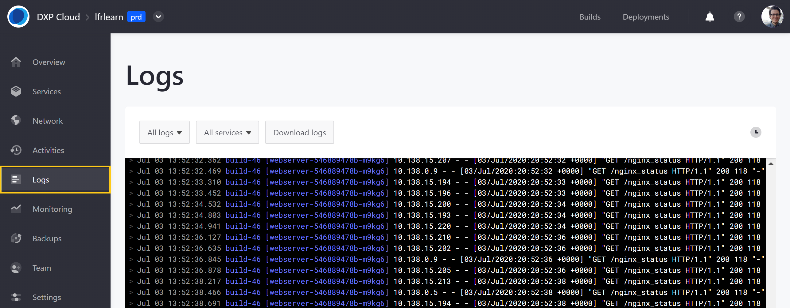
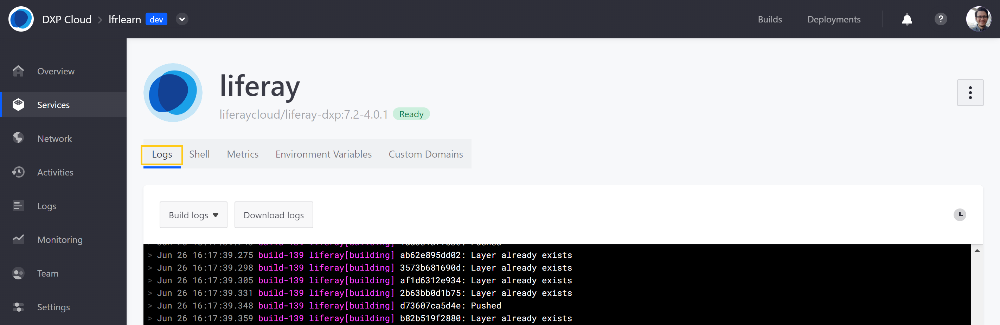

# Log Management

Environment logs are crucial for diagnosing and resolving technical issues in a project. Liferay DXP Cloud provides a variety of environment logs that users can access and download via the DXP Cloud console or OS terminal.

## Types of Logs

Liferay DXP Cloud provides three types of logs for environment services:

* **Build Logs**: These logs list build information generated as the application boots up. Examples of build information include: when docker images are pulled from the registry, when deploys are in progress, and when builds are successful.
* **Status Logs**: These logs list orchestration layer information from the Kubernetes cluster. Examples of status information include: when images are successfully pulled, when containers are created and started, and when readiness or liveness probes fail.
* **Application Logs**: These logs list runtime information generated after the application is running and accessed by users.

## Accessing Logs via the DXP Cloud Console

Follow these steps to access environment service logs via the DXP Cloud console:

1. Navigate to a project environment.

1. Click on *Logs* in the environment menu.

View application, status, and build logs across all environment services, or filter results using the drop-down menus.

To download logs, click the *Download Logs* button.



Individual service logs are also available under the *Logs* tab in each service's dedicated page.



## Accessing Logs via the Terminal

Administrators and developers can also view logs via an OS terminal.

Run the following command to list logs for all services:

```shell
lcp log
```

To access service logs from a specific environment, either enter the environment's ID after running the `lcp log` command, or run the `lcp log` command with the environment ID:

```shell
lcp log -p <environment-id>
```

Users can also specify a service as part of the `lcp log` command:

```shell
lcp log -p <environment-id> -s <service-id>
```

## Additional Information

* [Shell Access](./shell-access.md)
* [Disaster Recovery Overview](./disaster-recovery-overview.md)
* [Configuring Cross-Region Disaster Recovery](./configuring-cross-region-disaster-recovery.md)
