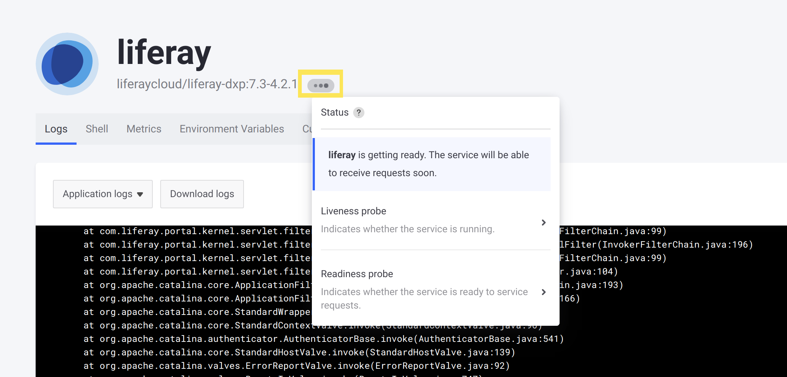

# Troubleshooting Services

The services you have running are the core of your DXP Cloud environment. Some common issues that arise can potentially be investigated or addressed with some simple troubleshooting techniques.

See here for help identifying and addressing common issues that may pop up for your services.

## A Service is Continually Restarting 

Services repeatedly restarting may signal an issue with the [liveness or readiness probes](./self-healing.md) for that service. When this happens, you may notice it in the *General* tab of the *Activities* panel, on the Overview for one environment.

If the service is repeatedly restarting because of a recurring *liveness probe failure*, then this means the service never fully starts up before the liveness probe triggers a restart. If it is because of a *readiness probe failure*, then this means the readiness probe failed to get the appropriate response a number of times in a row (possibly after the service has already fully started).

Follow the strategy outlined here to help determine whether the probes themselves are the cause of the problem.

### Identify Probe Failure Logs

First, confirm that a liveness (or readiness) probe failure is causing the service restarts.

Navigate to the service's page to see the logs on the first tab. Scan the recent logs to find any that indicate a probe failure.

For example, a liveness probe failure message may look like:

```
Liveness probe failed: HTTP probe failed with statuscode: 500
```

### Check the Probe Configurations

If you have customized your probe configurations for your environment, then it is possible that incorrect probe configuration causes the probe failures. To rule this out as the cause of probe failures, check the configurations of your liveness and readiness probes and make sure they match what they must be for your environment.

Check the probe configurations by navigating to the service having problems, and hovering your cursor over the status icon (the ellipsis or "Ready" icon):



Click on the probe in question to see its configuration: 

```
timeoutSeconds: 10
httpGet: path: /c/portal/layout
         port: 8080

initialDelaySeconds: 120
periodSeconds: 15
failureThreshold: 3
successThreshold: 3
```

If the probe configuration values(such as the `path` or `port` values) are incorrect for your environment, then adjust them to the expected values in the service's `LCP.json` file, in your project repository. Find this file in the directory corresponding to the service (e.g., `liferay/`), and then [deploy the changes to your testing environment](../build-and-deploy/overview-of-the-dxp-cloud-deployment-workflow.md).

If your service's `LCP.json` file does not already have the probe configurations, then you can copy the configurations shown in the console and convert them to JSON format while applying your changes. For example, readiness and liveness probe configurations for the `liferay` service may look like:

```json
{
"readinessProbe": {
    "httpGet": {
      "path": "/c/portal/layout",
      "port": 8080
    },
    "initialDelaySeconds": 120,
    "periodSeconds": 15,
    "timeoutSeconds": 10,
    "failureThreshold": 3,
    "successThreshold": 3
  },
  "livenessProbe": {
    "tcpSocket": {
      "port": 8080
    },
    "initialDelaySeconds": 300,
    "periodSeconds": 60,
    "timeoutSeconds": 10,
    "failureThreshold": 3,
    "successThreshold": 1
  }
}
```

```note::
   The default probe configurations should normally work for your environment. If you have not changed the probe configurations at all, then the issue is likely not a matter of incorrect configuration.
```

### Analyze the Service's Startup Logs

If your probe configurations are correct, then the probes failing may be a sign of a problem with the service itself.

Check the logs to look for any error messages that may indicate a failed startup. If you can identify an error or problem in the startup logs, then this may be what is causing one or more probes to fail, which would trigger a service restart.

```tip::
   For the Liferay service, look for this message to signal the first logs after a restart: ``[LIFERAY] To SSH into this container, run: "docker exec -it liferay-<node-id> /bin/bash".``
```

[Contact Support](https://help.liferay.com/hc/en-us) if you need assistance in handling Liferay startup errors.

### Try Adjusting Probe Configuration

If there are no obvious errors or problems in the startup logs for your service causing the probe failures, but the service is still restarting, then an adjustment to the probe configurations may be necessary.

It is possible that your service takes enough time to start up that the liveness probe times out too soon, and triggers a service restart. This is likely the case if the normal startup logs have not all appeared yet by the time the probes fail and trigger a restart. This is not as likely to be the case if it is the *readiness* probe failing after the service has already fully started.

If this is happening for your service, then try one of the following:

* Increase the `initialDelaySeconds` value for the probes to wait longer before checking the service.
* Increase the `failureThreshold` to force the probes to make more attempts before triggering a service restart.
* Increase the `timeoutSeconds` value to reduce the chance of a probe failure, if responses from the service are slow.

Increase one or more of these values in the probe configurations (in the service's `LCP.json` file) and deploy the changes as appropriate for your service if slowness is causing service restarts. However, avoid setting these values too arbitrarily high, because the changes will apply to the probes for every service restart in the future.

See [Using and Configuring Probes](./self-healing.md#using-and-configuring-probes) for more information.

### Contact Cloud Support

If liveness or readiness probe failures are not causing the service restarts, or if these strategies have not helped to resolve them, then please contact [DXP Cloud Support](https://help.liferay.com/hc/en-us) for further assistance.