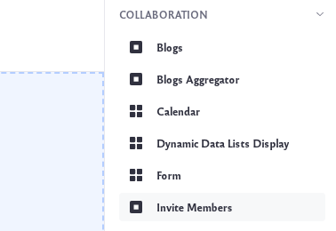

# Inviting Members to Your Site

The Invite Members widget lets site administrators send invitations to users to join a Site. To start using the widget,

1. Add the widget by clicking on the Add icon () at the top of a page. Find the Invite Members widget under the *Collaboration* section and drag it to your page.

    

1. Click on the *Invite Members* button to bring up a new form.

    

1. Click the plus sign next to a User you would like to send an invitation to. Users that have already been invited but have not yet responded appear with a check mark next to their names. Users that have already accepted an invitation will no longer appear in the list.

    For others not on the list, you can input an email address and click *Add Email Address*.

1. Select a role for the user by using the dropdown menu under *Invite to Role*. Select between *Site Owner*, *Site Content Reviewer*, or *Site Administrator*.
    
    Once you've added all the Users you want to invite and have selected their Roles, click the *Send Invitations* button to invite them. For more information on roles, see the [Roles and Permissions](../../../users-and-permissions/roles-and-permissions/understanding-roles-and-permissions.md) documentation.

1. The Site invitation shows up under the *Requests List* tab on the User's *Notifications* page. The User can then choose to *Confirm* or *Ignore* the invitation.

    

    When the user confirms their invitation, they become a Site member assigned with the Role you defined.