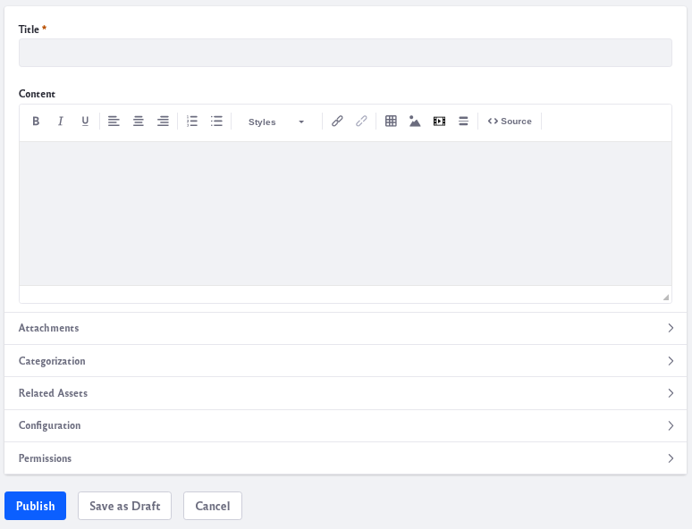

# Creating Knowledge Base Articles

The Knowledge Base app contains everything you need to create articles in the Knowledge Base. You can create articles by authoring them in the app’s WYSIWYG editor or by importing them from Markdown files (`.markdown`, `.md`) in a ZIP archive. The sections below cover both ways of creating articles.

<!-- Do we need a note about permissions on every article?
Note: To access Knowledge Base in Site Administration, a Role must have the permission *Knowledge Base* &rarr; Access in *Site Administration*. To add or act on articles, folders, or suggestions, the Site administrator must grant the appropriate permissions using the Permissions window in Knowledge Base. -->

To navigate to the Knowledge Base app, click on the Menu icon () and navigate to *Content and Data* &rarr; *Knowledge Base*. The Knowledge Base app has three tabs,

**Articles:** Create and manage articles and folders.

**Templates:** Create and manage templates.

**Suggestions:** Manage user-submitted feedback for articles.


## Authoring Articles in the Editor

To create a Knowledge Base article,

1. In the *Articles* tab, click on the Add icon () and click *Basic Article*.

    

1. Enter a title for the article. A URL-safe version of the title you provide is added to the end of the article’s friendly URL. You can manage the friendly URL in the *Configuration* section’s *Friendly URL* field.

1. Use the WYSIWYG editor to create the article’s content. To view or edit the article’s HTML source, click the *Source* button in the editor. The sections below the editor let you add attachments and tags, specify related assets, and set permissions for the article. By default, View permission is granted to the Guest role, meaning anyone can view your article.

1. Click *Publish* to submit the article for publication or click *Save as Draft* to continue working on it later. Note that if you’ve enabled workflow for the Knowledge Base, your article must be approved before publication.

Once the article is saved, it is converted automatically to HTML for the Knowledge Base. Articles are listed in a table in the Articles tab.

## Importing Knowledge Base Articles

You can also create new Knowledge Base articles by importing them from a ZIP archive that contains articles in the Markdown format (`.markdown`, `.md`). For example, you could write articles in your favorite Markdown editor, package them in a ZIP file, and then import that ZIP file to create those articles in the Knowledge Base. The Knowledge Base can also prioritize articles by their filenames’ numerical prefixes. For example, the Knowledge Base would list `01-article.markdown` and `02-article.markdown` in ascending order by their numerical prefix (`01`, `02`). For more information on article priority, see [Managing Knowledge Base Articles](managing-the-knowledge-base.md#managing-knowledge-base-articles) for detailed information on the Knowledge Base importer,

* [Importing Knowledge Base Articles](importing-knowledge-base-articles.md)
* [Knowledge Base ZIP File Requirements](knowledge-base-zip-file-requirements.md)
* [Knowledge Base Importer FAQs](knowledge-base-importer-faq.md)

```Note:: 
To import articles, your Role must have the permission Knowledge Base → Resource Permissions: Import Articles.
```

To import articles into the Knowledge Base,

1. In the Articles tab, click on the Add icon () and click *Import*.

    

1. Click *Choose File* and locate the ZIP file to import. 

1. If you want to use the files’ numerical prefixes to prioritize the imported articles in the Knowledge Base, select *Apply numerical prefixes of article files as priorities*.

1. Click *Save* when you’re finished.

Like all articles, imported articles are automatically converted to HTML for the Knowledge Base and listed in a table with the rest of the articles in the Articles tab.