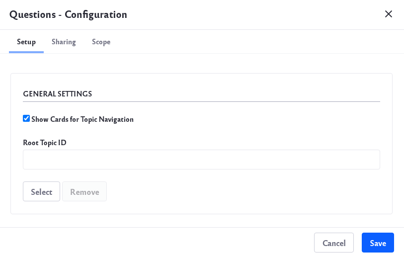
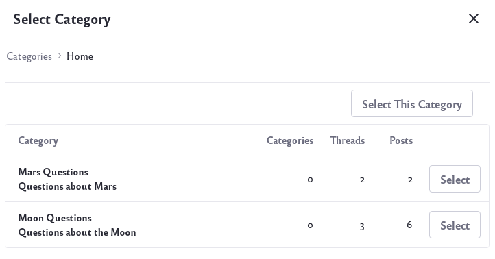

# Configuring the Questions App

## Configuration from the App

To configure the app,

1. Click on the Options icon () of the app and click *Configuration*.

    

1. Under *General Settings*, there is a *Show Cards for Topic Navigation* option. If this is checked, the app will display separate cards for each question topic. If it is not checked, the app will display a list of all the questions.

    

1. By default, the app will display all existing topics. To show the questions of one specific topic, click the *Select* button under *Root Topic ID*.

    

1. Select a topic and click *Save*. The app will now only show questions for the selected topic.

To modify permissions for the app,

1. Click on the Options icon () of the app and click *Permissions*.

    

## Configuration from System Settings

1. 