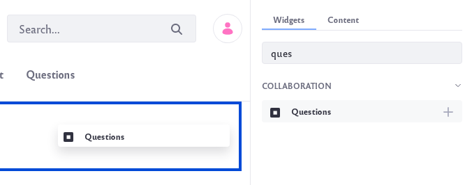

# Getting Started with the Questions App

The Questions app is a new UI of the Message Boards application more focused in a questions and answers format but maintaining the same elements of Message Boards. The Questions app allows the creation of,

Topics: Themes where questions are categorized
Questions: A question inside the app
Answers: An answer to a specific question

When questions are created, tags can also be used to help others find relevant content.

## Adding a Questions App to a Site

To add the Questions app to a Site,

1. Navgiate to the site page where the app will be added.

1. Click on the Add icon () at the top right of the page.

1. Locate the app under the Collaboration section of widgets. Drag the app to the page.

    

Users can now begin asking and answering questions with the app.

## What's Next

Learn more about the app,

* [Using the Questions App](using-the-questions-app.md)
* [Configuring the Questions App](configuring-the-questions-app.md)