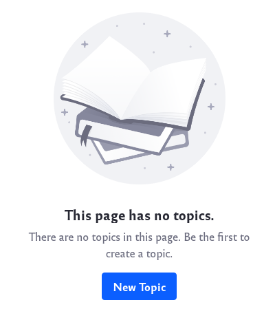
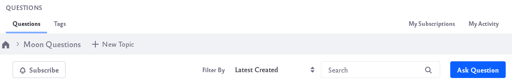
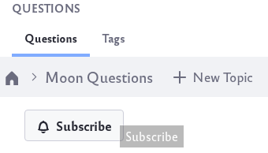

# Using the Questions App

After [adding the Questions app to a Site](getting-started-with-the-questions-app.md#adding-a-questions-app-to-a-site), topics can be created for users to post different questions.

Note that only users with the requisite permissions have the ability to create topics.

## Creating Topics

1. Click the *New Topic* button. 

   

1. Give your new topic a title and description and click the *Create* button.

   

   You can create as many different topics as you like.

## Asking Questions

1. Once you've created a topic, you can begin asking questions. Click on the *Ask Question* button to create a new question.

   

1. A new window appears for your question. Fill in the title and body. Add optional tags to your question.

   

   To finish, click the *Post Your Question* button.

## Answering Questions

1. Users can view existing questions and give their replies. To give an answer, click on an existing question.

1. Type your answer into the *Your Answer* box and click the *Post Answer* button.

    

1. The answer is visible to everyone who views the question.

    

Once a question has been answered, those answers can be managed:

**Rating:** You can give the answer a [rating](../../social-tools/user-guide/using-the-ratings-system.md) using the up or down arrows. 

**Sort:** You can use the tabs to sort answers by Active, Oldest, or Votes.

**Reply:** Other users can reply to a given answer.

**Delete:** Users can delete their answers.

**Mark as answer:** The user who asked the question can mark an answer as the correct or most helpful response.

**Edit:** Users can edit their answers.

## Searching Questions

There are a few different ways to search for questions:

**Filter By:** Filter the different questions based on criteria such as date and most votes.

**Search:** Search through different questions by typing keywords into the search bar.

**Tags:** Filter questions based on tags. Click the *Tags* tab to see the available tags and their associated questions.

## Subscriptions

You can subscribe to both topics and questions. This makes it easy to go back to your favorite topics and favorite questions.

To subscribe to a topic, click the *Subscribe* button below the topic title bar.

To subscribe to a question, click the subscribe bell button next to the question. Note that when you ask a question, you're automatically subscribed to it. 

To view your subscriptions, click on the *My Subscriptions* tab. A list of all the topics and questions you are subscribed to appears.

## My Activity

You can track your use of the Questions app by clicking on the *My Activity* tab. 

Here is displayed your ranking, the number of questions they have asked, and a list of each of these questions.
