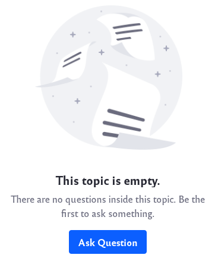
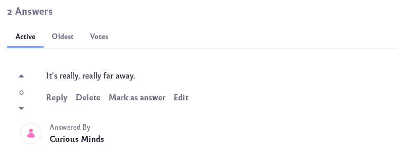
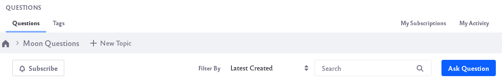

# Using the Questions App

The Questions App is a new UI of the Message Boards application that is more tailored for a questions and answers format but maintains the same elements of Message Boards. The Questions application allows for the creation of questions and answers within customized topics.

## Adding the Questions App to a Page

1. Navigate to an existing page where you wish to add the Questions app. Click on the *Add App* icon () at the top of the page.

    Or [create a new page](../../../site-building/creating-pages/adding-paged.md) on which to add the app.

1. The *Questions* app is found under the Collaboration section. It can also be found by searching for *Questions*.

    

## Creating Topics

1. Begin by clicking on the *New Topic* button to create a new topic.

    

1. Give your new topic a title and description and click the *Create* button.

    

    You can create as many different topics as you like.

## Asking Questions

1. Once you've created a topic, you can begin asking questions. Click on the *Ask Question* button to create a new question.

    

1. A new window will pop up for your question. Fill in the title and body. Add optional tags to your question.

    

    To finish, click on the *Post Your Question* button.

## Answering Questions

1. Users can view existing questions and give their replies. To give an answer, click on an existing question.

1. Type your answer into the Your Answer box and click the *Post Answer* button.

    

1. The answer should now be visible to everyone who views the question.

    

1. There are a few additional features for answers:

    * Rating - Users can click on the up or down arrow next to an answer to give a positive or negative rating.

    * Sort - Users can sort the different answers by clicking on the tabs: Active, Oldest, or Votes.

    * Reply - Other users can reply to a given answer.

    * Delete - A user can delete their answer.

    * Mark as answer - The user who asked the question can mark an answer as the correct response, or the most helpful response. Simply click on Mark as answer.

        

    * Edit - A user can edit their answer.

## Searching Questions

With the Questions app, there are a few different ways to search for questions:

* Filter By - Users can filter the different questions based on criteria such as date and most votes.

* Search - Users can search through different questions by typing keywords into the search bar.

* Tags - Users can also filter out questions based on tags. Click on the *Tags* tab to see all the available tags and their associated questions.

    

## My Subscriptions and My Activity

Two additional features of the Questions app is subscriptions and activity tracking.

* ### Subscriptions

    Users can subscribe to both topics and questions of their choice. This makes it easy to go back to your favorite topics and favorite questions.

    To subscribe to a topic, click on the *Subscribe* button below the topic title bar.

    

    To subscribe to a question, click on the subscribe bell button next to the question. Note, you are automatically subscribed when asking the question.

    

    To view your subscriptions, simply click on the *My Subscriptions* tab. You will see a list of all the topics and questions you are subscribed to.

    

* ### My Activity

    Users can track their use of the Questions app by clicking on the *My Activity* tab. 

    

    Users can see their ranking, the number of questions they have asked, and a list of each of these questions.