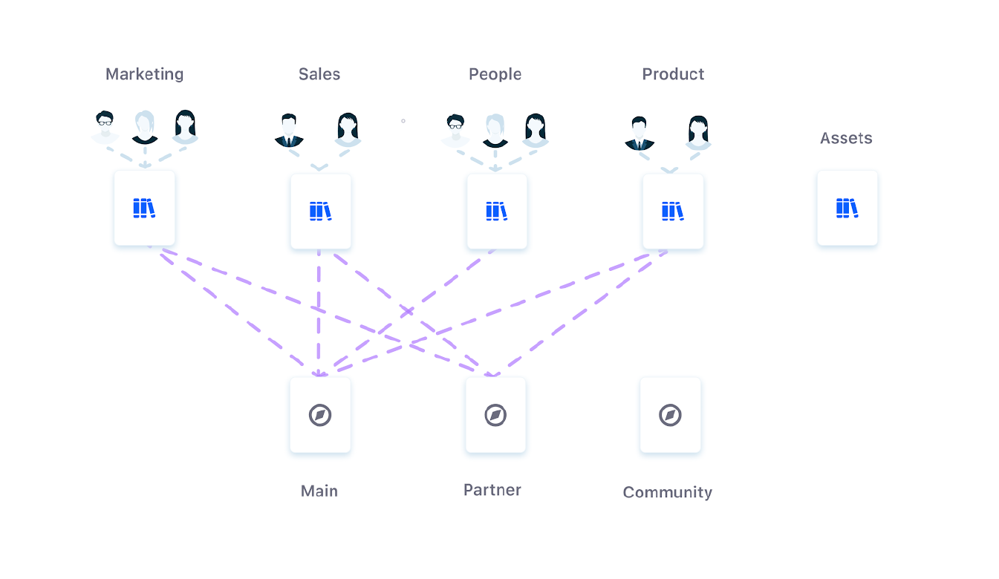

# Asset Libraries Overview

Asset Libraries are virtual spaces where you can create and store reusable assets. You can create as many of these spaces as needed to group together content for departments, teams, or even individual products and campaigns. Each Library is created at the instance level and can be connected to multiple Sites, so your Users can develop and manage assets in each Library instead of within individual Sites. Supported applications include Web Content, Documents and Media, and Collections.

By organizing content into smaller, focused buckets, you can more easily access and manage content in different Site contexts. This structure can lower the risk of editing conflicts and content duplication. You can also integrate a custom workflow to direct the publishing process for each Library's web content.

Asset Libraries work under the same permission management system as other applications, so you can configure who can create or access assets in a Library and determine the channels where those assets are accessible. By default, there are four main Asset Library Roles, equivalent to their Site counterparts: Asset Library Owner, Admin, Member, and Content Reviewer. You can create new Asset Library Roles for your specific needs.

Use Asset Libraries to improve content collaboration, simplify asset organization, and reduce content duplication across your instance. See [Creating and Managing Asset Libraries](./creating-and-managing-asset-libraries.md) to get started with Asset Libraries.

## Additional Information

* [Creating and Managing Asset Libraries](./creating-and-managing-asset-libraries.md)
* [Asset Library Content](./asset-library-content.md)
