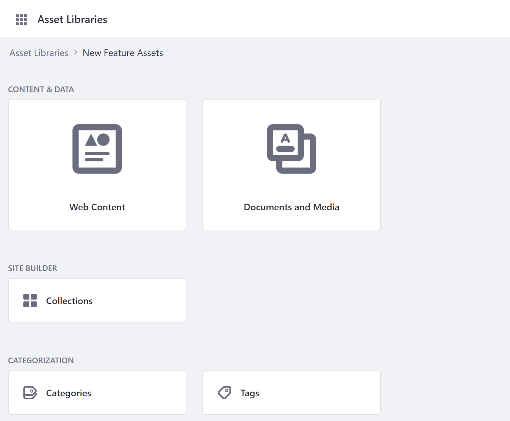
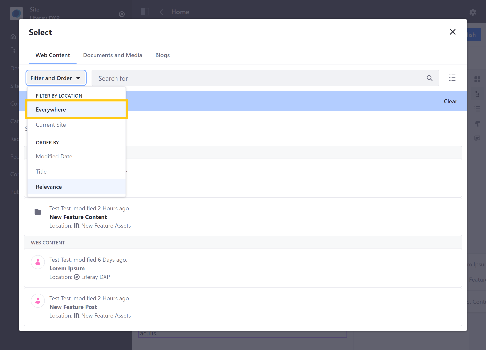
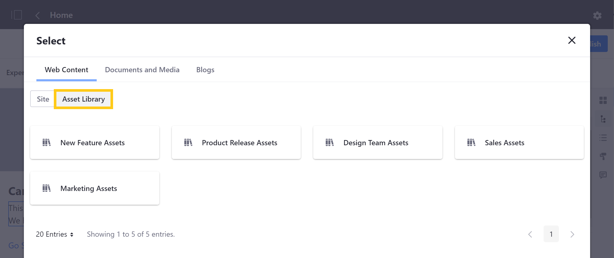
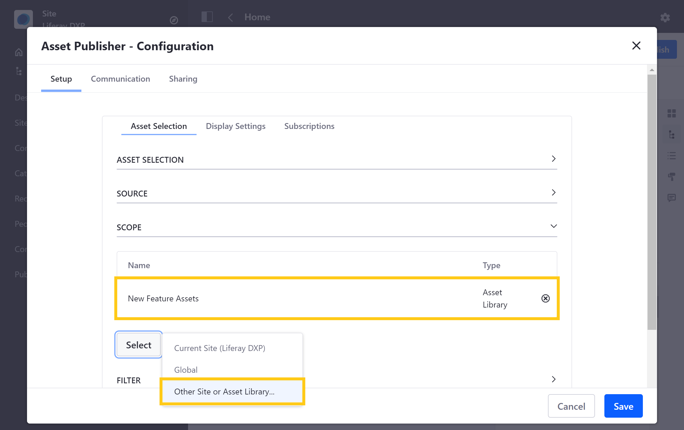
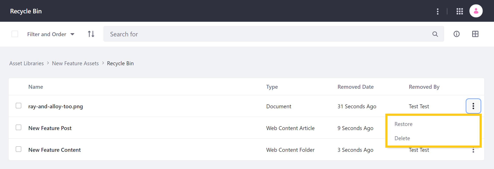

# Asset Library Content

Asset Libraries provide a convenient way to share content across your Sites. This can help to reduce data duplication and streamline content collaboration across your instance. You can add and manage a Library's content from its *dashboard* page, which can be accessed by clicking on its name in the Asset Libraries application page.



Each dashboard displays the Library's active applications and categorization tools. From here, you can view, create, and organize a Library's content. You can also enable a workflow to _ the publishing process for the Library's web content. 

You can also initiate import and export processes for a Library using LAR files.

When enabled, you can also view the Library's Recycle Bin before its content is permanently removed from your instance. -->

You can also import content to your Library, or export its content to an LAR file.

If enabled, this is also where Users can view the Library's *Recycle Bin* before they're permanently removed from your instance.

* [Creating Content](#creating-content)
* [Using Content in Your Sites](#using-content-in-your-sites)
* [Tagging and Categorizing Content](#tagging-and-categorizing-content)
* [Importing and Exporting Content](#importing-and-exporting-content)
* [Removing Content](#removing-content)

## Creating Content

Since all supported applications behave in the same way, creating content in an Asset library is essentially the same as creating it in a Site. The only differences are its location and default theme settings.

Follow these steps to create content in an Asset Library:

1. Open the *Applications* tab in the Global menu, and go to *Content* &rarr; *Asset Libraries*.

1. Click on the *name* of the desired Asset Library to access its dashboard.

1. Click on the *application* for/with<!--w/c--> which you want to create content.

   ```note::
      Only active applications appear on a Library's dashboard. To activate or deactivate an application, see `Asset Library Configuration <./creating-and-managing-asset-libraries.md#asset-library-configuration>`_ for more information.
   ```
   <!-- TEST RELATIVE LINK -->

1. Create your desired content type as usual. See [Content Authoring and Management]() articles for more information on how to create each content type.<!--Finish.-->

You can view created content in the Asset Library or connected Sites.

Once created, you can view an Asset Library's content by going to its respective application. You can also create and <!--assign/manage/___--> categories and tags for organizing your Library's content. <!--finish-->

```tip::
   When viewing a Library's content, you can use breadcrumbs to quickly navigate back to the Library's *dashboard* or to the *Asset Libraries* application Page.
```

## Using Content in Your Sites

To use content from an Asset Library in a Site, the Library must be connected to the Site, and it must have the desired application enabled. Once __<!--configured-->, using Asset Library content in your Site essentially works the same way as using Site content. The only difference is that Users must filter available content to display content from connected Asset Libraries. <!--refine-->

For example, when mapping content to a page fragment, you can use content from an asset library by filtering displayed content to include content from *Everywhere*. Then, select the desired content in the Item Selector.



Alternatively, use the breadcrumb in the Item Selector modal window to navigate to *Sites and Libraries*. Then, click on the *Asset Library* tab. From here, select the Library with the content you want to use. This directs you back to the Item Selector window, where you can view and map content from your selected Library.



Similarly, when publishing content using the Asset Publisher widget, you must set its scope to include content from a specific Asset Library. Then, select the content you want to use.



For more information about using content in your Site, see []() and []().<!--Finish.-->

## Tagging and Categorizing Content

<!--  -->

## Importing and Exporting Content

<!--With Asset Libraries, you-->Can export existing Site content and import it to an Asset Library as an LAR file. Can also export an Asset Library's contents...
<!--Finish.-->

To initiate a new export/import process for a Library, go to its dashboard, and click on *Export* or *Import* at the bottom of the page. Then, click on the *Add* button () to initiate a new process. Importing and exporting Library content follows the same process as Site assets. Can create custom export templates. Click on the *Actions* button (  ) in the Applications bar menu, and select *Export Templates*... See [Importing/Exporting Sites and Content]() for more information.<!--Finish.-->

## Removing Content

When enabled for your Asset Library, you can move content to the Recycle Bin. By default, the content is retained for 43200 minutes (i.e., 30 days), but you can adjust this period in the Asset Library's settings. Once a recycled item has reached ___<!--the assigned period of time-->, it is automatically deleted from your instance. <!--Entries that have been in the Recycle Bin for more than this time are automatically deleted.--> 



See [Recycle Bin]() for more information.<!--Finish.-->

## Additional Information

* [Asset Libraries Overview](./asset-libraries-overview.md)
* [Creating and Managing Asset Libraries](./creating-and-managing-asset-libraries.md)
* [Asset Library Roles and Permissions](./asset-library-roles-and-permissions.md)