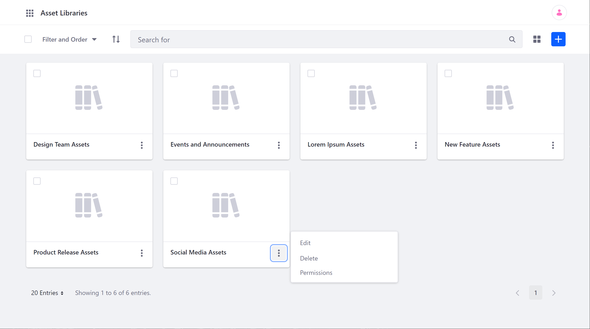
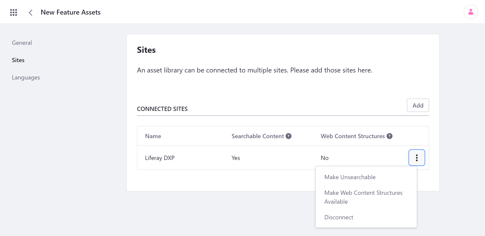
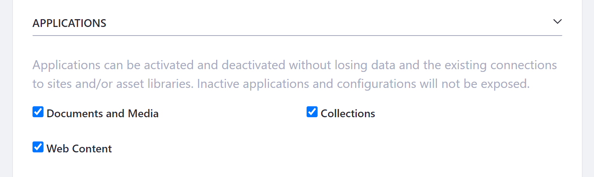
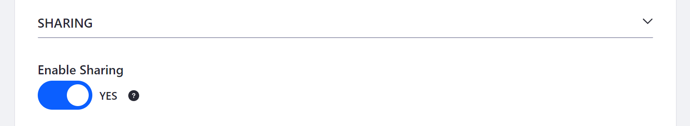
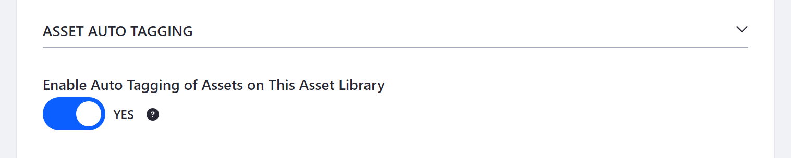
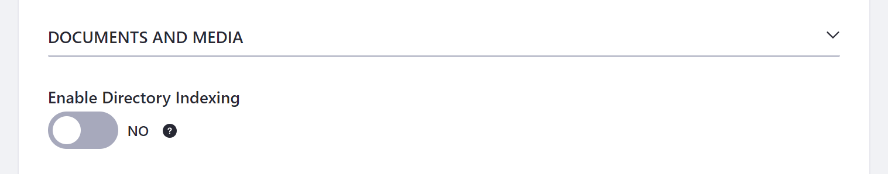
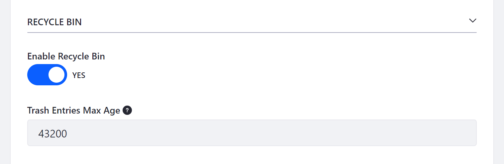
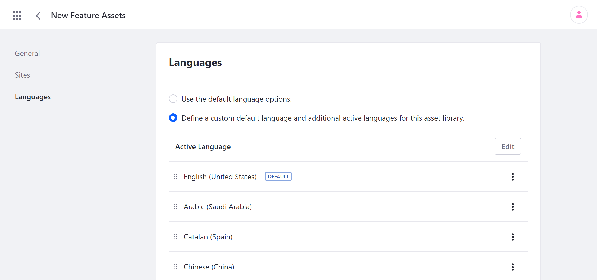
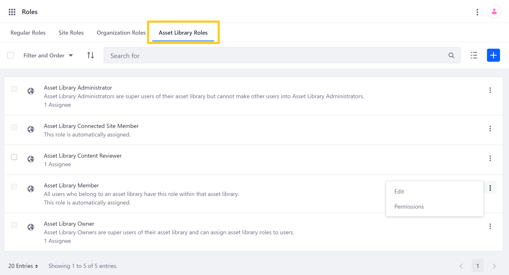

# Creating and Managing Asset Libraries

You can manage Asset Libraries for your DXP instance via the *Asset Libraries* Page in the *Applications* tab of the Global Menu. Here, you can create and configure as many Libraries as needed and determine how each Library is connected to your Sites.



* [Creating an Asset Library](#creating-an-asset-library)
* [Configuring Asset Libraries](#configuring-asset-libraries)
* [Managing Asset Library Memberships](#managing-asset-library-memberships)
* [Deleting an Asset Library](#deleting-an-asset-library)

## Creating an Asset Library

Follow these steps to create an Asset Library for your instance:

1. Open the *Global Menu*, and go to *Content* &rarr; *Asset Libraries* in the Applications tab.

1. Click on the *Add* button (  ), and enter a *Name* for your new Asset Library.

1. Click on *Save*.

This creates a new Asset Library with a unique ID and redirects you to its configuration page.

You can configure your Library now, or accept the default settings and get started adding content to the Library.

## Configuring Asset Libraries

Once you've created an Asset Library, you can configure it at any time by clicking on its *Actions* button (  ) and selecting *Edit*. Configuration options are organized into three sections: *General*, *Sites*, and *Languages*. <!--IS THE FOLLOWING TEXT RELEVANT? "You can also access a Library's settings via its dashboard page. Simply click on the *name* of the Asset Library you want to configure, and then click on *Settings*."-->

### General Settings

In the *General* tab, you can configure an Asset Library's basic information.

* **Details**: View a Library's unique ID, and configure its name or description.

   

* **Applications**: Determine whether a Library's supported applications (i.e., Documents and Media, Collections, Web Content) are available to Sites.

   

* **Sharing**: Determine whether Users can share a Library's assets with other Users.

   

* **Asset Auto Tagging**: Determine whether a Library's assets are auto tagged by the providers configured at the instance level.

   

* **Documents and Media**: Determine whether all Users with the View permission can browse Documents and Media files and folders in a Library. By default, this setting is disabled.

   

* **Recycle Bin**: Determine whether to enable Recycle Bin for a Library, and set the maximum age for recycled assets.

   

### Sites

In the *Sites* tab, you can connect or disconnect individual Sites to an Asset Library, as well as configure how they're related via the connected Site's *Actions* button (  ).


* **Add**: Connect a new Site to the selected Library.

* **Make Searchable/Unsearchable**: Determine whether the Library's assets appear in search queries for the selected Site. By default, all connections are searchable.

* **Make Web Content Structures Available**: Determine whether *Web Content Structures* and *Document Types* are available to the selected Site. By default, this feature is disabled. When enabled, you can create content in the Site based on structures and types stored in the Library.

   ```important::
      You cannot disconnect a site while this feature is enabled. This is to avoid problems in public Pages using these contents. Also, ensure you've communicated with your team before disabling this feature, since content using these structures will no longer be available.
   ```

* **Disconnect**: Disconnect the selected Site from the Library. When disconnected, the Library's assets are no longer accessible from the Site.

### Languages

In the *Languages* tab, you can determine whether to use your instance's default language options for an Asset Library, or to define your own options. When configuring your own options, you can determine your Library's default language, as well as each language's relative priority. You can also click on *Edit* to determine which languages are available in the Library.



The default language is used for displaying content when no other language is selected, or when the selected language has no set translation. Use the *Drag* icon (  ) to manually adjust a language's relative priority, or click on a language's *Actions* button (  ) and select *Move Up* or *Move Down*.

## Managing Asset Library Memberships

You can view and manage User memberships for an Asset Library by going to its dashboard Page and clicking on *Memberships*. From here, you can add new Users, Organizations, and User Groups to the selected Library by click on the *Add* button (). You can also *Assign Roles* or *Remove Memberships* for each existing member by clicking on its *Actions* button (  ).


By default, Asset Libraries include the five following roles:

* **Asset Library Member**: This role grants basic permissions and is automatically assigned to Users who belong to an Asset Library.

   ```note::
      By default, the Asset Library Member's permissions are more restricted than those of its Site counterpart. This means you’ll need to manually grant access to applications, update/delete permissions for content, and more if you want Members to be responsible for managing content.
   ```

* **Asset Library Connected Site Member**: This role is automatically assigned to members of a connected Site. <!--does this role come with any permissions? Do its permissions depend on how their Site's connection to a Library is configured? -->

* **Asset Library Content Reviewer**: This role grants permissions necessary for reviewing content in a workflow.

* **Asset Library Administrator**: This role grants permission to manage most aspects of an Asset Library, including content, memberships, and settings. However, it does not grant permission to modify or assign the Owner or Administrator roles to other Members.

* **Asset Library Owner**: This role grants control over all aspects of an Asset Library and is automatically assigned to the Library's creator.



Creating or customizing an Asset Library role is the same process as for other kinds of roles. See [Roles and Permissions](../../users-and-permissions/roles_and_permissions.html) documentation for how to create, customize, manage, and assign User roles.

## Deleting an Asset Library

To remove an Asset Library and its contents from your instance, click on its *Actions* button (  ), and select *Delete*. You are then prompted to confirm this action. Once deleted, all contained assets are removed from your database and are no longer available to previously connected Sites.

```warning::
   This action cannot be undone. Ensure you're removing the correct Asset Library and that you've backed up any assets you want to keep.
```

## Additional Information

* [Asset Libraries Overview](./asset-libraries-overview.md)
* [Asset Library Content](./asset-library-content.md)
