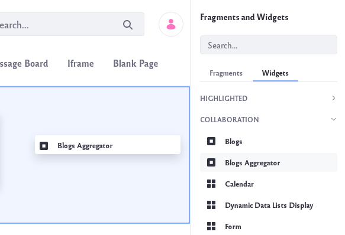

# Aggregating Blogs

The *Blogs Aggregator* widget lets you publish entries from multiple bloggers on one page, giving further visibility to blog entries.

To add a *Blogs Aggregator* widget to a page,

1. Navigate to an existing page where you wish to add the *Blogs Aggregator* widget. Click on the *Add App* icon () at the top of the page.

    Or [create a new page](../../site-building/creating-pages/adding-pages.md) on which to add the widget.

1. The *Blogs Aggregator* widget is found under the Collaboration section of the list of widgets. It can also be found by searching for *Blogs Aggregator*. Drag the widget onto your page.

    

1. To configure the widget, click the Options icon ()  in its title bar and select Configuration.

    

    The Setup tab contains these options:

    **Selection Method:** Set how the widget selects blogs for display. You can choose *Users* or *Scope*. If you select Users, the widget aggregates the entries of every blogger on your system. To refine the aggregation, you can select an organization by which to filter the users. If you select Scope, the widget aggregates the entries of users in the current scope. This limits the entries to members of the site where the widget resides.

    **Organization:** Select the organization whose blogs you want to aggregate.

    **Display Style:** Select the overall appearance for blog entries in the widget: *Body and Image*, *Body*, *Abstract*, *Abstract without Title*, *Quote*, *Quote without Title*, and *Title*.

    **Maximum Items to Display:** Set the maximum number of entries the widget displays.

    **Show Tags:** Set whether to display each entry's tags.

    **Enable RSS Subscription:** Enable an RSS feed of the aggregated entries. This lets users subscribe to an aggregate feed of all your bloggers. Below this option, you can configure how you want to display the RSS feed:

    **Maximum Items to Display:** Set the maximum number of RSS items to display.

    **Display Style:** Set the overall appearance of each entry in the RSS feed: *Abstract*, *Full Content*, or *Title*.

    **Format:** Set the language to use for your RSS feed: *Atom 1.0*, *RSS 1.0*, or *RSS 2.0*.

1.  Here are descriptions for the other tabs in the Blogs Aggregator’s configuration:

    **Sharing:** Embed the widget instance as a widget on any website, Facebook, Netvibes, or as an OpenSocial Gadget.

    **Scope:** Specify the blog instance the widget displays: the current site’s blog (default), the global blog, or the page’s blog. 

    When you finish setting the options, click *Save* and then close the dialog box. 
    
You’ll notice that the Blogs Aggregator looks very much like the Blogs widget, except that it shows entries from multiple blogs.

