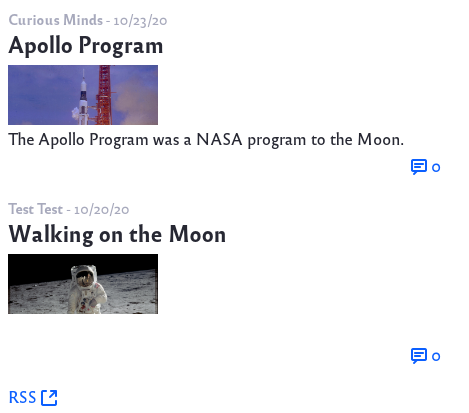
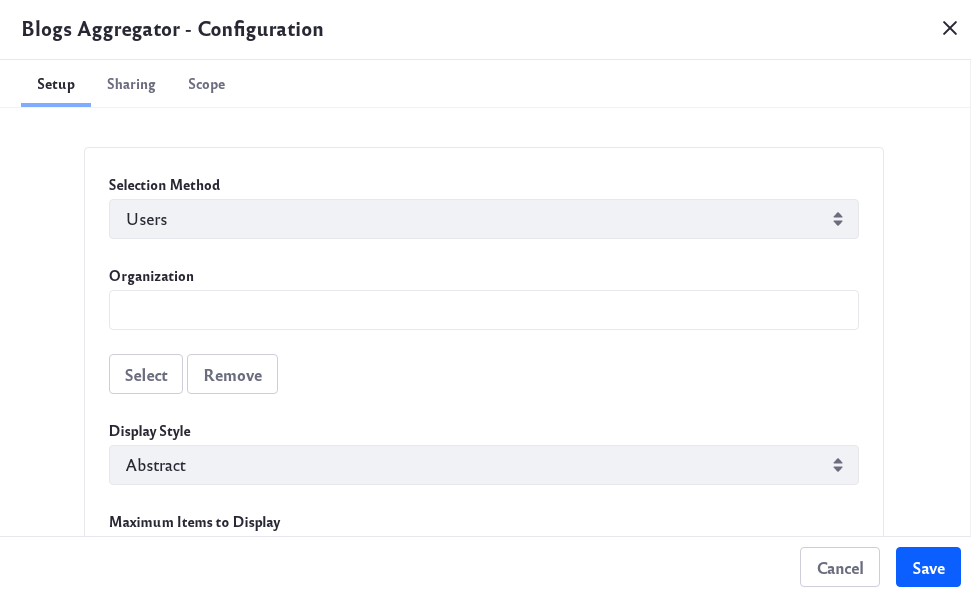

# Aggregating Blogs

The Blogs Aggregator widget publishes blogs entries from multiple blog sources. 

To configure the widget, click _Options_ () &rarr; Configuration.

Within the configuration screen there are several tabs with different options.

## Setup

The Setup tab contains these options:

**Selection Method:** Set how the widget selects blogs for display. You can choose *Users* or *Scope*. If you select Users, the widget aggregates the entries of every blogger on your system. To refine the aggregation, you can filter the Users by selecting an organization. If you select Scope, the widget aggregates the entries of users in the current scope. This limits the entries to members of the Site or Organization where the widget resides.

**Organization:** Select the Organization whose blogs you want to aggregate.

**Display Style:** Select the overall appearance for blog entries in the widget: *Body and Image*, *Body*, *Abstract*, *Abstract without Title*, *Quote*, *Quote without Title*, and *Title*.

**Maximum Items to Display:** Set the maximum number of entries to display.

**Show Tags:** Set whether to display each entry's tags.

### RSS Settings

**Enable RSS Subscription:** Enable an RSS feed of the aggregated entries. Below this option, you can configure how you want to display the RSS feed:

**Maximum Items to Display:** Set the maximum number of RSS items to display.  

**Display Style:** Set the overall appearance of each entry in the RSS feed: *Abstract*, *Full Content*, or *Title*.  

**Format:** Set the language to use for your RSS feed: *Atom 1.0*, *RSS 1.0*, or *RSS 2.0*.  

## Sharing

Use the options here to embed the widget instance as a widget on any website, Facebook, Netvibes, or as an OpenSocial Gadget.

## Scope

Specify the blog instance the widget displays: the current Site's blog (default), the global blog, or the page's blog. 

## Conclusion

When you finish setting the options, click *Save* and then close the dialog box. 

You’ll notice that the Blogs Aggregator looks much like the Blogs widget, except that it shows entries from multiple blogs.