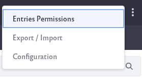
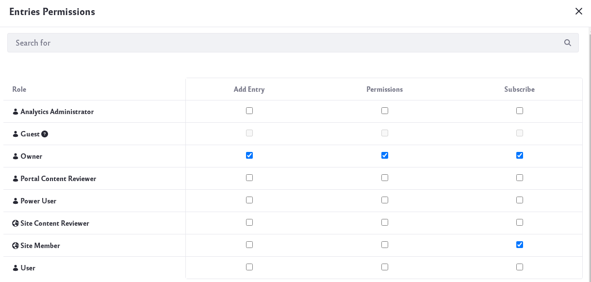
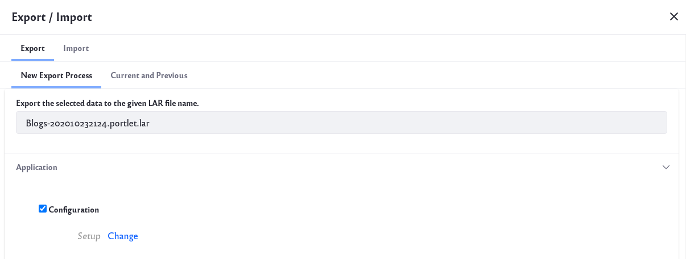
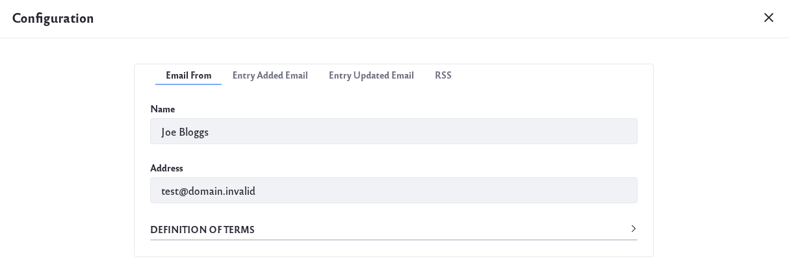

# Configuring the Blogs App

By configuring the *Blogs* app in Site Administration, you can control how the app behaves for all blogs in your site. To make changes,

1. Navigate to the *Blogs* application.

1. Click on the options icon () at the top-right of the app.

    

1. Here are each of the options available in this menu:

    **Entries Permissions:** Configure the permissions that can be applied to the Blogs app. You can control which roles can add an entry, configure entry permissions, and subscribe to entries.

    

    **Export/Import:** Export or import a LAR file that contains the Blogs app’s content.

    

    **Configuration:** Configure the following options for the Blogs app, in these tabs:

    

    **Email From:** Define the *From* field in the email messages that users receive from Blogs.

    **Entry Added Email:** Define a subject and body for the emails sent when a new blog entry has been added.

    **Entry Updated Email:** Define a subject and body for the emails sent when a new blog entry has been updated.

    **RSS:** You can enable RSS subscription and choose how blogs are displayed to RSS readers. 
        
    The *Maximum Items to Display* selector lets you choose the total number of RSS feed entries to display on the initial page. You can choose up to one hundred to be displayed. 
            
    The *Display Style* selector lets you choose between Full Content, Abstract, and Title for the entry display in the RSS feed. 
            
    The *Format* selector lets you choose which format the RSS feed uses to deliver the entries: Atom 1.0, RSS 1.0, or RSS 2.0.