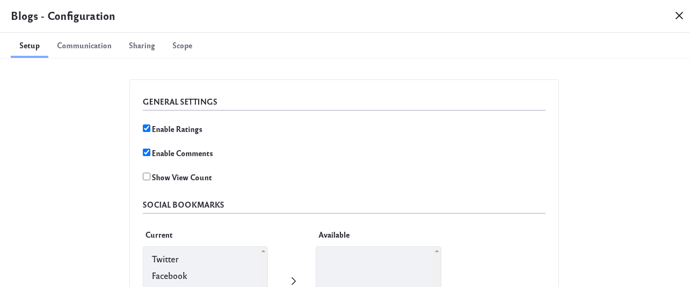
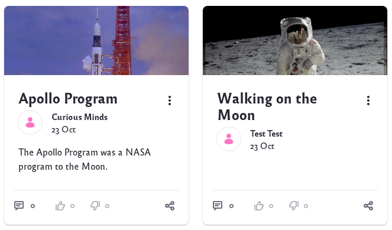

# Displaying Blogs

You can [add](./adding-blog-entries.md), [manage](./managing-blog-entries.md), and [configure](./configuring-the-blogs-app.md) blogs from the Product Menu () &rarr; _Content & Data_ &rarr; _Blogs_. Once you have blog entries, you can display them by adding a Blogs widget to a page. 

Adding the Blogs widget to a page exposes the blog interface to Site members. Similarly, adding the widget to a User's personal Site (Profile) creates a blog just for that User. The widget works the same way in both cases. 

Once you've added a Blogs widget to a page, there are several display options for configuring the listing to look the way you want. 

To configure the widget, click _Options_ () &rarr; _Configuration_. 

## Setup Tab

**Enable Ratings:** Enable the [ratings system](../../collaboration-and-social/social-tools/user-guide/using-the-ratings-system.md) for blog entries. 

**Enable Comments:** Enable comments on blog entries.

**Show View Count:** Enable showing the number of views for each entry.

**Social Bookmarks:** Enable sharing blog entries on the social media platforms you add to the *Current* column. To move social networking sites between the *Current* and *Available* columns, select the sites and use the arrows between those columns. Similarly, use the up/down arrows beneath the Current column to reorder the sites as they appear on each blog entry. 

**Display Style:** Define how social bookmarks appear. *Inline* is the default and displays the social bookmark icons in a row. *Menu* hides them inside a share menu.

**Maximum Items to Display:** The total number of blog entries to display on the initial page. You can select up to 60 to display at once.

**Display Template:** Choose the display layout for blogs:

* **Abstract:** Displays an abstract of each blog entry.

* **Full Content:** Displays the full content of each blog entry.

* **Title:** Displays only the title of each blog entry.

* **Basic:** A stripped-down version of the Abstract, with less text and no cover image.

* **Card:** Displays each blog entry in a card-like rectangle that shows the cover image, title, author, post date, and a few lines of text.

To select a different application display template (ADT) or create your own, click *Manage Templates*. 

**Enable Report Inappropriate Content:** Enable flagging content as inappropriate, which sends an email to administrators.

**Enable Ratings for Comments:** Enable the [ratings system](../../collaboration-and-social/social-tools/user-guide/using-the-ratings-system.md) for blog entry comments.

**Show Related Assets:** Enable showing related content from other widgets.

## Communication, Sharing, and Scope Tabs

**Communication:** Lists public render parameters the widget publishes to other widgets on the page. Other widgets can read and take actions on these. For each shared parameter, you can specify whether to allow communication using the parameter and select which incoming parameter can populate it.

**Sharing:** Embed the widget instance as a widget on any website, Facebook, Netvibes, or as an OpenSocial Gadget.

**Scope:** Specify the blog instance the widget displays: the current Site's blog (default), the global blog, or the page's blog. 

