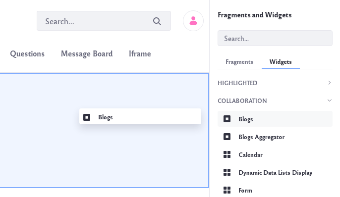

# Displaying Blogs

The *Blogs* app in Site Administration lets you [add](adding-blog-entries.md), [manage](managing-blog-entries.md), and [configure](configuring-the-blogs-app.md) your Site’s blogs. You can then display those blogs by adding a separate *Blogs* widget to a page. Adding the *Blogs* widget to a Site page creates a shared blog for site members. Adding the widget to a user’s personal site (dashboard) creates a blog just for that user. The widget works the same way in both cases. 

Follow these steps to add a Blogs widget to a page:

1. Navigate to an existing page where you wish to add the *Blogs* widget. Click on the *Add App* icon () at the top of the page.

    Or [create a new page](../../site-building/creating-pages/adding-pages.md) on which to add the widget.

1. The *Blogs* widget is found under the Collaboration section of the list of widgets. It can also be found by searching for *Blogs*. Drag the widget onto your page.

    

    By default, the Blogs widget lists abstracts of the site’s recent blog entries. The listing shows each entry’s cover image prominently. Each abstract in the listing also shows the number of comments, thumbs up/down ratings, and links to share the entry on Twitter, Facebook, LinkedIn, and other social networking sites. Clicking a blog entry lets you view its full content, where you can also comment on the entry.

1. There are several display options that let you configure the listing to look the way you want. To configure the widget, click the Options icon ()  in its title bar and select Configuration. The display settings are in the Setup tab:

    

    * **Enable Ratings**: Enable whether readers can rate blog entries.

    * **Enable Comments**: Enable whether readers can comment on blog entries.

    * **Show View Count**: Enable whether to show the number views for each entry.

    * **Social Bookmarks**: The social networking sites that users can share blog entries with. Only those in the *Current* column are displayed via the share buttons on each blog entry. To move social networking sites between the *Current* and *Available* columns, select the sites and use the arrows between those columns. Similarly, use the up/down arrows beneath the Current column to reorder the sites as they appear on each blog entry. 

    * **Display Style**: The display style for social bookmarks. *Inline* is the default and displays the social bookmark icons in a row. *Menu* hides them inside a single share menu.

    * **Maximum Items to Display**: The total number of blog entries to display on the initial page. You can select up to 60 to display at once.

    * **Display Template**: The overall appearance of blog entries in the listing. You can also choose the following:

        * **Abstract**: Displays an abstract of each blog entry.
        * **Full Content**: Displays the full content of each blog entry.
        * **Title**: Displays only the title of each blog entry.
        * **Basic**: A stripped-down version of the Abstract, with less text and no cover image.
        * **Card**: Displays each blog entry in a card-like rectangle that shows the cover image, title, author, post date, and a few lines of text. The card display template makes your blog posts look like fun little trading cards.

            

        To select a different application display template (ADT) or create your own, click *Manage Templates*. 

    * **Enable Report Inappropriate Content**: Enable whether to let users flag content as inappropriate, which sends an email to administrators.

    * **Enable Ratings for Comments**: Enable whether to let readers rate blog entry comments.

    * **Show Related Assets**: Enable whether to display related content from other apps/widgets in blog entries.

    There are also other tabs in *Configuration*:

    **Communication**: Lists public render parameters the widget publishes to other widgets on the page. Other apps/widgets can read and take actions on these. For each shared parameter, you can specify whether to allow communication using the parameter and select which incoming parameter can populate it.

    **Sharing**: Embed the widget instance as a widget on any website, Facebook, Netvibes, or as an OpenSocial Gadget.

    **Scope**: Specify the blog instance the widget displays: the current site’s blog (default), the global blog, or the page’s blog. 

1. When you finish setting the options, click *Save* and then close the dialog box.