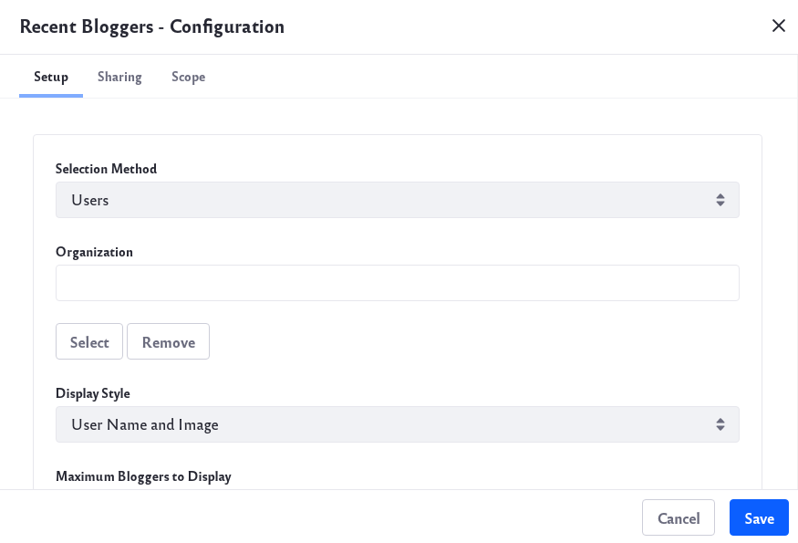

# Highlighting Recent Bloggers

You can use the *Recent Bloggers* widget to highlight the work of your most recent blog authors. This widget lists each recent author's name, profile picture, and number of posts. 

To configure the widget, click _Options_ () &rarr; _Configuration_.

## Setup

The Setup tab contains these options:

**Selection Method:** Set how the widget selects blog authors to highlight. You can choose *Users* or *Scope*. If you select Users, the widget aggregates every recent blogger on your system. To refine the aggregation, you can filter the Users by selecting an Organization. If you select Scope, the widget aggregates the recent bloggers in the current scope. This limits the entries to members of the Site or Organization where the widget resides.

**Organization:** Select the Organization whose recent bloggers you want to aggregate.

**Display Style:** Select how the widget displays recent bloggers: *User Name and Image* or *User Name*.

**Maximum Bloggers to Display:** Select the maximum number of recent bloggers the widget displays.

## Sharing

Embed the widget instance as a widget on any website, Facebook, Netvibes, or as an OpenSocial Gadget.

## Scope

Specify the blog instance the widget displays: the current Site's blog (default), the global blog, or the page's blog.

When you’re finished setting the options, click *Save*. Then close the dialog box.
