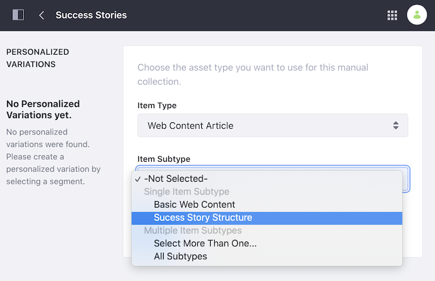
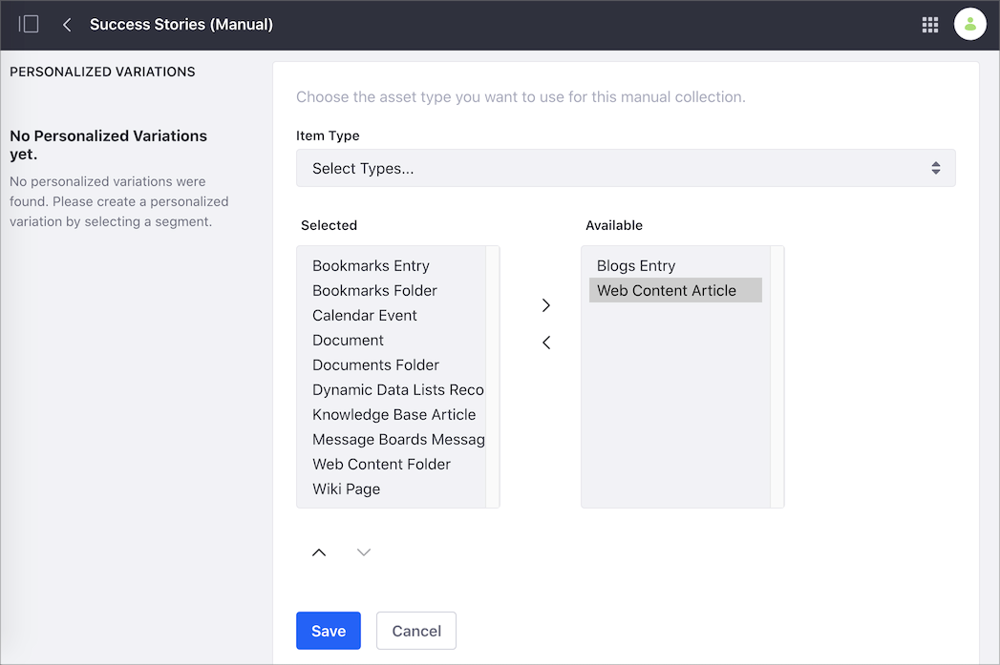
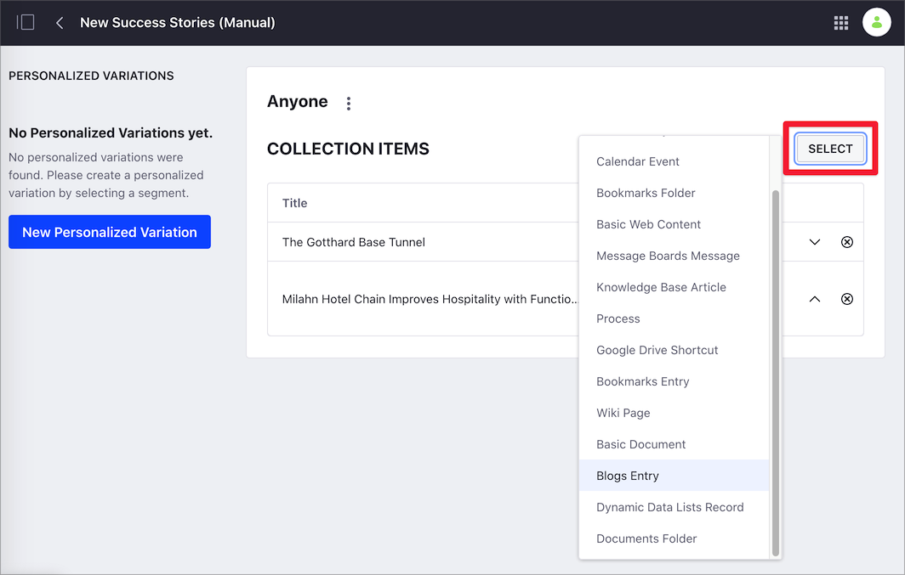
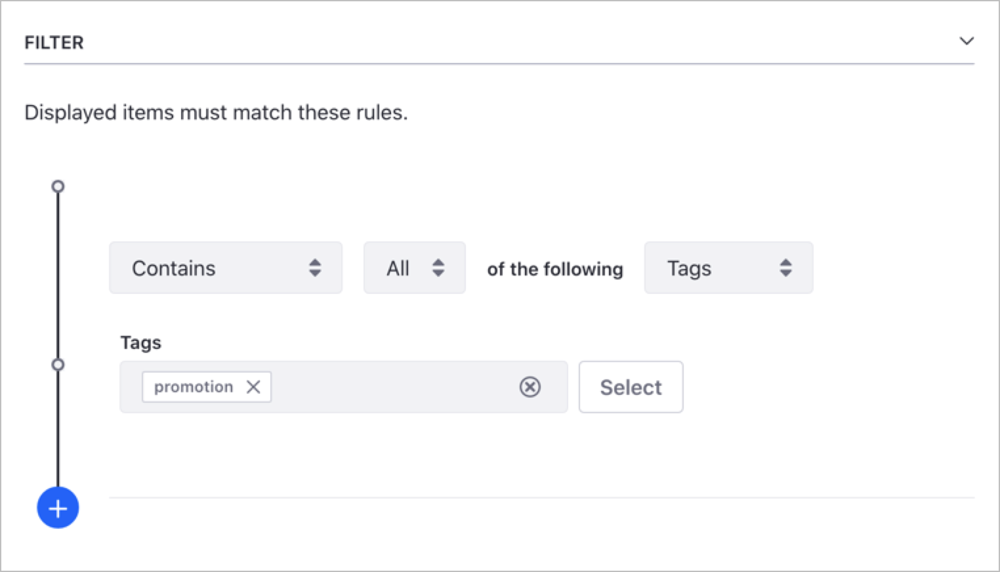
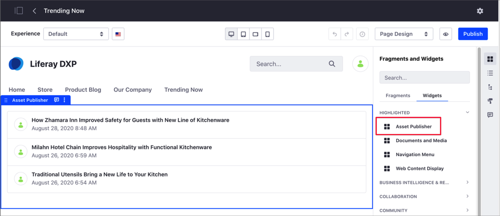
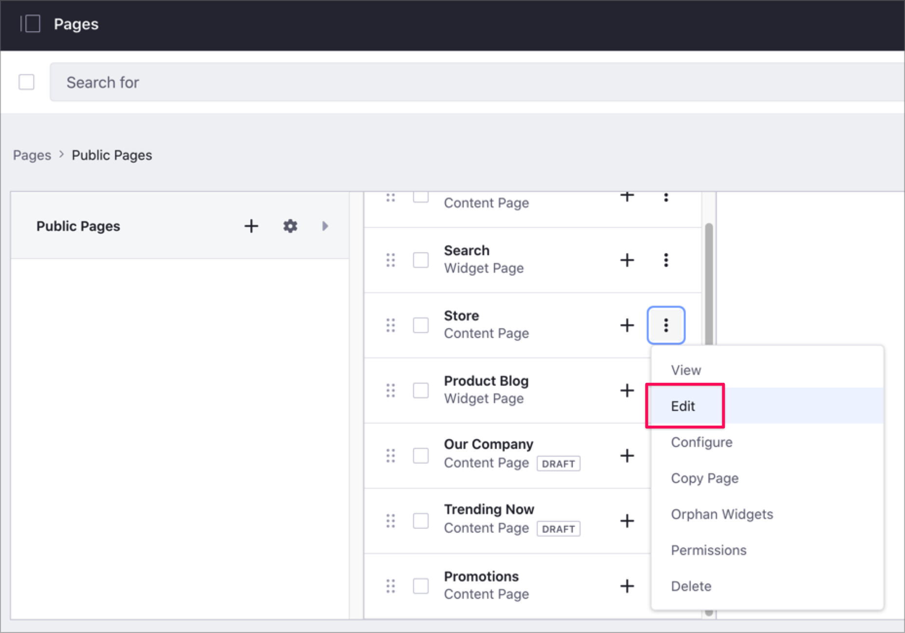
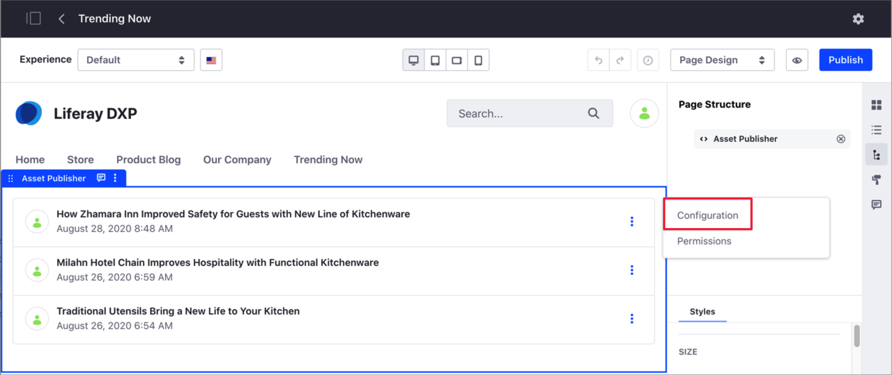
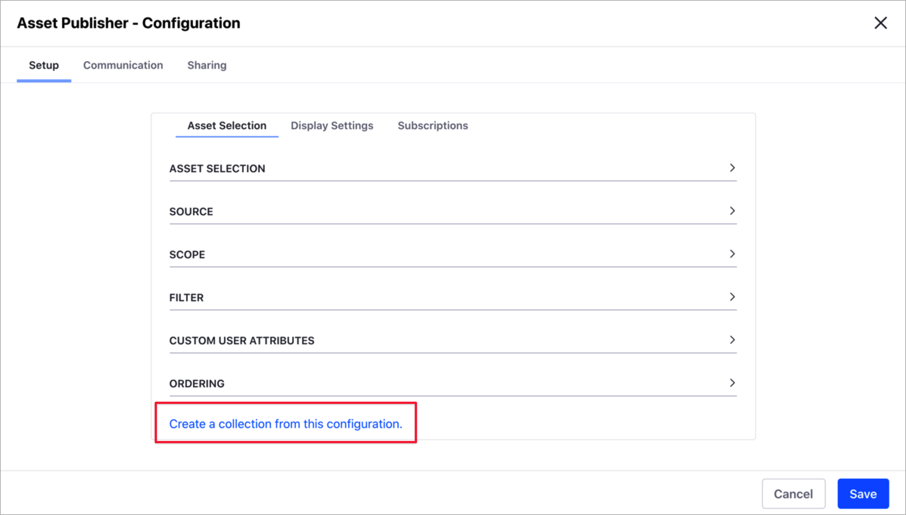

# Creating Collections

You can create *Manual* or *Dynamic* Collections. For more information, see [About Collections and Collection Pages](./about-collections-and-collection-pages.md).

## Creating a Manual Collection

1. Go to *Site Administration* &rarr; *Site Builder* &rarr; *Collections*.
1. Click on the *New* button () and select *Manual Collection*.
1. Add a *Title* for your Manual Collection and click *Save*.
1. In the *Item Type* drop-down menu, select the item type you want to include in the Collection.
    - If you want to include only one item type:

        1. Select the type under *Single Item Type*.
        1. Optionally, if your *Item Type* includes a subtype, select this in the *Item Subtype* drop-down menu.
        1. Click *Save*.

        

    - If you want to include more than one item type:

        1. Select *Select Types* under *Multiple Item Types*.
        1. In the dual list box, add or remove the item types you want to include in your collection.

        

1. Click *Save*.
1. Click *Select* next to *Collection Items* and select the item type to include.

    

1. In the selection dialog, check the items you want to include.
1. Click *Add*.
1. If your Manual Collection includes more than one item type, repeat steps 6 to 8.

## Creating a Dynamic Collection

1. Go to *Site Administration* &rarr; *Site Builder* &rarr; *Collections*.
1. Click on the *New* button () and select *Dynamic Collection*.
1. Add a *Title* for your Manual Collection and click *Save*.
1. In the *Item Type* drop-down menu, select the item type you want to include in the Collection.
    - If you want to include only one item type:

        1. Select the type under *Single Item Type*.
        1. Optionally, if your *Item Type* includes a subtype, select this in the *Item Subtype* drop-down menu.
        1. To filter you *Item Subtype* by a specific field, enable the *Filter by Field* switch, click *Select*, choose the field, and click *Apply*.
        1. Click *Save*.

        

    - If you want to include more than one item type:

        1. Select *Select Types* under *Multiple Item Types*.
        1. In the dual list box, add or remove the item types you want to include in your collection.

        

1. Configure the criteria for your Dynamic Collection, based on *Scope*, *Filter*, *Content Recommendation*, or *Ordering*

    - *Scope* - Define the source of items in your Dynamic Collection. By default, the source is the current site.
    - *Filter* - Configure the rules for the items in the Dynamic Collections. For example, you may want the collection to include only items with the "Promotion" tag.

    

        ```tip::
           You can add multiple rules to your Filter clicking on the Add button. The final content in the Dynamic Collection is the result of adding all the rules. 
        ```

    - *Content Recommendation* - Enable this option to display content based on user behavior. For more information, see [Configuring Content Recommendations](../site-building/displaying-content/configuring-content-recommendations.md).
    - *Ordering* - Items in the collection appear using the order criteria you define here.

1. Click *Save*.

## Creating a Collection from an Asset Publisher 

You can create a new Collection from an Asset Publisher widget. This is useful when you have an Asset Publisher customization that you want to use as a Collection.



1. Go to *Site Administration* &rarr; *Site Builder* &rarr; *Pages*.
1. Click the *Actions* button () next to the page that contains the Asset Publisher and select *Edit*.

    

1. Hover over the Asset Publisher, click the *Options* icon () in the widget's menu, and select *Configuration*.

    

1. In the *Asset Publisher - Configuration* dialog, click the *Setup* tab and *Asset Selection* sub-tab.
1. Scroll down and click on the *Create a Collection from this Configuration* link.

    

1. Enter the *Title* for your Collection and click *Save*.
1. Close the *Asset Publisher - Configuration* dialog.
1. Find your new Collection in *Site Administration* &rarr; *Site Builder* &rarr; *Collections*.

## Related Information

- [About Collections and Collection Pages](./about-collections-and-collection-pages.md)
- [Displaying Collections and Collection Pages](./displaying-collections-and-collection-pages.md)
- [Customizing Collections Using Segments](./customizing-collections-using-segments.md)

