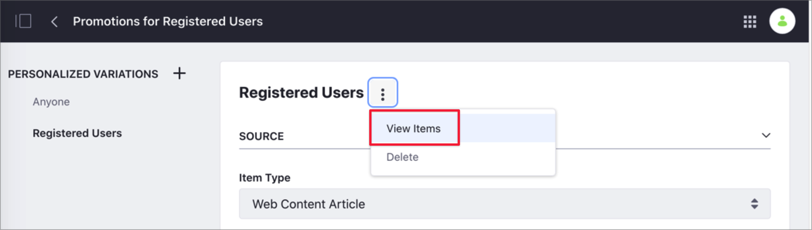

# Customizing Collections Using Segments

By default, all the items in a Collection are visible for all users and assigned to the *Anyone* group. However, you can create a *Personalized Variation* of these items using Segments. When you use a Personalized Variation, the items that are part of your Collection don't change, but the items shown are filtered for your Segment.


Consider the following example. You want to increase the number of sales in your online Kitchenware Store by offering exclusive promotions to registered users. You create a Collection including news about your products and promotions for registered users. You want all users to see the news about your products, but you want to restrict the promotions to users who have already signed up on your website. In this case, you can create a new Segment for users that have signed up on your website, and associate your Collection to this Segment using a new Personalized Variation.

```note::
   To customize a Collection using Segments, you must define your Segments first. For more information, see [Creating and Managing User Segments](../../site-building/personalizing-site-experience/segmentation/creating-and-managing-user-segments.md)
```

To Customize a Collection:

1. Go to *Site Administration* &rarr; *Site Builder* &rarr; *Collections*.
1. From the *Collections* tab, click the Options menu () next to the Collection you want to customize and select *Edit*.

    

1. Under *Personalized Variations*, click *New Personalized Variation*.
1. In the *New Personalized Variation* dialog, click the Segment you want to associate to the Collection.
1. Configure the properties for your Collection. For example, if you want this Personalized Variation to include only web content with the tag "Promotion", set this tag as a filter. For information on how to configure these properties, see [Creating Collections](./creating-collections.md#creating-a-dynamic-collection).
1. Click *Save*.
1. To preview the items that are part of this collection, click the Options menu () next to the Personalized Variation's name.

    

```note::
   You can create multiple Personalized Variations for a Collection, and edit or delete them as needed. You can also edit the Anyone Personalized Variation, but you cannot delete it.
```

## Related Information

* [About Collections and Collection Pages](./about-collections-and-collection-pages.md)
* [Creating Collections](./creating-collections.md)
* [Displaying Collections and Collection Pages](./displaying-collections-and-collection-pages.md)
