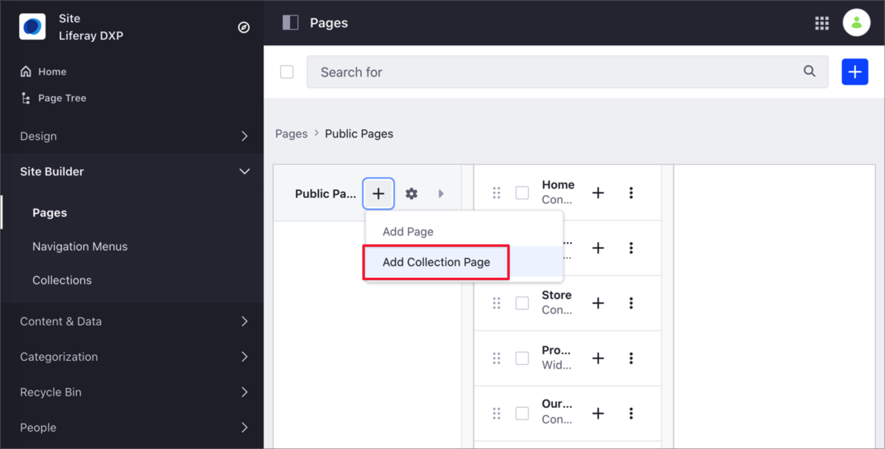
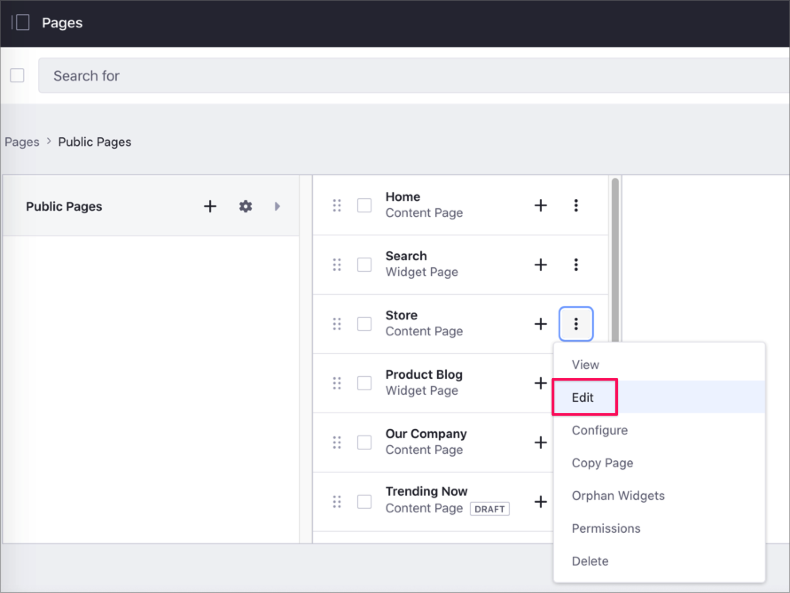
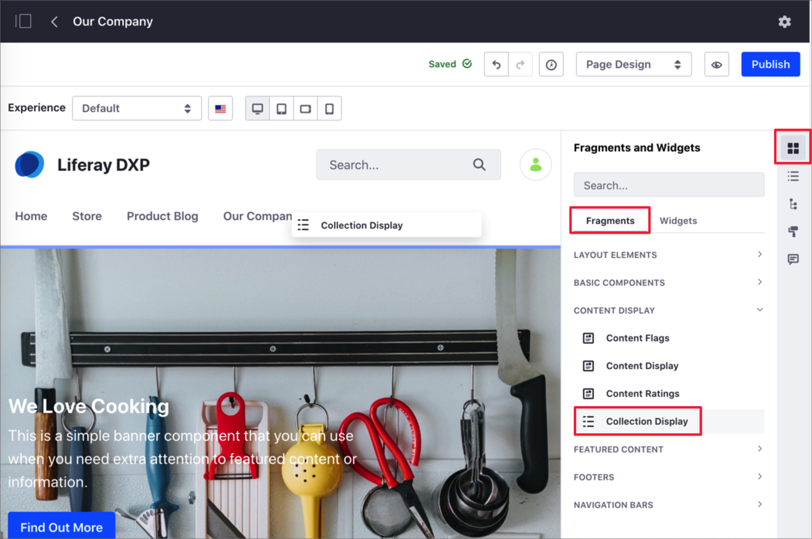
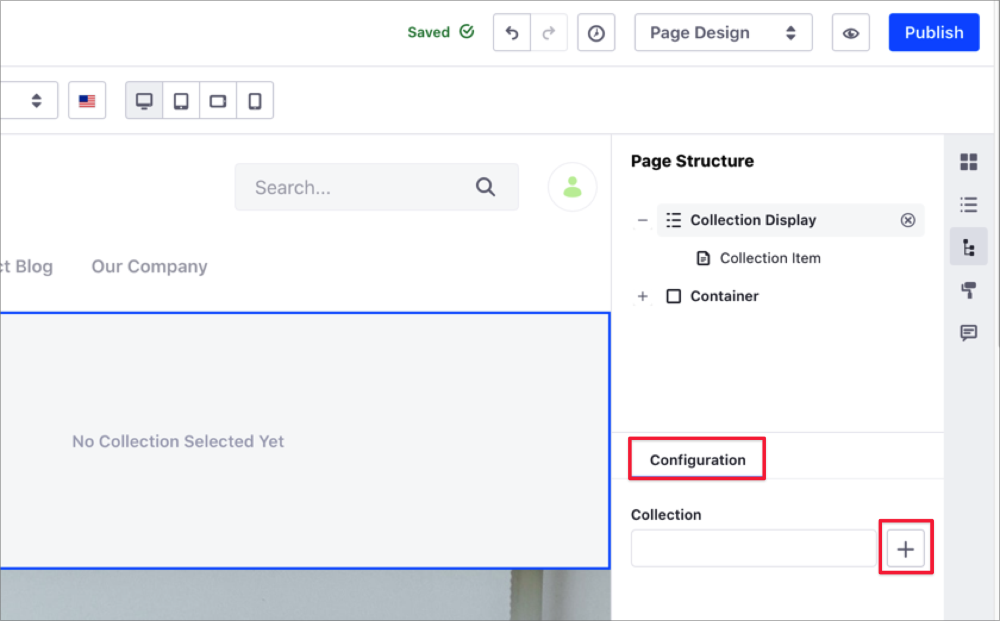
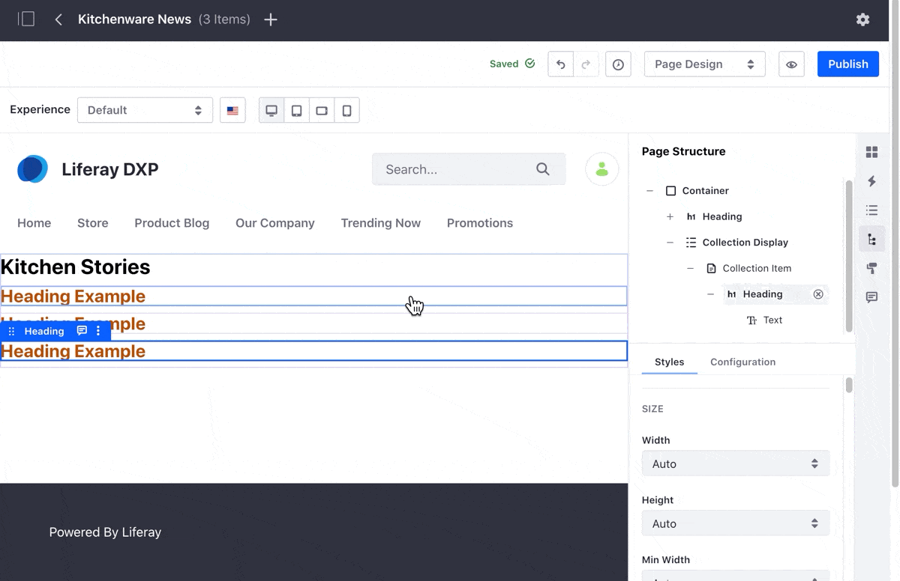

# Displaying Collections

You can display a Collection using a Collection Page or a Collection Display Fragment. For more information about these display options, see [About Collections and Collection Pages](./about-collections-and-collection-pages.md#displaying-collections).

By default, a Collection displays all its items. However, you can create *Personalized Variations* of these items using Segments. For more information, see [Customizing Collections Using Segments](./customizing-collections-using-segments.md).

```note::
   Before displaying a Collection, you must create one. For more information, see [Creating Collections](./creating-collections.md).
```

## Displaying Collections Using a Collection Page

A Collection Page is a type of page where the content is linked to a Collection.

1. Go to *Site Administration* &rarr; *Site Builder* &rarr; *Pages*.
1. Click the *New Page* button () at the level where you want to add the new page, and select *Add Collection Page*.

    

1. From the *Collections* tab, select one of your Collections.
1. Select the *Master Page* you want to use.
1. Enter the *Name* of your Collection Page and click *Add*.
1. To show the Collection, map its content to page elements. See the [Mapping the Collection Items in the Page Editor](#mapping-the-collection-items-in-the-page-editor) section.

## Displaying Collections Using a Collection Display Fragment

A Collection Display Fragment is a type of fragment that shows a Collection in a Content Page.

1. Go to *Site Administration* &rarr; *Site Builder* &rarr; *Pages*.
1. If you want to create a new Content Page to show the Collection Display Fragment, click the *New Page* button () at the level where you want to add the new page, and select *Add Page*.
1. If you want to add the Collection Display Fragment to an existing page, click the *Actions* () button next to the page and select *Edit*.

    

1. Click on the *Fragments and Widgets* () button.
1. In the *Fragments* column, under the *Content Display* section, drag the *Collection Display* fragment onto the page editor.

    

1. Click on the *Collection Display* Fragment to access its *Configuration*.
1. Click on the *Add* () icon next to the *Collection* field.

    

1. Click the *Collection* you want to show on your page.
1. To show the Collection, map its content to page elements. See the [Mapping the Collection Items in the Page Editor](#mapping-the-collection-items-in-the-page-editor) section.

## Mapping the Collection Items in the Page Editor

1. In the Page Editor, click the Collection Display representing your Collection.
1. In the tools sidebar, click the *Fragments and Widgets* () button.
1. From the *Fragments and Widgets* sidebar panel, drag and drop the elements you want to use to show the Collection items.

```note::
   If the Collection contains more than one item, you can drag the Fragment or Widget to any of them. The rest of the items in your Collection will automatically use the same layout settings.
```


1. Click the Fragment or Widget.
1. Click again to access the mapping options.
1. In the *Mapping* column, select the *Field* that you want to map to your Collection.

    

1. Add more Fragments or Widgets as necessary, and map the content to the content Fields.

    

1. Click *Publish* to publish your changes or return to the *Pages* screen to save your page as a draft.

## Viewing Your Collection Usage Through the Site.

You can find how your Collections are being used and displayed in the Site.

1. Go to *Site Administration* &rarr; *Site Builder* &rarr; *Collections*.
1. Under the *Collections* tab, click on the Actions () menu next to the Collection you want to review and select *View Usages*.

    

## Related Information

* [Creating Collections](./creating-collections.md)
* [About Collections and Collection Pages](./about-collections-and-collection-pages.md)
* [Customizing Collections Using Segments](./customizing-collections-using-segments.md)
