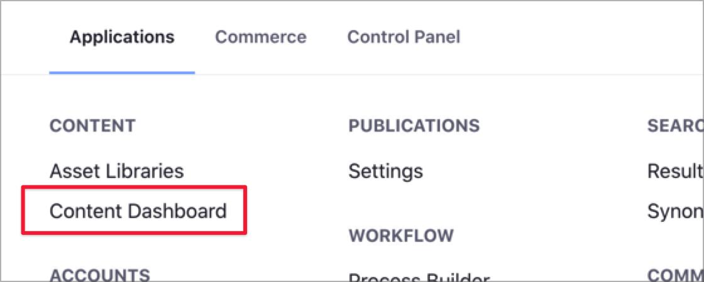
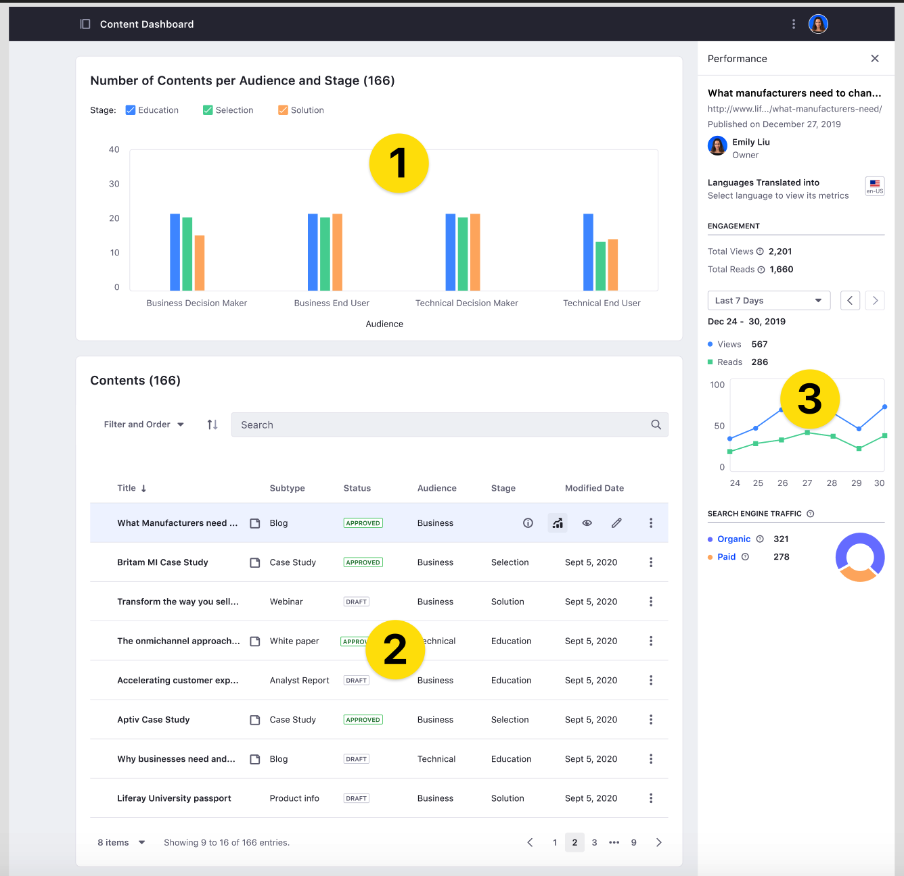

# About the Content Dashboard

> Available: Liferay 7.3+.

The Content Dashboard is a global application for managing your content in Liferay DXP. From the Content Dashboard page, content authors and marketers can access all the content generated across the sites in the Liferay DXP instance, audit this content in the [Content Audit Tool](./content-dashboard-interface.md#the-content-audit-tool), or analyze content performance using the [Content Performance](./content-dashboard-interface.md#the-content-performance-sidebar) sidebar.

Using the Content Dashboard, content authors and marketers can analyze their content in different ways:

- Filter and find content, using built-in or custom filters.
- Analyze the existing content for each audience or phase in the customer journey.
- Audit the content areas with enough content or content gaps to improve the content strategy.
- Gather content performance information, like traffic sources or the number of views and reads along the time.

The Content Dashboard shows information based on the Vocabularies and Categories you assign to the content assets. Liferay provides the *Content* and *Stage* global Vocabularies to work along with the Content Dashboard. To learn about Vocabularies and Categories, see [Organizing Content with Categories and Tags](../tags-and-categories/user-guide/organizing-content-with-categories-and-tags.md). To categorize to your content, see [Defining Categories and Vocabularies for Content](../tags-and-categories/user-guide/defining-categories-and-vocabularies-for-content.md).

## Content Dashboard Components

To access the Content Dashboard, click on the Global Menu and, under the *Content* area, click *Content Dashboard*.



```note::
   If the Global Menu is disabled, open the Product Menu and, under the *Site* Menu, go to *Content* &rarr; *Content Dashboard*.
```

You can access different areas in the Content Dashboard page.



The [Content Audit Tool](./content-dashboard-interface.md#the-content-audit-tool) (1) is the graphical area at the top of the page, showing metrics for the Vocabularies and Categories you define in Liferay DXP. You can include and combine your Vocabularies here, and filter the Categories to analyze your data in different ways.

The [Content List area](./content-dashboard-interface.md#the-content-list-area) (2) shows content across all Sites and Asset Libraries. From here, you can sort and filter your information using built-in or custom filters. The Content Audit Tool chart changes dynamically based on the filters that you set.

From the Content List area, you can access the [Information](./content-dashboard-interface.md#the-information-sidebar) and [Content Performance](content-dashboard-interface.md#the-performance-sidebar) sidebars (3). The Information sidebar provides different metadata for each asset, while the Content Performance sidebar gathers statistics for your content, like the number of reads and views or the traffic sources.

To learn more about the Content Dashboard interface and how to customize the information presented, see the [Content Dashboard Interface](./content-dashboard-interface.md) topic.

## Auditing your Content with the Content Dashboard

Using the Content Performance sidebar in the Content Dashboard, content teams can periodically assess the content strategy execution and adapt this strategy base on quantitative data.

To learn more about how analyze and audit your information quantitatively using the Content Dashboard, see [Analyze Content Performance Using the Content Dashboard](./analyze-content-performance-using-content-dashboard.md).

## Related Information

- [Analyze Content Performance Using the Content Dashboard](./analyze-content-performance-using-content-dashboard.md)
- [Content Dashboard Interface](./content-dashboard-interface.md)
- [Defining Categories and Vocabularies for Content](../tags-and-categories/user-guide/defining-categories-and-vocabularies-for-content.md)
