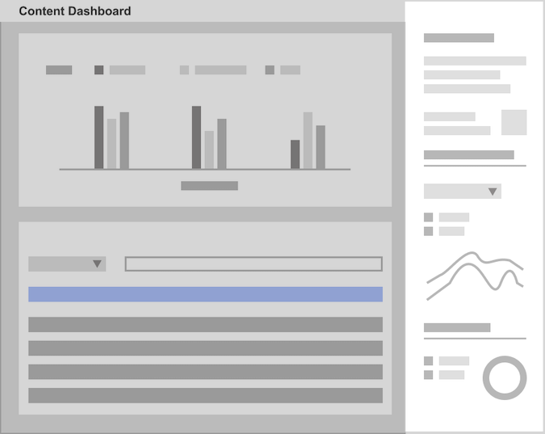
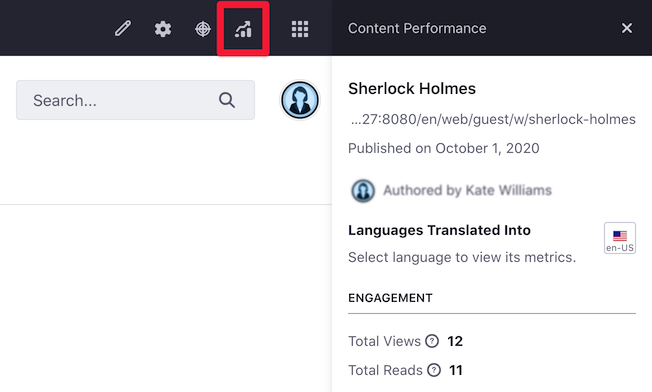
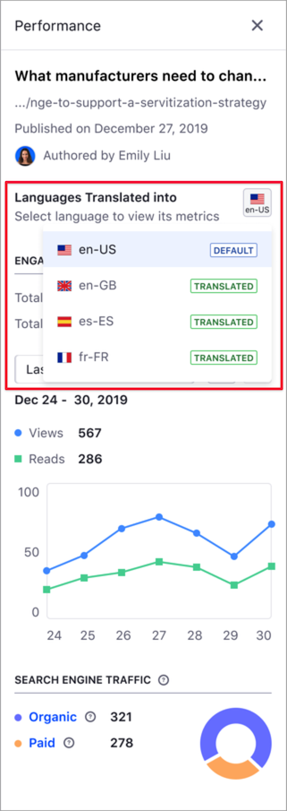
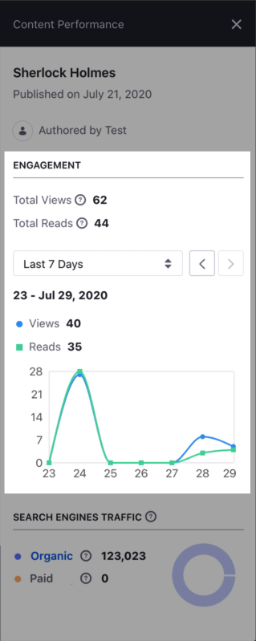
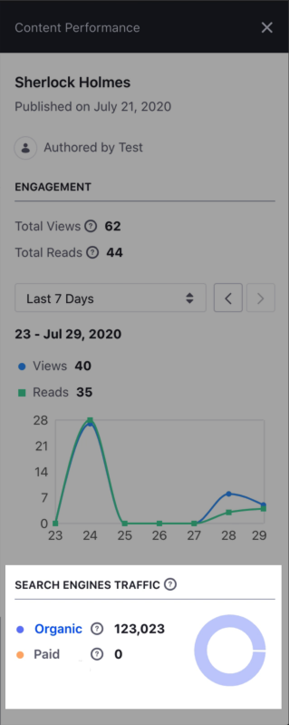
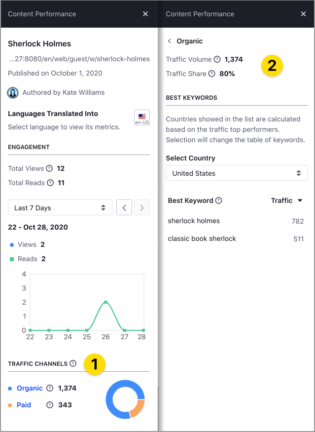

# Analyze Content Metrics Using the Content Performance Tool

> Available: Liferay 7.3+.

You can use the Content Performance tool in the [Content Dashboard](./about-the-content-dashboard.md) to analyze metrics about your content, like the number of reads and views, traffic channels, or keywords driving people to your site. Using the Content Performance sidebar, content teams can periodically assess the content strategy execution and adapt this strategy based on quantitative data.



To access the Content Performance, the following condition should be met:

- You have View and Edit permissions for the content.
- The content is based on a [Display Page Template](../../site-building/displaying-content/using-display-page-templates/displaying-content-with-display-page-templates.md) (denoted by the *Page* () icon).
- The Liferay DXP instance has an active [connection to Liferay Analytics Cloud](https://learn.liferay.com/analytics-cloud/latest/en/getting-started/connecting-data-sources/connecting-liferay-dxp-to-analytics-cloud.html) and your site is synchronized.

To open the Content Performance sidebar:

1. Click the *Actions* menu () next to the content you want to review and select *View Metrics*.
1. Alternatively, hover over the content and click the *View Metrics* () icon.

You can also access the performance metrics outside of the Content Dashboard. The *View Metrics* button is available in view mode for web content when you have permission to edit the web content layout.



When your content is localized in different languages, you can view metrics for each language in the *Languages Translated Into* section. To do so, click on the language icon selector and select the language.

```note::
   The language selector is only available for localized content.
```



The Content Performance sidebar contains two different areas:

- [Engagement](#engagement)
- [Search Engine Traffic](#search-engine-traffic)

## Engagement

This area shows the number of Views and Reads of your content, and how these metrics change over time. Views and Reads are two key values to understand your content performance and discover content insights. A visitor accessing one particular content may or may not read this content. To distinguish the audience that only visit the content (number of Views) from the audience engaging with the content (number of Reads), Liferay uses a specialized algorithm that considers parameters like article length, language, or scroll behavior, among others.



By default, the Engagement area shows the total number of views and reads for the content, along with the number of views and reads in the last seven days. You can change this period in the drop-down time selector, and analyze trends over time using the backward and forward buttons ( ). Hover over any part of the line chart to show the Views and Reads for a specific time.

```note::
   If the Engagement chart shows a zero value for a certain period, it means that the information could not be collected or analyzed for that period.
```

## Search Engine Traffic

This part of the Content Performance sidebar provides information about the sources driving web traffic to your content. The sources can be:

- **Organic** --- People finding the content through a search engine.
- **Paid** --- People finding the content through paid keywords.

    

You can click the sources in the graphic (1) to access additional metrics about these sources (2), or filter the information by country. The following table describes these metrics:

| Label | Description |
| --- | --- |
| Traffic Volume | The estimated number of visitors to your page. |
| Traffic Share | Percentage of traffic you content receives from the traffic source. |
| Best Keyword | Top five keywords driving traffic through organic search |
| Best Paid Keyword |Top five keywords driving traffic through paid search. |

```note::
   Keywords are one or more words that people use to find content.
```



## Related Information

- [About the Content Dashboard](./about-the-content-dashboard.md)
- [Content Dashboard Interface](./content-dashboard-interface.md)
- [Defining Categories and Vocabularies for Content](../tags-and-categories/user-guide/defining-categories-and-vocabularies-for-content.md)