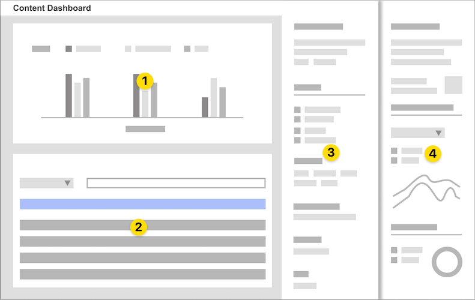
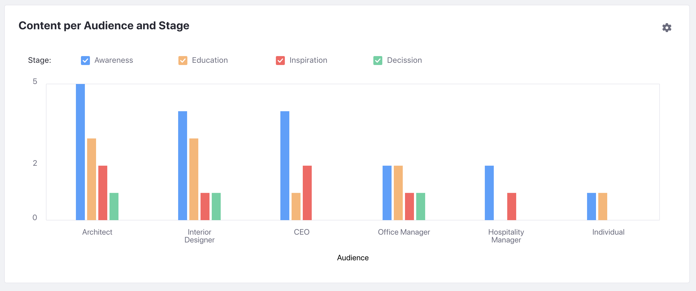
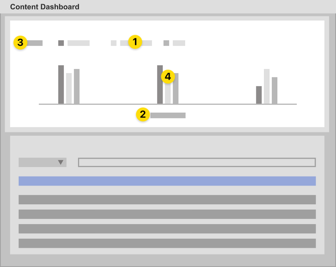
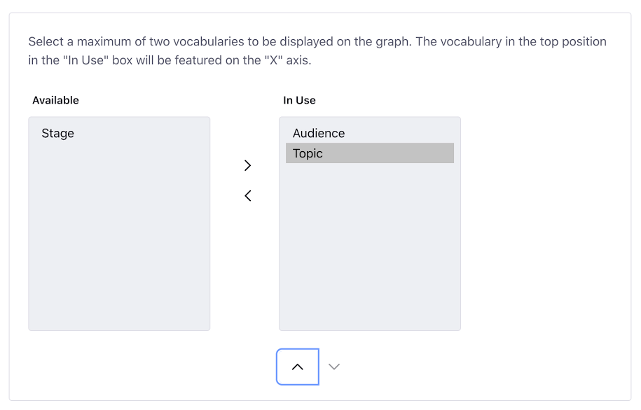
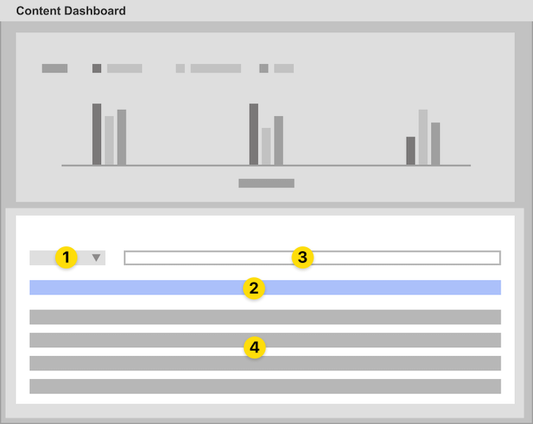
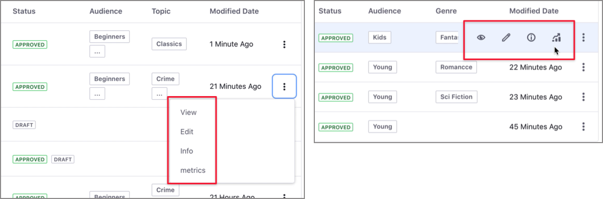
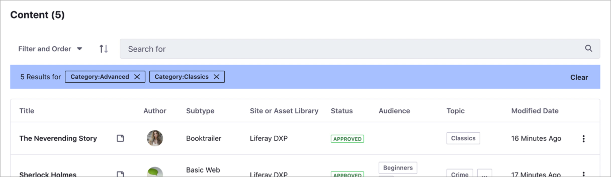
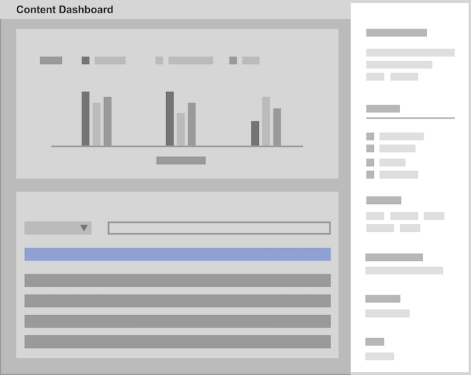
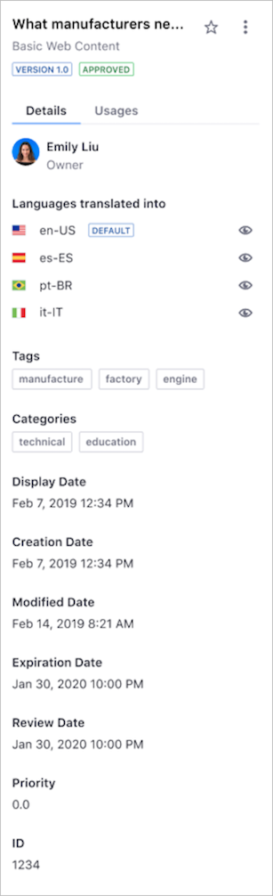
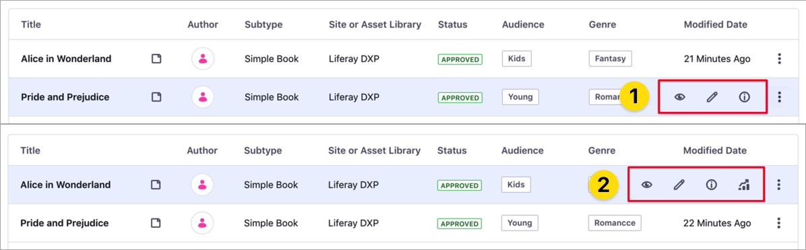

# Content Dashboard Interface

> Available: Liferay 7.3+.

In the Content Dashboard interface, you can find the following areas:

- [Content Audit Tool](#content-audit-tool) (1)
- [Contents list](#contents-list) (2)
- [Information sidebar](#information-sidebar) (3)
- [Content Performance sidebar](#content-performance-sidebar) (4)



When you [open the Content Dashboard](#opening-the-content-dashboard) page, you can see the [Content Audit Tool](#content-audit-tool) at the top of the page and the [Contents list](#contents-list) at the button. From the Contents list, you can access the [Information](#information-sidebar) and [Content Performance](#content-performance-sidebar) sidebars. These sidebars are collapsable elements that show additional information for each item in the Contents List.

To access the Information or Performance sidebar, click the Actions Menu () for the content and select the *Info* or *Metrics* option. Alternatively, hover over the article and use the *Info* () or *Metrics* () buttons.

```important::
   To access the metrics for your content in the Performance panel, you must connect the Liferay DXP instance with Liferay Analytics Cloud and synchronize your content. To learn more, see [Connecting Liferay DXP to Analytics Cloud](https://learn.liferay.com/analytics-cloud/latest/en/getting-started/connecting-data-sources/connecting-liferay-dxp-to-analytics-cloud.html).
```

## Opening the Content Dashboard

1. Click on the Global Menu and, under the *Content* area, click *Content Dashboard*.
1. If the Global Menu is disabled, open the Product Menu and, under the *Site* Menu, go to *Content* &rarr; *Content Dashboard*.

    

## Content Audit Tool

This tool is the graphical area at the top of the Content Dashboard page. The chart on this area represents the total number of assets for the combination of categories in the global Vocabularies you select. This chart takes into account:

- Web content articles exclusively, across all Sites and Asset Libraries.
- Web content you have access to.
- The existing [filters](#filtering-and-sorting-content-in-the-contents-list) in the [Contents list](#contents-list).
- A maximum of two global Vocabularies (for the *x* and *y* axis.)



```tip::
   If the Content Audit Tool doesn't show the expected chart, [verify your Categories](../tags-and-categories/user-guide/defining-categories-and-vocabularies-for-content.md) for the global Vocabularies and ensure that [your content is categorized](../tags-and-categories/user-guide/organizing-content-with-categories-and-tags.md).
```

In the Content Audit Tool interface you can find:

- Chart legend (1)
- *X*-axis Categories for the first global Vocabulary (2)
- *Y*-axis Categories for the second global Vocabulary (3)
- Bar chart (4)



### Customizing the Vocabularies and Categories in the Content Audit Tool

By default, the bar chart shows the total number of assets for each Category in the selected global Vocabularies, but you can filter this information in different ways:

- Using the [filters](#filtering-and-sorting-content-in-the-contents-list) in the [Contents list](#contents-list).
- Filtering categories in the chart, by clicking the Category name in the chart legend.
- Changing the Vocabularies.

To change the Vocabularies:

1. Click on the *Actions* menu () in the Content Audit area.
1. In the dual listbox, click the Vocabulary in the *Available* or *In Use* lists and click the selection buttons ( ) to add or remove the Vocabularies you want to show.
1. Click the *Up* () and *Down* () buttons to order of the Vocabularies in the chart axis.
1. Click *Save*.

    

```note::
   You can use a maximum of two Vocabularies defined at the Global Site level.
```

## Contents List

By default, this area shows all the content you have access to, across all sites and Asset Libraries. From here, you can sort and filter this content using built-in or custom filters. The Content Audit Tool chart changes dynamically based on the filters that you set.

In the Contents list you can find the following elements:

- Filter and Sort selector (1)
- Filter editor (2)
- Search field (3)
- List of contents (4)



In the list of contents, you can find the following columns:

| Column | Description |
| --- | --- |
| Title | Article title. When the article is based on a [Display Page Template](../../site-building/displaying-content/using-display-page-templates/displaying-content-with-display-page-templates.md) (*). |
| Author | Author's name. |
| Subtype | Article's [Subcategory](../tags-and-categories/user-guide/defining-categories-and-vocabularies-for-content.md#creating-subcategories). |
| Site or Asset Library | Location of the article in the Liferay DXP instance. |
| Status | Article workflow status. Articles with more than one version in different statuses show all than statuses. |
| *First Vocabulary* | This is the first Vocabulary in the Content Audit Tool. |
| *Second Vocabulary* | The optional second Vocabulary in the Content Audit Tool. |
| Topic | Shows one of more Categories from the Topic Vocabulary. |
| Modified Date | Date or time of the last article update. |

(*) The *Page* () icon denotes articles based on a [Display Page Template](../../site-building/displaying-content/using-display-page-templates/displaying-content-with-display-page-templates.md).

For each entry in the Contents list, you can access the following options using the Actions Menu () or hovering over the article and clicking the corresponding option:

- *View* (): Opens the Display Page in view mode.
- *Edit* (): Opens the Display Page in edit mode.
- *Info* (): Opens the [Information sidebar](#information-sidebar).
- *Metrics* (): Opens the [Content Performance sidebar](#the-content-performance-sidebar).

    

```note::
   You can use the *View*, *Information*, and *Metrics* options for content based on a Display Page Template. You can use the *Edit* option when you have Edit permission for the content.
```

### Filtering and Sorting Content in the Contents List

To filter the content:

1. Click the *Filter and Order* drop-down menu.
1. Select one of the predefined filters or a custom filter (denoted by three dots) to create your own filter criteria.
1. Select the content you want to filter by.

The Filter Editor area shows your filters and the total number of results. To remove one or more filters, click the *Close* () button next to the filter's name, or click *Clear* to remove all the filters and reset the Contents list. In addition to the predefined and custom filters, you can search and filter the assets in the Content View using keywords in the Search field.



To sort the content:

1. Click the *Filter and Order* drop-down menu.
1. Under the *Order By* section, select the order for the items.

```note::
   Whe you close the Content Dashboard page, the default filter and sorting option are set again.
```

## Information Sidebar

This sidebar provides access to different metadata for the asset selected in the Contents list, including the asset owner, available languages for the content, tags and categories for the asset, or review date.



```note::
   You can open the Information Sidebar for assets with a Content Display Page associated. You can identify these assets in the Contents list by the Page icon next to the asset name.
```

To open the Information sidebar panel:

1. Click the Actions Menu () next to the asset and select *Info*.
1. Alternatively, hover over the asset and click the *Information* () icon.

    

## Content Performance Sidebar

This sidebar shows statistics for your content, like the number of reads and views or the web traffic sources.


You can access the Content Performance sidebar for assets in the Contents list when the following conditions are met:

- You have View and Edit permissions for the web content.
- The content is based on a [Display Page Template](../../site-building/displaying-content/using-display-page-templates/displaying-content-with-display-page-templates.md) (denoted by the *Page* () icon).
- The Liferay DXP instance has an active [connection to Liferay Analytics Cloud](https://learn.liferay.com/analytics-cloud/latest/en/getting-started/connecting-data-sources/connecting-liferay-dxp-to-analytics-cloud.html) and your content is synchronized.

```note::
   The *Metrics* option for your content is available when these conditions are met (2). If the *Metrics* options is missing, one or more conditions are not met (1).
```



To open the Performance sidebar panel:

1. Click the Actions menu () next to the asset and select *Metrics*.
1. Alternatively, hover over the asset and click the *Metrics* () button.

To learn how to analyze your content performance using the Performance area, see [Analyze Content Performance Using the Content Dashboard](./analyze-content-performance-using-content-dashboard.md).

## Related Information

- [About the Content Dashboard](./about-the-content-dashboard.md)
- [Analyze Content Performance Using the Content Dashboard](./analyze-content-performance-using-content-dashboard.md)
- [Defining Categories and Vocabularies for Content](../tags-and-categories/user-guide/defining-categories-and-vocabularies-for-content.md)