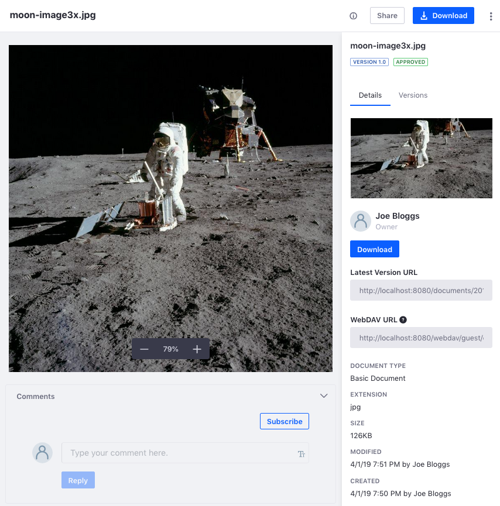
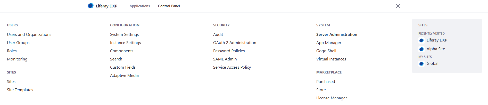
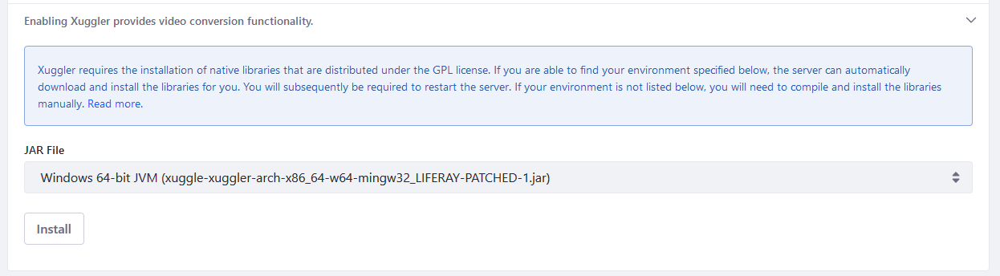
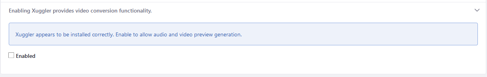

# Configuring Document Previews

File previews help users browse and find media efficiently. To view a preview of a file, click the file's name in the Document Library. If the file is an image, the image appears. If an installed app can render a preview of the file type, a representative image of the file appears (e.g., the opening frame of a video file or a presentation's first slide). If there are no such preview apps for the file, a generic image based on the file type appears.

## File Preview Apps

Whenever possible, DXP generates previews of documents added to the Document Library. Out of the box, Java-based APIs generate previews. The only tool available that is 100% Java and has a compatible license to be distributed with DXP is [PDFBox](https://pdfbox.apache.org).
A separate thread generates a preview for PDFs when uploaded. This process may last only a few seconds for a small file. The larger the file, the longer it takes.

While PDFBox provides a default implementation of image generation for document previews and thumbnails, you must install and configure additional tools to harness the full power of document previews. These tools include

* [OpenOffice](http://www.openoffice.org) or [LibreOffice](http://www.libreoffice.org):
    Either of these in server mode can generate thumbnails and previews for supported file types (`.pdf`, `.docx`, `.odt`, `.ppt`, `.odp`, etc.), view documents in your browser, and convert documents. See [Enabling OpenOffice/LibreOffice Integration](./enabling-openoffice-libreoffice-integration.md) to learn more.

* [ImageMagick](http://www.imagemagick.org) (also requires [Ghostscript](http://www.ghostscript.com)): Enables faster and higher-quality previews and conversions.

* [Xuggler](http://www.xuggle.com/xuggler): Enables audio and video previews, can play audio and video files in your browser, and extracts thumbnails from video files.

After installing these tools, configure them in the Control Panel's Server Administration screen.

## Enabling ImageMagick

1. Navigate to the _Global Menu_ &rarr; _Control Panel_.
1. Click _Server Administration_.

   .

1. Click _External Services_.
1. Enter the Ghostscript and ImageMagick `variables` in the _Path_ field.

   .

1. Check the _Enabled_ box.
1. Click _Save_ when finished.

## Enabling Xuggler

1. Navigate to the _Global Menu_ &rarr; _Control Panel_.
1. Click _Server Administration_.
1. Click _External Services_.
1. Scroll down to the bottom.
1. Select the desired `JAR` file based on your operating system.

   .

1. Click _Install_.
1. Shut down your application server.
1. Start the application server.
1. Navigate back to the _Server Administration_ &rarr; _External Services_.
1. Verify that the success message displays.

   .

1. Check the _Enabled_ box.
1. Click _Save_ when finished.

With these tools installed and configured, Documents and Media can preview content of various types. For example, you can view documents in a viewer page by page. You can also view and play multimedia (audio or video) in your browser's native HTML 5 player. 

## Additional Information

* [Previewing Files](../uploading-and-managing/previewing-files.md)
* [Documents and Media UI Reference](../documents-and-media-ui-reference.md)
