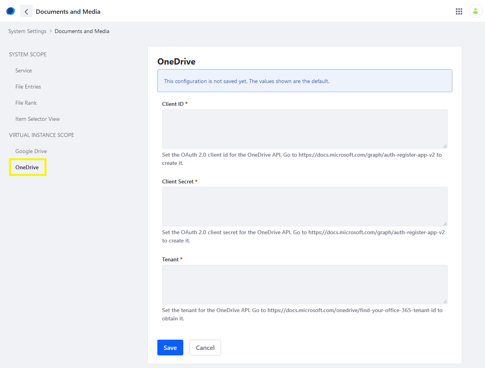
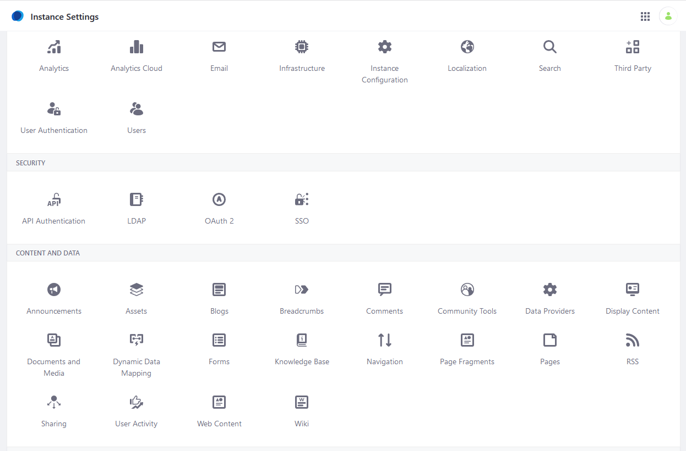
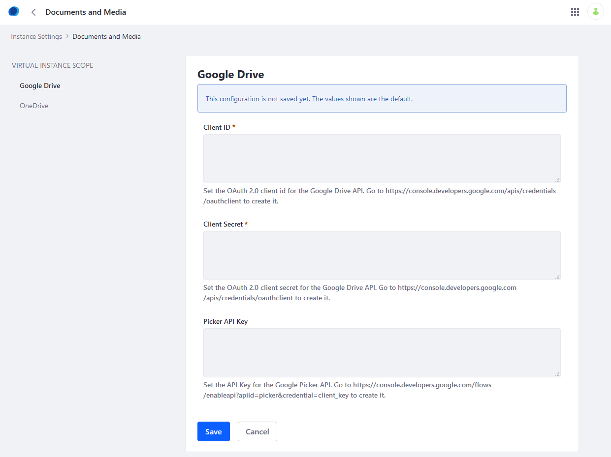

# Enabling Document Creation and Editing with Microsoft Office 365

Before you can use Office 365&trade; to create and edit Documents and Media files, you must configure DXP to connect with an application in the [Azure portal](https://portal.azure.com/). You must have administrator rights to perform the following steps.

## Register an Application with the Microsoft Identity Platform

First, configure your application with the Microsoft identity platform&trade;. To do so, follow the steps described in [Microsoft's documentation](https://docs.microsoft.com/en-gb/graph/auth-register-app-v2).

To construct a URL for the *Redirect URI* parameter, follow this pattern: `https://[hostname]/o/document_library/onedrive/oauth2`

Here's the minimum permission set needed to use Office 365&trade; integration:

* `Files.Read.All`
* `Files.ReadWrite.All`

For more information about permissions, see [Microsoft's documentation](https://docs.microsoft.com/graph/permissions-reference).

## Configuring DXP

Now you must connect your DXP installation with your Microsoft identity platform&trade; application. You can do this at two scopes:

* Globally, for all instances in your DXP installation.
* At the instance scope, for one or more instances in your DXP installation.

You can override the global configuration for one or more instances by configuring those instances separately. Similarly, you can configure only the instances you want to connect to your application and leave the global configuration empty.

### Global Level Configuration

To grant access at the global level:

1. Navigate to the *Control Panel* &rarr; *System Settings* &rarr; *Documents and Media*.

    

1. Click *OneDrive* in the left menu.

    

1. Enter your application's OAuth 2 client ID and client secret in the *Client ID* and *Client Secret* fields, respectively.
1. Enter your tenant ID in the *Tenant* field. To find your tenant ID, see [Microsoft's documentation](https://docs.microsoft.com/onedrive/find-your-office-365-tenant-id).
1. Click *Save*.

Access has been granted at the global level.

### Instance Level Configuration

To grant access at the instance level:

1. Navigate to the *Control Panel* &rarr; *Instance Settings* &rarr; *Documents and Media*.

    

1. Click *OneDrive* in the left navigation menu.

    

1. Enter your application's OAuth 2 client ID and client secret in the *Client ID* and *Client Secret* fields, respectively.
1. Enter your tenant ID in the *Tenant* field. To find your tenant ID, see [Microsoft's documentation](https://docs.microsoft.com/onedrive/find-your-office-365-tenant-id).
1. Click *Save*.

 **Note:** Once enabled, you can disable this feature by deleting the client ID, client secret, and tenant values from the form.

## Additional Information
