# Documents and Media UI Reference

Navigate to the _Site Administration_ &rarr; _Content & Data_ &rarr; _Documents and Media_.

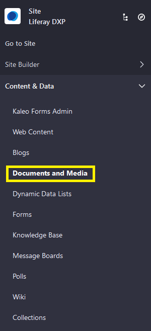

There are three tabs: _Documents and Media_, _Document Types_, and _Metadata Sets_.

## Documents and Media Tab

The _Documents and Media_ Tab's Home screen displays the selected Site's folders and documents. This is the Root folder. Here, users can upload a single document or multiple documents, add a new folder, add a new Repository (for example, Sharepoint), or a new shortcut.

Click the () to begin using the _Documents and Media_ application.

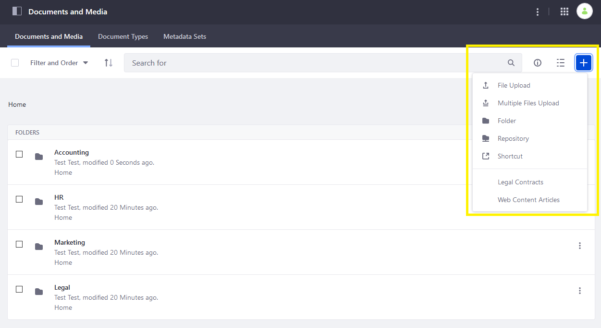

## Document Types Tab

_Document Types_ are made of metadata fields that help define the purpose of Document Library files. They provide additional, searchable information about uploaded documents.

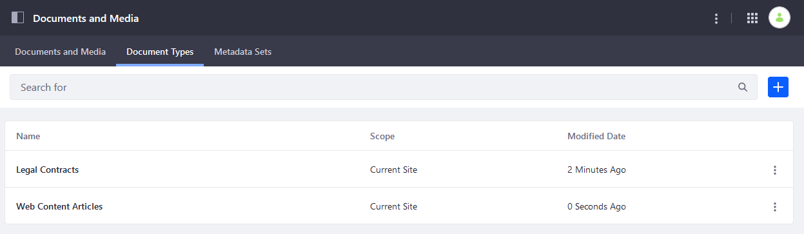

Click the () to create a new Document Type.

To learn more about using Document Types, see [Defining Document Types](./uploading-and-managing/managing-metadata/defining-document-types.md).

## Metadata Set Tab

Metadata Sets are groups of fields that can be added to Document Types.

Metadata Sets can be grouped in a hierarchy and can become the foundation of another metadata set (an *extension*). A child metadata set is displayed on the same level as the parent.

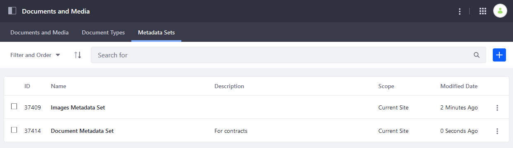

Click the () to create a new Metadata Set.

To learn more about Metadata Sets, see [Using Metadata Sets](./uploading-and-managing/managing-metadata/using-metadata-sets.md).

## Documents and Media Settings

You can access the application's settings from any of the three tabs by clicking the () to access the _Options_ menu.

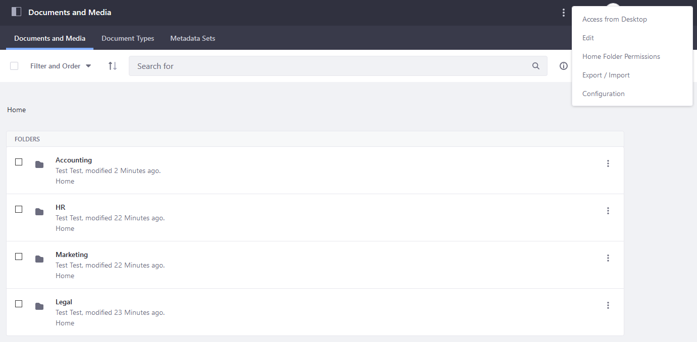

### Access from Desktop

Users can access their _Documents and Media_ repository in their file explorer on their desktop using WebDAV. Click on _Access from Desktop_ to generate the WebDAV URL.

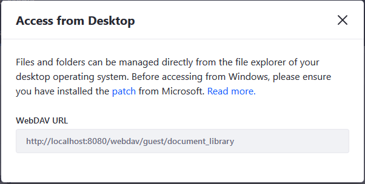

### Edit

Users can enable or disable [Workflow](../../process-automation/workflow/using-workflows/activating-workflow.md) for all Document Types. To learn more about Workflows in general, see [Introduction to Workflow](../../process-automation/workflow/introduction-to-workflow.md).

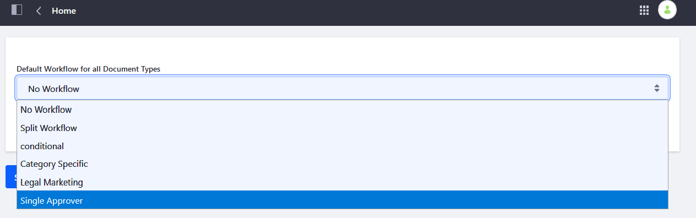

Workflows for Documents and Media are managed only here.

### Home Folder Permissions

Users can manage the permissions for the _Documents and Media_ Home folder.

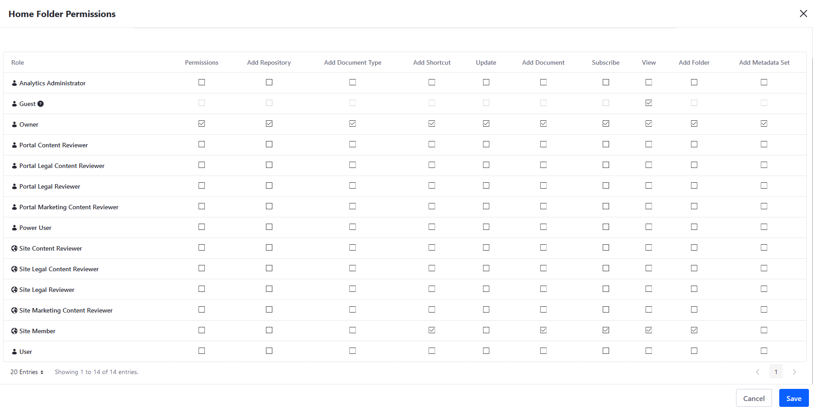

See [Understanding Roles and Permissions](../../users-and-permissions/roles-and-permissions/understanding-roles-and-permissions.md) to learn more.

### Export/ Import

You can [Export or Import](../../site-building/building-sites/importing-exporting-pages-and-content.md) Documents and Media `LAR` (Liferay Archive) files. There are two primary places Export/Import is used: Sites and apps. Here, you can export the contents of your DM application or import an existing one.

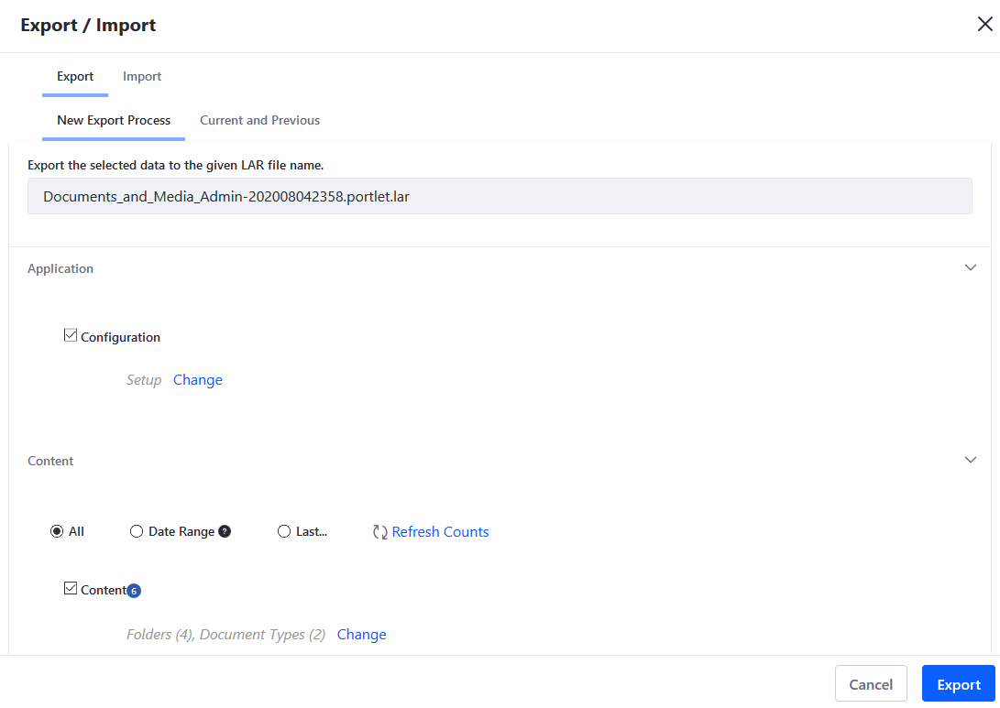

### Configuration

Users can configure their DM email notifications settings on the _Configuration_ menu. See [Connecting to a Mail Server](../../installation-and-upgrades/setting-up-liferay-dxp-configuring-mail/connecting-to-a-mail-server.md) to set up a mail server first.

Users can use the _Definition of Terms_: placeholders that parse information such as the system administrator, the recipient, and the name of the document.

#### Email From Tab

Users can enter a name and email address.

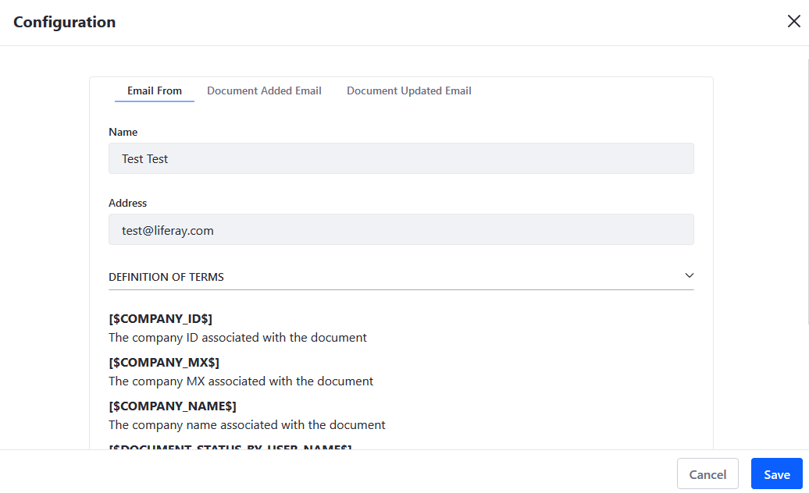

#### Document Added Email

If a new document has been added, this is the email notification sent to the desired persons.

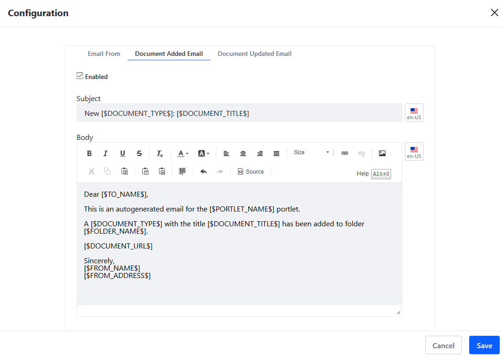

#### Document Updated Email

If an existing document has been updated, this is the email notification sent to the desired persons.

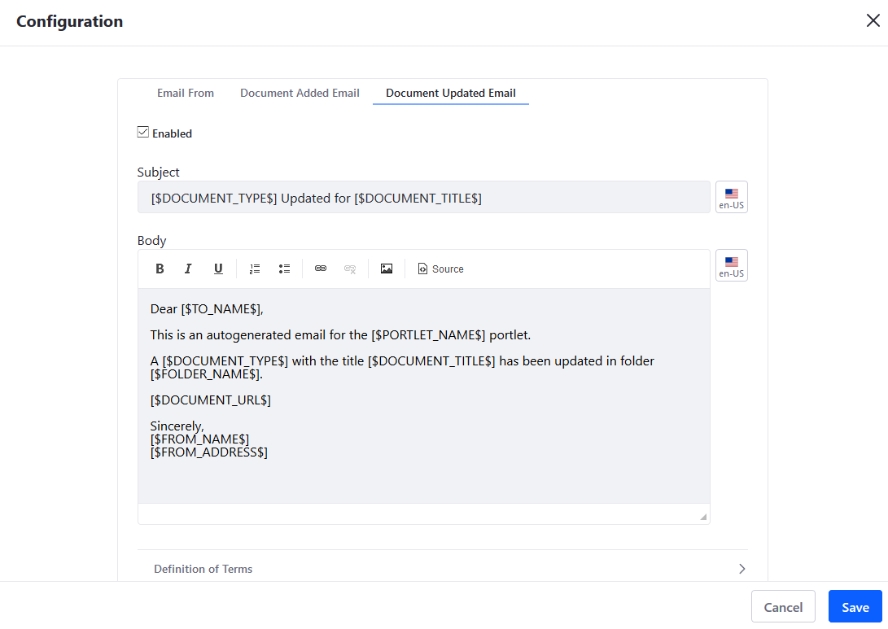

## Additional Information

* [Sharing Documents and Media](./sharing-documents-and-media.md)
* [Importing/Exporting Sites and Contents](../../site-building/building-sites/importing-exporting-pages-and-content.md)
