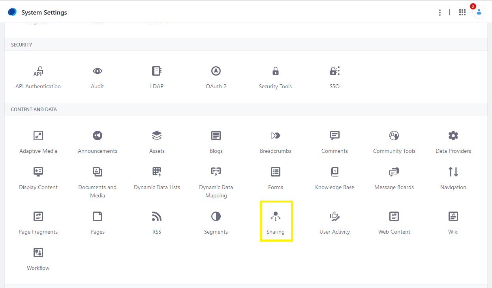
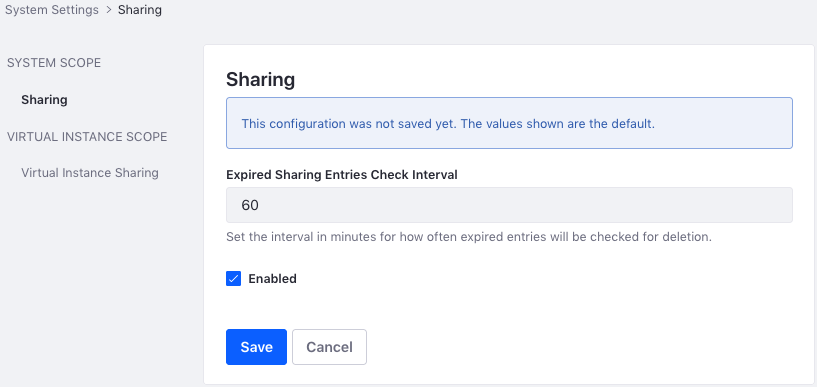
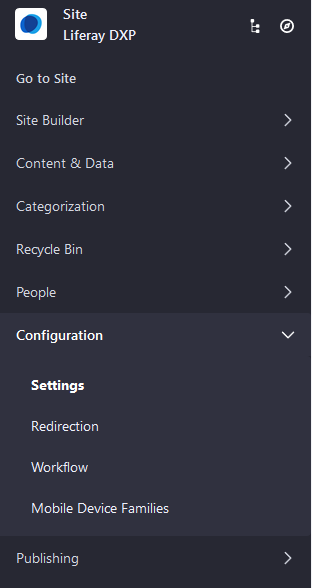
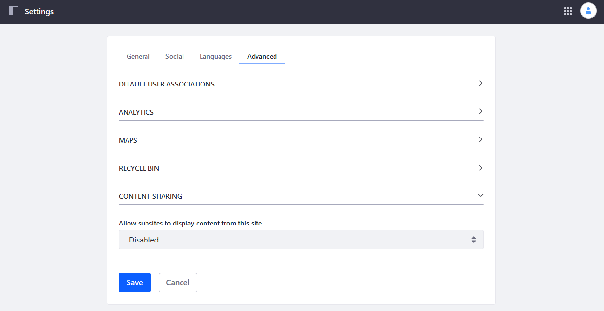

# Enabling and Configuring Sharing

You can choose to enable [file sharing](./sharing-documents-with-other-users.md) at the global, instance, and Site levels.

## Global Configuration

Sharing is enabled globally by default. 

1. Click the _Application Menu_ &rarr; _Control Panel_.
1. Click _System Settings_.
1. Click _Sharing_ under _Content and Data_.

    

1. Under *SYSTEM SCOPE*, select *Sharing*.
1. Enter the following values:

    * **Expired Sharing Entries Check Interval:** The interval in minutes for how often expired sharing entries are checked for deletion.

    * **Enabled:** Whether sharing is enabled globally.

   

1. Click _Save_ when finished.

When sharing is enabled globally, it is also enabled by default for all portal instances. You can disable this feature so that sharing is enabled on a per-instance basis: 

1. Click _Sharing_ under _Virtual Instance Scope_.
1. Check or uncheck the _Enabled_ box.
1. Click _Save_ when finished.

Sharing at the Virtual Instance Scope has been configured.

## Instance Configuration

1. Click the _Application Menu_ &rarr; _Control Panel_.
1. Click _Instance Settings_.
1. Click _Sharing_ under _Content and Data_.
1. Select *Sharing* under *VIRTUAL INSTANCE SCOPE*.
1. Check or uncheck the *Enabled* checkbox to enable or disable sharing, respectively.

   

1. Click _Save_ when finished.

## Site Configuration

1. To access the _Site Administration_, open the _Menu_ () and click your Site's name.
1. Click _Configuration_ &rarr; _Settings_.

    

1. Click on the _Advanced_ tab.
1. Expand the _Content Sharing_ section and select the desired option from the dropdown menu.

    

1. Click _Save_ when finished.

## Additional Information

* [Sharing Documents with Other Users](./sharing-documents-with-other-users.md)
