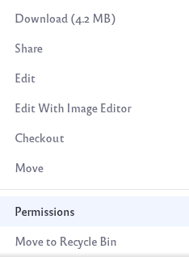
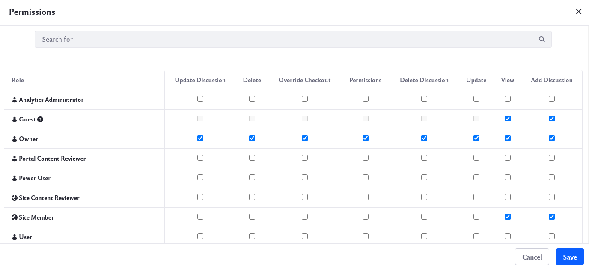
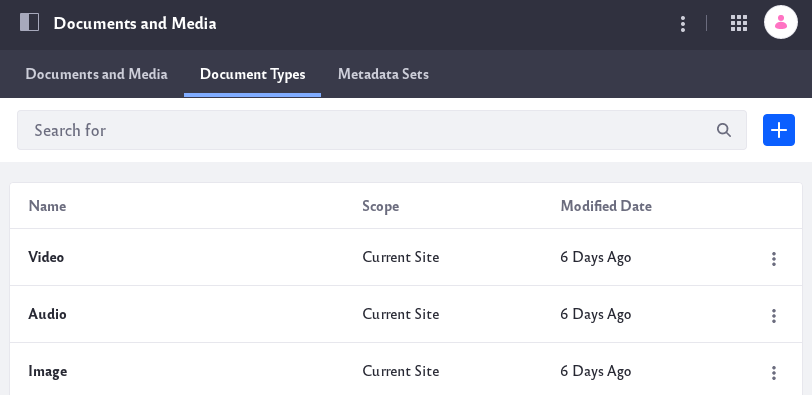
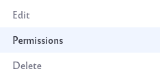

# Permissions and Documents

Liferay DXP gives you different options to set permissions for your documents and media files. You can give permissions to an individual file, to an entire folder, or to a specific file type.

## Permissions for an Individual File

To set permissions for an individual file,

1. Navigate to the *Documents and Media* application. 

1. Locate the file you want to set permissions for. Click on the options icon () and select Permissions.

    

1. Set your desired permissions and click the Save button to save your changes.

    

    Go to the [Roles and Permissions](../../../../users-and-permissions/roles_and_permissions.md) page to learn more about the different roles you can have for your Site.

## Permissions for an Entire Folder

To set permissions for an entire folder,

1. Navigate to the *Documents and Media* application. 

1. Locate the folder you want to set permissions for. If you need a new folder, go to the [Create Folder](../../uploading-and-managing/creating-folders.md) page to learn more about folders. 

    Click on the options icon () and select Permissions.

    

1. Set your desired permissions and click the Save button to save your changes.

    

    Go to the [Roles and Permissions](../../../../users-and-permissions/roles_and_permissions.md) page to learn more about the different roles you can have for your Site.

## Permissions for a Specific File Type

To set permissions for a specific file type,

1. Navigate to the *Documents and Media* application. Click on the *Document Types* tab. 

    

1. Locate the document type you want to set permissions for. If you need a new document type, go to the [Defining Document Types](../../uploading-and-managing/managing-metadata/defining-document-types.md) page to learn more about document types. 

    Click on the options icon () and select Permissions.

    

1. Set your desired permissions and click the Save button to save your changes.

    

    Go to the [Roles and Permissions](../../../../users-and-permissions/roles_and_permissions.md) page to learn more about the different roles you can have for your Site.