# Publishing Documents on a DXP Site

Liferay DXP makes it easy to publish and showcase documents and other types of media files. As you begin [uploading media files](../../uploading-and-managing/uploading-files.md), you probably want to start sharing them on your site.

There are different widgets that are available to use to highlight your documents and media files: The *Media Gallery* widget, the *Documents and Media* widget, and the *Asset Publisher* widget. You can choose an appropriate widget based on the type of media you have.

Documents and media files can also be embedded and displayed on other types of DXP assets such as Web Content, Blogs, or Wiki Pages.

## Using the Media Gallery Widget 

The *Media Gallery* widget publishes your media in a simple gallery-like style. It shows a large thumbnail of each media file, lets the user download files, and has slideshow capabilities. A common way to use the *Media Gallery* is to have a separate page for displaying media and add a *Media Gallery* widget to it. The widget does not display `.doc` files.

To use the *Media Gallery* widget:

1. Navigate to an existing page where you wish to add the *Media Gallery* widget. Click on the *Add App* icon () at the top of the page.

    Or [create a new page](../../../site-building/creating-pages/adding-paged.md) on which to add the widget.

2. The *Media Gallery* widget is found under the Content Management section of the list of widgets. It can also be found by searching for *Media Gallery*.

    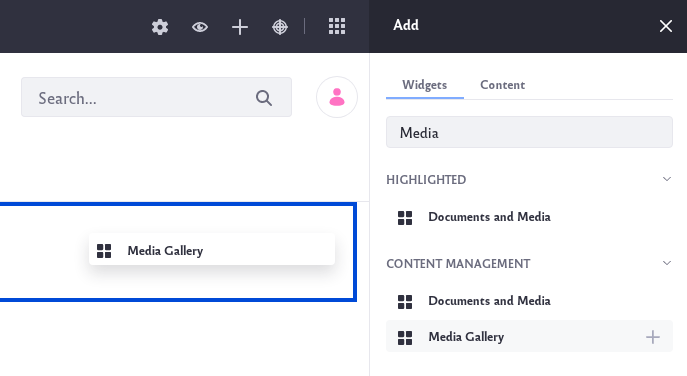

3. Drag the widget onto your page. Any media files previously uploaded should already be visible. If you wish to [add additional media files](../../uploading-and-managing/uploading-files.md), they can be uploaded from the *Documents and Media* Application.

4. Configure the widget by clicking on the *Options* button () at the top-right corner of the widget.

5. Select *Configuration* and the Configuration window will appear.

    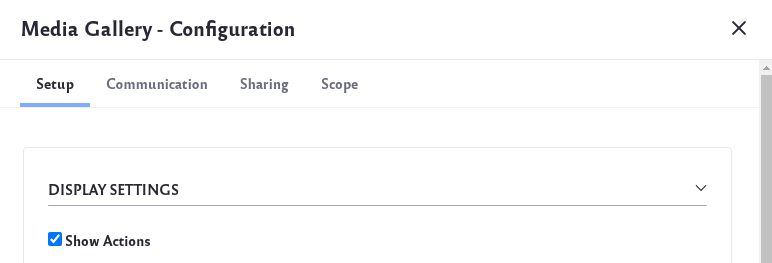

    Under the Setup tab, there are a few options to configure:

    * Display Settings - This allows you to show each file’s actions, filter the media types to display, and choose a display template for your media.

    * Folders Listing - This allows you to select a Document Library folder to serve as the root folder from which to display files. The root folder you select becomes the highest-level folder the widget can access. 

    Click *Save* to save your changes. Click *Cancel* to return to the widget without saving changes.

6. Once you've added your media files and finished configuring, you can view the widget on your page. Clicking on any media file automatically starts a slideshow of all the files.
    
    

7. Clicking on the *Options* button of an individual media file () will give you different options:

    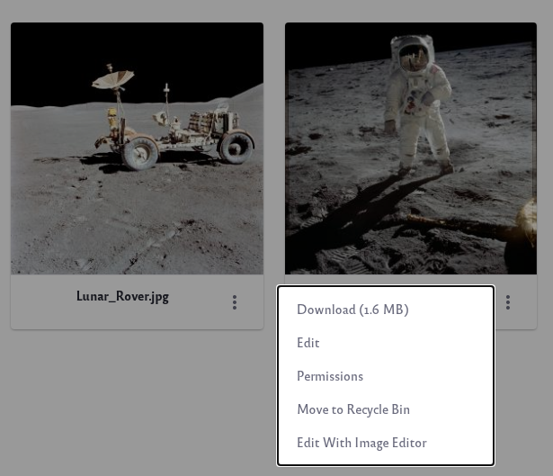

    * Download
    * Edit
    * Permissions
    * Move to Recycle Bin
    * Edit With Image Editor (for image files)

## Using the Documents and Media Widget 

The *Documents and Media* widget gives users a simple way to publish various types of files from within a site page. Unlike the *Media Gallery* widget, this widget also allows you to publish documents and other types of media.

1. Navigate to an existing page where you wish to add the *Documents and Media* widget. Click on the *Add App* icon () at the top of the page.

    Or [create a new page](../../../site-building/creating-pages/adding-paged.md) on which to add the widget.

2. The *Documents and Media* widget is found under the Content Management section of the list of widgets. It can also be found by searching for *Documents and Media*.

    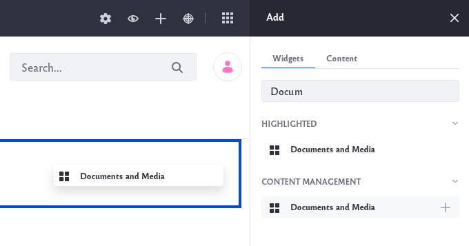

3. Drag the widget onto your page. Any media files previously uploaded should already be visible. If you wish to [add additional media files](../../uploading-and-managing/uploading-files.md), they can be uploaded from the *Documents and Media* Application.

4. Configure the widget by clicking on the *Options* button () at the top-right corner of the widget.

5. Select *Configuration* and the Configuration window will appear.

    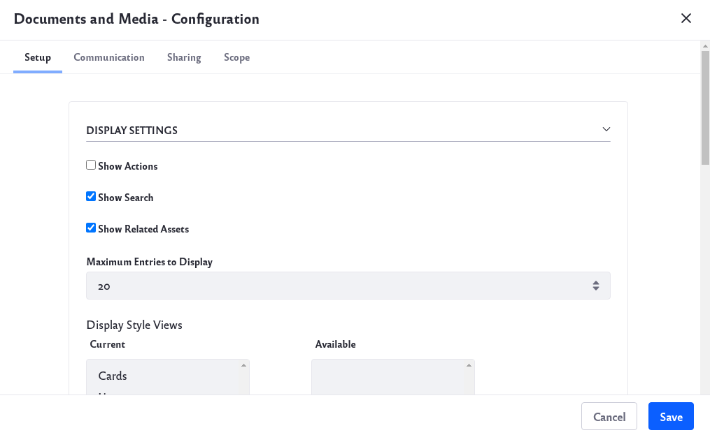

    Under the Setup tab, there are a few options to configure:

    * Display Settings - This allows you to show each file’s actions, show the search bar, show related assets, set maxium number of files per page, and enable different view options.

    * Folders Listing - This allows you to select a Document Library folder to serve as the root folder from which to display files. The root folder you select becomes the highest-level folder the widget can access. 

    * Entries listing for table display style - This allows you to set what type of file information to display when the user selects Table view.

    * Ratings - Enabling this allows users to give a thumbs up or thumbs down rating on your media files.

    Click *Save* to save any changes. Click *Cancel* to return to the widget without saving changes.

6. Once you've added your media files and finished configuring, you can view the widget on your page.

7. On your site page, there is a toolbar at the top of the widget that gives you access to different tools:

    

    * Checkbox - Allows you to select all the media files.

    * Filter and Order - Allows you to filter files by document type. It also allows you to sort your files by different parameters.

        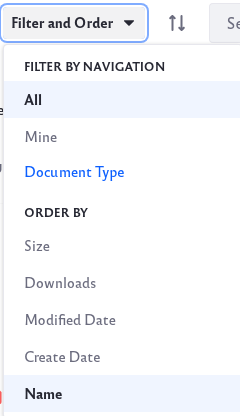

    * Reverse - Click on the *Reverse* icon () to reverse the direction of the sorting. 

    * Search - The search bar allows you to search through your media files by keyword.

    * Information - The *Information* icon () provides details about the media files within the folder.

    * Display Style - Click on the *Display Style* icon ()to choose how to display your media files. There are 3 display types: Cards, List and Table view

        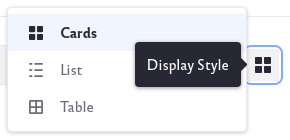
        
        Users can choose the display type of their choice.

8. Once you click on the checkbox [x] of a media file, you are given different options:

    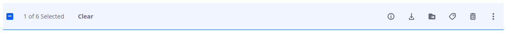

    * Clear - Click to clear your current selection.
    * Information - Click the *Information* icon () to see detailed information about the file.
    * Download - Click the *Download* icon () to download the file.
    * Move - Click the *Move* icon () to move the file to a different folder.
    * Edit Tags - Click on the *Edit Tags* icon () to edit the existing tags of a file.
    * Move to Recycle Bin - Click on the *Recycle Bin* icon () to delete a file.
    * Actions - Clicking on the * Actions* icon () to access more options, including *Checkin* and *Checkout*.

## Using the Asset Publisher Widget

The *Asset Publisher* widget gives users a simple way to organize and publish different assets from within a site page. The widget also supports collections.

1. Navigate to an existing page where you wish to add the *Asset Publisher* widget. Click on the *Add App* icon () at the top the page.

    Or [create a new page](../../../site-building/creating-pages/adding-paged.md) on which to add the widget.

2. The *Asset Publisher* widget is found under the Content Management section of the list of widgets. It can also be found by searching for *Asset Publisher*.

    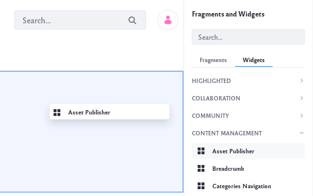

3. Drag the widget onto your page. Any media files previously uploaded should already be visible. If you wish to [add additional media files](../../uploading-and-managing/uploading-files.md), they can be uploaded from the *Documents and Media* Application.

4. Configure the widget by clicking on the *Options* button () at the top-right corner of the widget.

5. Select Configuration* and the Configuration window will appear.

    

    Under the Setup tab, there are a few sub-tabs with different options to configure. The Asset Selection sub-tab allows you to select how you would like to filter through your assets:

    * Dynamic - Select this option to set parameters that will automatically include specific assets. Use the Asset Type drop-down list to select one or more types of assets to be included. Choose across your different sites in the Scope section. In the Filter section, you can also filter your assets by things such as category, keywords, or tags. As new assets are added, the widget will automatically update.

    * Manual - Select this option to set parameters and manually filter specific assets. Choose across your different sites in the Scope section. Under Asset Entries, click on the *Select* button to filter for specific types of assets. For example, if you wanted to filter for images, you could select *Images* and add a check to each image you want included.

        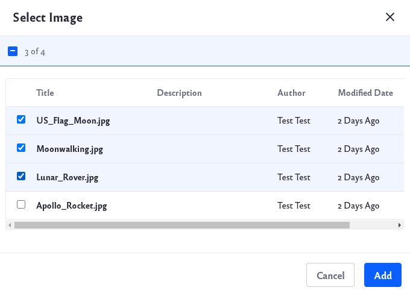

        Once you are finished making your selection, click the *Add* button. A new collection will be created based on your selection.

    * Collection - Select this option to choose from your previously saved collections. Under Select Collection, click on the *Select* button and choose a collection.

        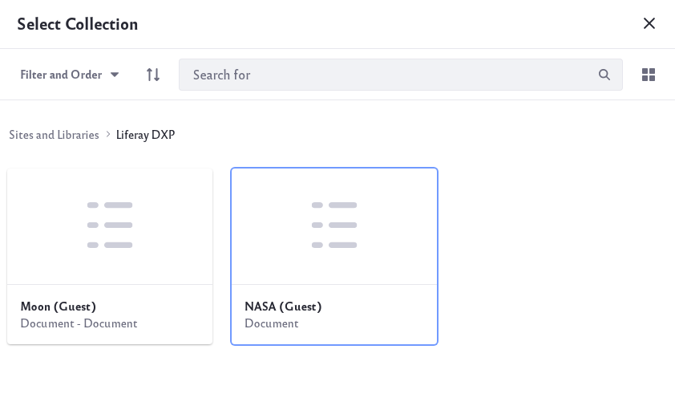

        To learn more, go to the [About Collections](../../collections-and-collection-pages/about-collections-and-collection-pages.md) page.

    * Collection Provider - This is a new feature in Liferay 7.3 that allows developers to create specific collections with more advanced criteria. 
        
    * *Create a collection from this configuration*: Once you have set your specific parameters, you can click this option to save this as a new collection.

    To learn more about this widget, go to the [configuring the asset publisher widget](../../../../site-building/displaying-content/using-the-asset-publisher-widget) page.

## Using Documents in Liferay DXP Assets

It is very easy to add your documents or media files to other types of DXP assets. Here are some examples within different assets:

### In Web Content

1. To be able to add documents or media to your Web Content, first [create a Structure](../..//web-content/web-content-structures/creating-structures.md) that contains a field for documents and media.

2. Go to the Structures tab of the Web Content application to create a new Structure. Drag and drop the Documents and Media field onto the Structure.

    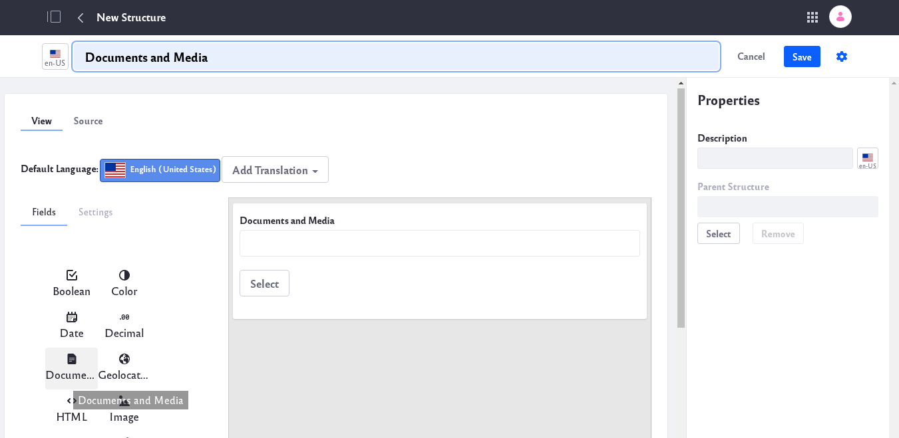

3. Now under the Web Content tab, click on the Add icon () to create new Web Content. Select the Structure you just created as your template.

    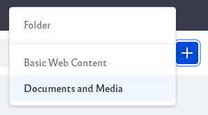

4. You shoudld now be able to select and add your documents or media files to your Web Content.

### In Blogs

1. To add documents and media to your blog, first navigate to the Blog application.

2. Click the the Add icon () to add a new blog entry. 

3. Under Related Assets, click on the *Select* button and you should be able to select your documents and media to be added to your blog post.

    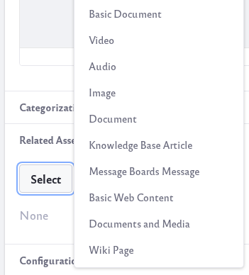

### In Wiki's

1. To add documents and media to your wiki, first navigate to the Wiki application.

2. Navigate to the node you wish to add your new Page. Click on the Add icon () to add a new wiki page.

3. Under Related Assets, click on the *Select* button and you should be able to select your documents and media to be added to your wiki page.

    