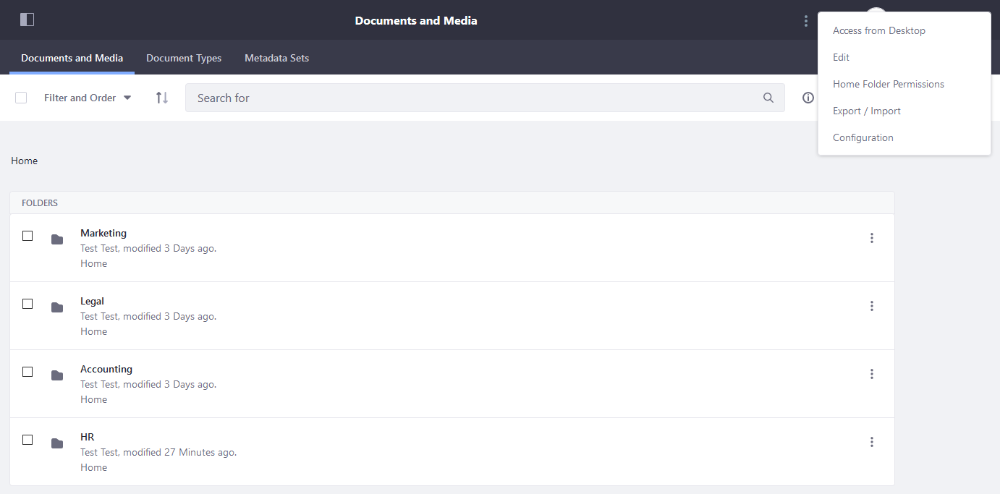
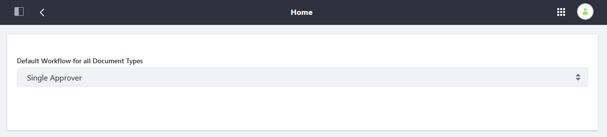
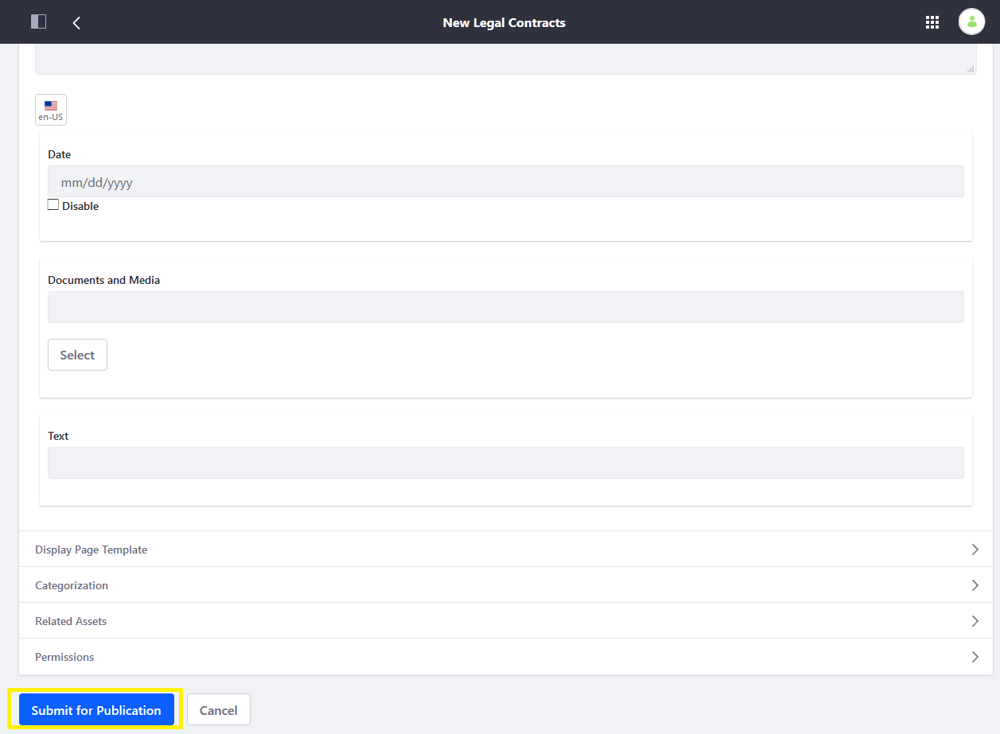
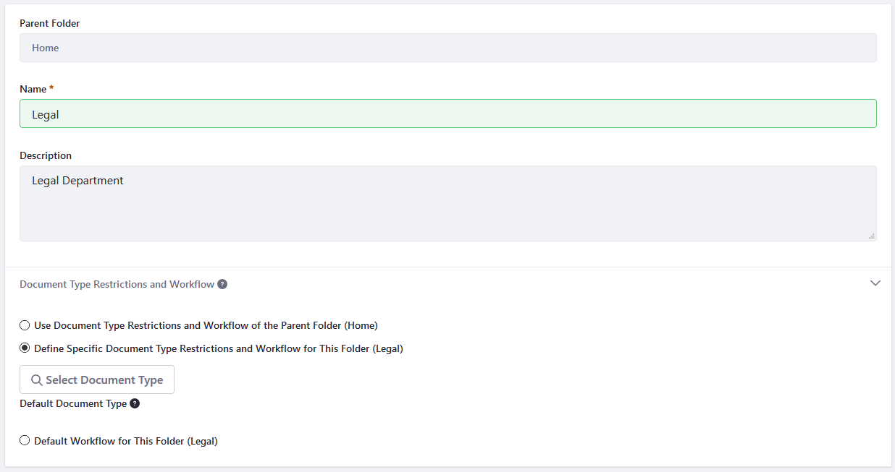
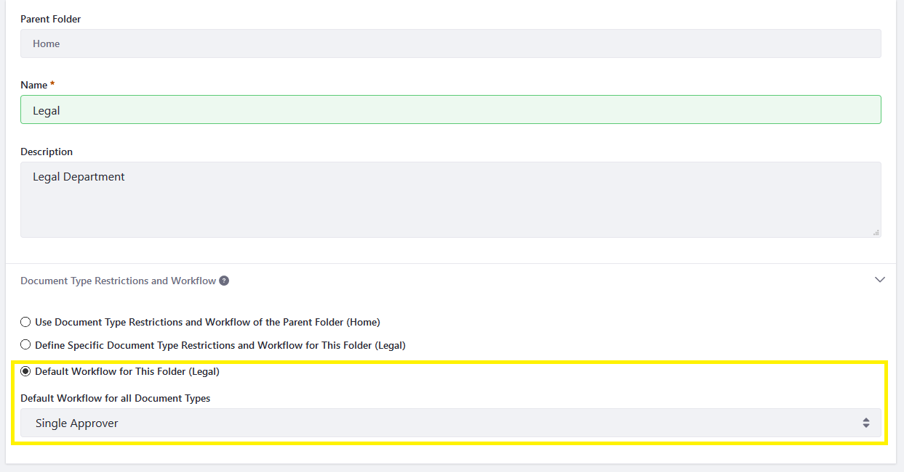

# Using Workflow with Documents and Media

Users can [implement a Workflow](../../../process-automation/workflow/user-guide/activating-workflow.md) for their _Documents and Media_ files. (To learn more about Workflows in general, see [Introduction to Workflow](../../../process-automation/workflow/user-guide/introduction-to-workflow.md).)

The _Documents and Media_ application has its own separate workflow settings. For example, you can activate workflow for a specific [folder](../uploading-and-managing/creating-folders.md), so that every file uploaded into that folder must be reviewed first.

Second, you can create multiple [Document Types](../uploading-and-managing/managing-metadata/defining-document-types.md) and designate which Document Types are subject to a review process. For example, if there are two created Document Types---a Legal Docs Document Type and a Training Videos Document Type---you can activate workflow for only the Legal Docs Document Type. This is configured at the _folder_ level.

## Enabling Workflow for All Document Types

1. Click () at the top right then _Edit_.

    

1. Select the desired Workflow definition from the dropdown menu.

    

1. Click _Save_ when finished.

Once Workflow has been enabled, the _Publish_ button is replaced with a _Submit for Publication_ button whenever a user uploads a file (regardless of Document Type).

## Enabling Workflow for Folders

1. Navigate to (your site) &rarr; _Content & Data_ &rarr; _Documents and Media_.
1. Click () next to the desired folder &rarr; _Edit_.

    

1. Expand the _Document Type Restrictions and Workflow_ section.

    

1. Select your desired settings. You can have the folder inherit the parent folder (the _Documents and Media Home_ folder in this case), specify a specific Document Type, or enable workflow for all document types inside this designated folder.
1. If _Default Workflow for this Folder_ is selected, select the Workflow definition.

    

1. Click _Save_ when finished.

Workflow has been enabled for this folder.

Users can also _disable_ workflow for specific folders (or sub-folders) even if workflow has been enabled on the parent (for example, _Home_) folder. To do so, select the third option: _Default Workflow for this Folder (Folder Name)_ and then select _No Workflow_. If disabled, files uploaded into this folder do not require the review process.

## Additional Information

* [Activating Workflow](../../../process-automation/workflow/user-guide/activating-workflow.md)
* [Documents and Media UI Reference](../documents-and-media-ui-reference.md)
