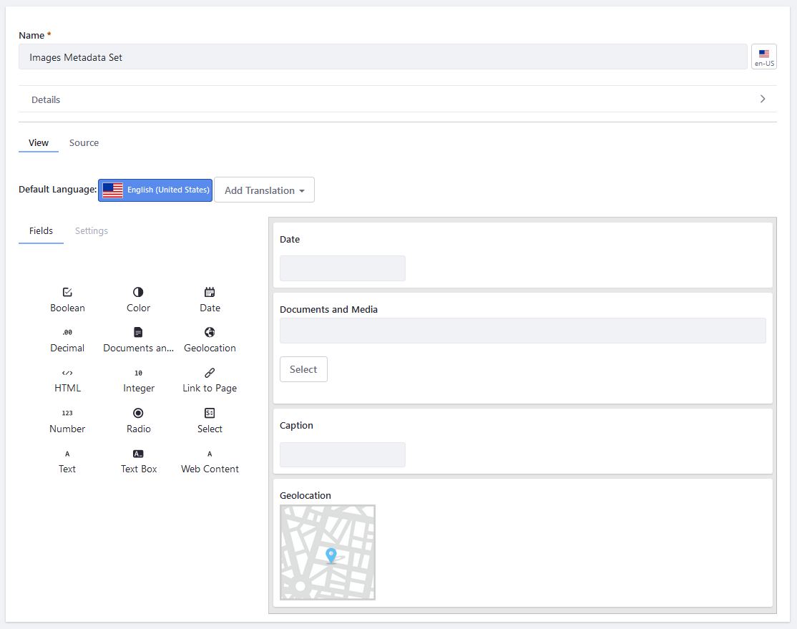
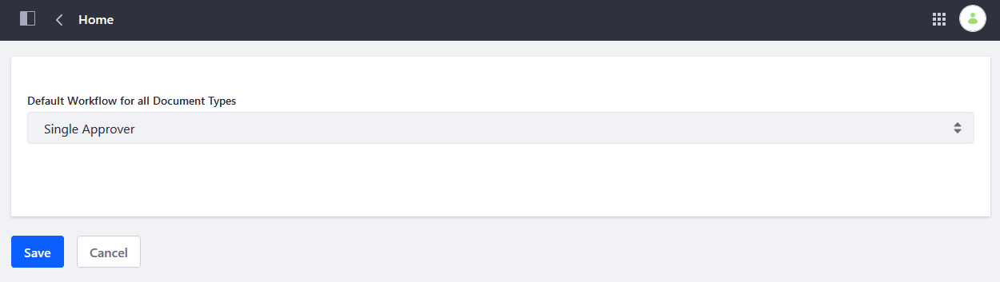
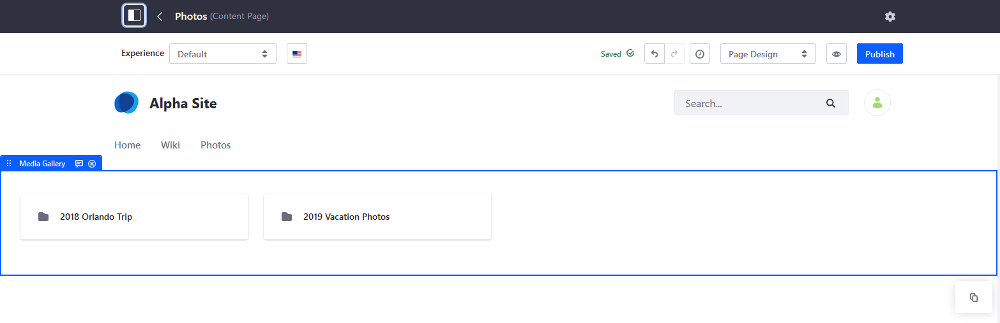

# Sharing Documents and Media

The Documents and Media library stores and organizes files on the server. It accepts files of any kind and can serve as a virtual shared drive. These files are stored using the [file storage method configured](../../system-administration/file-storage/configuring-file-storage.md) for the Liferay installation.

```tip::
   Each DXP Site has its own Documents and Media library. Thus documents are scoped to that Site and are not shared between Sites.
```

You can create [folders](./uploading-and-managing/creating-folders.md) and [upload documents](./uploading-and-managing/uploading-files.md) (even multiple ones at once via drag and drop) to the Documents and Media library.

Users can organize their documents using customizable document types and metadata sets and display them with automatic document preview generation. To create customizable Document Types, see [Defining Document Types](./uploading-and-managing/managing-metadata/defining-document-types.md). To create a new Metadata Set, see [Using Metadata Sets](./uploading-and-managing/managing-metadata/using-metadata-sets.md).



<!-- Stopped reviewing here. -Rich --> 

## Integrations

You can integrate the Documents and Media library with Microsoft Office 365&trade; or Google Drive. See [Enabling Document Creation and Editing with Microsoft Office 365](./devops/enabling-document-creation-and-editing-with-microsoft-office-365.md), [Enabling Links to Google Drive Documents](./devops/google-drive-integration/enabling-links-to-google-drive-documents.md), and [Enabling Document Creation and Editing with Google Drive](./devops/google-drive-integration/enabling-document-creation-and-editing-with-google-drive.md)
to learn more.

Finally, you can use WebDAV to access your documents from your file manager. See [Accessing Documents with WebDAV](./publishing-and-sharing/accessing-documents-with-webdav.md) for more information.

## Using Workflow with Documents and Media

DXP's [Workflow](../../process-automation/workflow/introduction-to-workflow.md) can help manage publication; if Workflow is activated for Documents and Media, documents must be reviewed before they are published. To activate Workflow for Documents and Media, see [Activating Workflow](../../process-automation/workflow/using-workflows/activating-workflow.md#activating-workflow-for-specific-applications) for more information.



## Backups and Import/Export

You can backup or [export](../../site-building/building-sites/importing-exporting-pages-and-content.md) the contents of your Site's Document and Media library. Exported Documents and Media `LAR` (Liferay Archive) files can be stored as a backup. Import them onto a separate Site or back to the original Site if necessary.

## Media Gallery

The companion Media Gallery widget displays selected content from the Documents and Media library. This widget can render image, audio, and video files.



See [Using the Media Gallery Widget](./publishing-and-sharing/publishing-documents-on-a-dxp-site/using-the-media-gallery-widget.md) for more information.

## Additional Information

* [Documents and Media UI Reference](./documents-and-media-ui-reference.md)
* [Creating Folders](./uploading-and-managing/creating-folders.md)
* [Uploading Files](./uploading-and-managing/uploading-files.md)
* [Configuring File Storage](../../system-administration/file-storage/configuring-file-storage.md)
