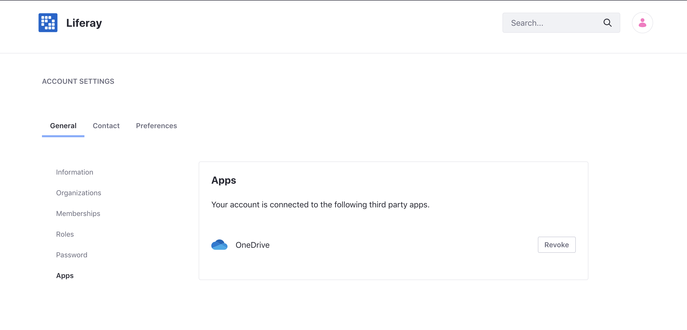

# Creating and Editing Documents with Microsoft Office 365

You can use Office 365&trade; to create and edit text documents, spreadsheets, or presentations for storage in the Documents and Media library. When you finish your Office 365&trade; editing session, you must check in the document to save the changes in the Documents and Media Library.

Before starting, you must first [enable](../../devops/enabling-document-creation-and-editing-with-microsoft-office-365.md) your DXP installation to connect with Microsoft Office 365&trade;.

## Authentication

The first time you create or edit a Documents and Media file via Office 365&trade;, you must authenticate with your Microsoft account. This links OneDrive&trade; to your DXP account, so you only need to do this once.

To unlink your account:

1. Click on *your profile* &rarr; *Account Settings*.
1. On the *General* tab, click *Apps*.
1. Click *Revoke* next to OneDrive&trade;.

    

OneDrive&trade; has been unlinked.

## Creating Files

Follow these steps to create a new Documents and Media file via Office 365&trade;:

1. Open the *Menu* (), click your Site's name, and navigate to *Content & Data* &rarr; *Documents and Media*.
1. Click the *Add* icon () and select the type of Office 365&trade; document to add to the Document Library:

    * Word&trade;
    * Excel&trade;
    * PowerPoint&trade;

    When you select one of these options, a new window opens for you to enter the document's name.

    

1. Enter the document's name in the *Title* field, and click *Save*. When you click *Save*, DXP creates a temporary Documents and Media file and links it to the new Office 365&trade; file. Your browser then opens a new window with that Office 365&trade; file so you can create its content.

    

1. Use the Office 365&trade; editor to create your document's content.

1. Save or discard your changes to DXP:

    **Check in:** Saves the Office 365&trade; file to Documents and Media, then deletes the file from Office 365&trade;. The saved file's format depends on the document type you selected in step two above.

    * Word: Microsoft Word&trade; (`.docx`)
    * PowerPoint: Microsoft PowerPoint&trade; (`.pptx`)
    * Excel: Microsoft Excel&trade; (`.xlsx`)

    **Cancel Checkout:** Deletes the Office 365&trade; file, discarding any changes.

## Editing Files

You can use Office 365&trade; to edit the following types of Documents and Media files:

* Text files (`.doc`, `.docx`, `.docm`, `.dot`, `.dotx`, `.dotm`, `.html`, `.txt`, `.rtf`, `.odt`)
* Presentation files (`.ppt`, `.pptx`, `.pptm`, `.pps`, `.ppsx`, `.ppsm`, `.pot`, `.potx`, `.potm`)
* Spreadsheet files (`.xls`, `.xlsx`, `.xlsm`, `.xlt`, `.xltx`, `.xltm`, `.ods`, `.csv`, `.tsv`, `.txt`, `.tab`)

Follow these steps to edit a Documents and Media file in Office 365&trade;:

1. Navigate to the file in the Documents and Media Library.

1. Click the file's Actions icon () and select *Edit in Office 365*. This automatically [checks out](../../publishing-and-sharing/managing-document-access/managing-document-changes-with-checkout.md) the file, transfers its content to a new Office 365&trade; file, and redirects you to that file Office 365&trade;.

1. Edit the file in Office 365&trade;. The editing process is exactly the same as described above for creating files.

    

## Additional Information

* [Enabling Document Creation and Editing with Microsoft Office 365](../../devops/enabling-document-creation-and-editing-with-microsoft-office-365.md)
* [Creating and Editing Documents with Google Drive](./creating-and-editing-documents-with-google-drive.md)
