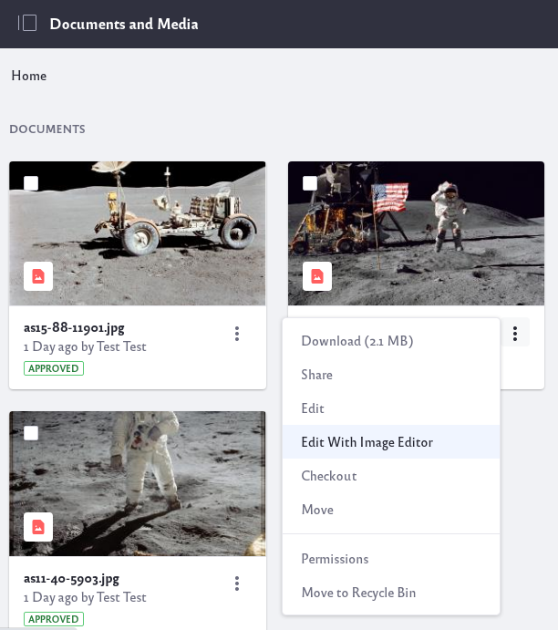
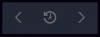

# Editing Images

Liferay DXP comes with its own built-in 
image editor. Right from your browser you can edit your images to do things such as apply filters, adjust contrast, or crop.

In the Documents and Media application, locate the image. Click on the Options icon () and select *Edit With Image Editor*. 

The image editor was designed with quick editing in mind, and offers a minimal, user-friendly UI:

**1. Effects Tool** (Filters):

This tool allows you to apply different filters to your image to give it a different look and feel.

**2. Transform Tools** (Transform Option):

* **Rotate**: Lets you rotate the image to the left or right, in 90 degree increments.

* **Resize**: Lets you resize the image in pixels. If the lock is closed, the aspect ratio remains locked, and changing either width or height will automatically adjust the other dimension to maintain the aspect ratio. When the lock is opened, the width and height can be changed individually, allowing the aspect ratio to be altered.  

* **Crop**: Lets you reframe the image, by removing the outer portions.

**3. Adjustment Tools** (Color Adjustment)

* **Saturation**: Lets you adjust the amount of color saturation in the image. The default value of 50 is the current saturation. The slider values range from 0 (completely desaturated) to 100 (completely saturated).

* **Contrast**: Lets you adjust the difference between highlights and shadows. The default value of 50 is the current contrast. The slider values range from 0 (no contrast) to 100 (full contrast).

* **Brightness**: Lets you adjust the amount of light in the image. The default value of 50 is the current brightness. The slider ranges from 0 (completely black) to 100 (completely white).

Once you have made changes to the image in the editor, you can click the *Cancel* button to cancel the changes, or the *Apply* button to apply the changes to the image. 

There is also history bar at the top of the image:

The history bar allows you to undo, redo, and reset changes that have been made to the image in the editor. Note that the reset button should be used with caution; once it has been pressed the image is reset to its original state, causing all changes made within the editor to be lost.