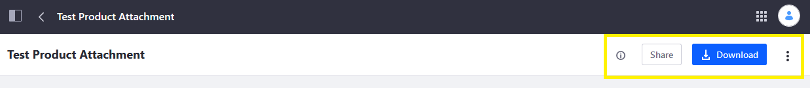
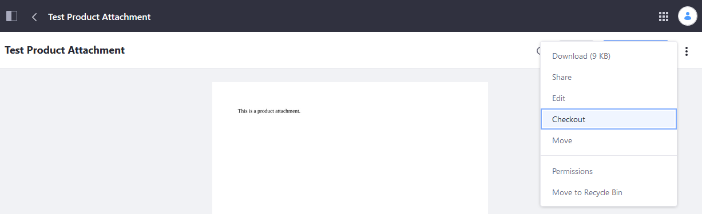
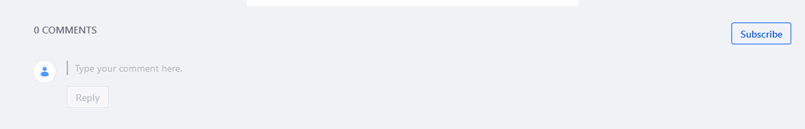
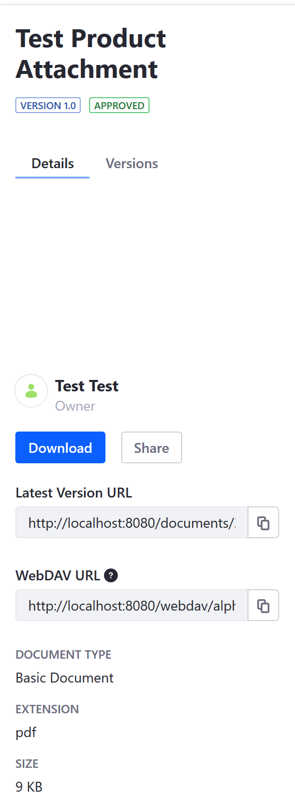

# Previewing Files

File previews help users browse and find media efficiently. To view a preview of a file, click the file's name in the Document Library. If the file is an image, the image appears. If an app is installed that can render a preview of the file type, a representative image of the file appears (e.g., the opening frame of a video file or a presentation's first slide). If there are no such preview apps for the file, a generic image based on the file type appears.

## Managing Files

You can also manage a file from its preview. The bar above the preview contains these buttons:

**Info** (): Open/close the file's info panel. This panel contains more detailed information about the file. For more information on this, see [The Info Panel](#the-info-panel).

**Share**: Share the file with other users. For more information, see [Sharing Files](../publishing-and-sharing/managing-document-access/sharing-documents-with-other-users.md).

**Download**: Download the file.

**Actions** () opens a menu with these possible actions:

| Action | Description |
| --- | --- |
| **Download** | Download the file into the local machine. |
| **Share** | Share the file with other collaborators. |
| **Edit** | This option is only for editable documents (that is, `doc`, `docx`, `txt`). Modify the file's name, description, document type, categorization, and [related assets](https://help.liferay.com/hc/articles/360028820532-Defining-Content-Relationships). You can even upload a new file to replace it. Note that modifying the file increments its version. |
| **Edit with Image Editor** | This option is available only for _images_. Edit the image in the Image Editor. The Image Editor is explained in [Editing Images](./editing-images.md). |
| **Checkout/Checkin** | Checkout prevents others from editing the document while you are working on it. Other users can still view the current version of the document, if they have permission. You can check in the document when you're done with it. |
| **Move** | Relocate the file to a different parent folder. |
| **Permissions** | Specify which actions each role can perform on the file. |
| **Move to [Recycle Bin](../../recycle-bin/user-guide/introduction-to-the-recycle-bin.md):** | Move the file from the Documents and Media library to the Recycle Bin. |

The comments area (below the preview area) lets you comment on and subscribe to comments on the file.

### The Info Panel

As mentioned above, clicking the *Info* icon () opens the info panel. The top of the info panel displays the file's name, version, and [workflow status](../../../process-automation/workflow/user-guide/introduction-to-workflow.md).

There are two tabs in the info panel: Details, and Versions. Details is selected by default and shows the following:

| Detail | Description |
| --- | --- |
| **Owner** | The file's owner. |
| **Download** | A button to download the file. |
| **Latest Version URL** | A URL to access the newest version of the file. |
| **WebDAV URL** | A WebDAV URL for accessing the file via a desktop. |
| **Document Type** | The file's document type. |
| **Extension** | The file's extension. |
| **Size** | The file's size on disk. |
| **Modified** | The user that last modified the file, and when it was last modified. |
| **Created** | The user that created the file, and when it was created. |
| **Ratings** | The file's average user rating. |
| **Automatically Extracted Metadata** | Any and all metadata automatically extracted from the file. When adding new documents or viewing existing documents, a process is triggered automatically that extracts the file's metadata. The library used by this process is TIKA and it's included out of the box. Depending on your file's type and the metadata written with the file, you can find out all kinds of details. In the case of audio or video files, the media's duration is displayed. |

### Version History

To view the file's version history, select the *Versions* tab near the top of the info panel. The info panel then changes to list the different versions of the file and lets you view, download, remove, and revert to specific file versions. File version history actions are explained in [Checking Out and Editing Files](../publishing-and-sharing/managing-document-access/managing-document-changes-with-checkout.md).

## Managing Folders

Documents can be organized in [folders](./creating-folders.md). Clicking the top right () Options menu displays the possible actions:

| Action | Description |
| --- | --- |
| Download | Download the file onto the local machine. |
| Access from Desktop | Generates the [WebDAV URL](../publishing-and-sharing/accessing-documents-with-webdav.md). |
| Edit | Edit the Folder's name and description. |
| Move | Move the files to another folder. |
| Permissions | Edit the folder permissions. |
| Move to Recycle Bin | Moves the folder into the Recycle Bin. |

## Additional Information

* [Documents and Media UI Reference](../documents-and-media-ui-reference.md)
