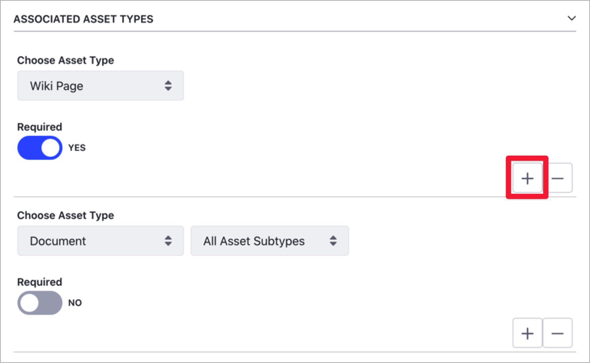

# Defining Categories and Vocabularies for Content

Using Categories, you can group similar assets and better organize your site content. Along with Tags, Categories help you and your users to find relevant information through search or navigation. For more information about Tags and Categories in Liferay DXP and the different usage scenarios, see [Organizing Content with Categories and Tags](organizing-content-with-categories-and-tags.md).

You can add properties to categories, to provide additional information about the category. You can think of category properties as tags for you categories.

## Defining Vocabularies

1. Open the Product Menu and, under the Site Menu, go to *Categorization* &rarr; *Categories*.
1. Click the *New Vocabulary* () button.
1. Enter a name for the Vocabulary and, optionally, a description.
1. Complete the rest of the Category options:

    - *Allow Multiple Categories*: When this option is enabled, you can apply more than one category from the vocabulary to your asset. When this option is disabled, you can only apply one category from the vocabulary.
    - *Visibility*: See [Vocabularies Visibility](##vocabularies-visibility) for more information

        ```important::
           You cannot change the Visibility after saving the Vocabulary.
        ```

    - *Associated Asset Type*: Select the type of assets where you can apply a category from this vocabulary. Set *Required* on if you want this type of asset to always have a category.
    
        ```tip::
           Click the *Add* () button under the *Associated Asset Type* section to include more than one asset type.
        ```
        
        
1. Click *Save*.
1. To edit an existing Vocabulary, click the *Actions* () menu next to the Vocabulary name and select *Edit*.

    

## Defining Categories

To define and manage Categories, open the Product Menu and, under the Site Menu, go to *Categorization* &rarr; *Categories*. You can also create new Categories from the Categorization Section in the Content Editor, using the *Select* button.


### Creating Categories

1. Open the Product Menu and, under the Site Menu, go to *Categorization* &rarr; *Categories*.
1. Under the *Vocabularies* list, click the Vocabulary you want to modify.
1. Click *Add Category* ().
1. Enter a name for the Category and, optionally, a description.
1. Click *Save* or *Save and Add a New One* to add more Categories.
1. To edit an existing Category, click the *Actions* () menu

### Creating Subcategories

You can create a nested hierarchy of Categories and Subcategories:

1. Open the Product Menu and, under the Site Menu, go to *Categorization* &rarr; *Categories*.
1. Under the *Vocabularies* list, click the Vocabulary you want to modify.
1. Click the Category name where you want to create the new Subcategory.
1. In the *Add New Subcategory* screen, enter the Subcategory's name and, optionally, a description.
1. Click *Save* or *Save and Add a New One* to add more Subcategories.

### Moving Categories

You can move a Category to a different Vocabulary, or as a Subcategory of the same Vocabulary.

1. Open the Product Menu and, under the Site Menu, go to *Categorization* &rarr; *Categories*.
1. Click the *Actions* () menu and select *Move*.

    

1. Select the *Vocabulary* and *Category* where you want to move the Category.

    ```note::
       You can only move a Category into a Vocabulary of the same [Visibility type](#vocabulary-visibility).
    ```

### Editing Additional Properties
