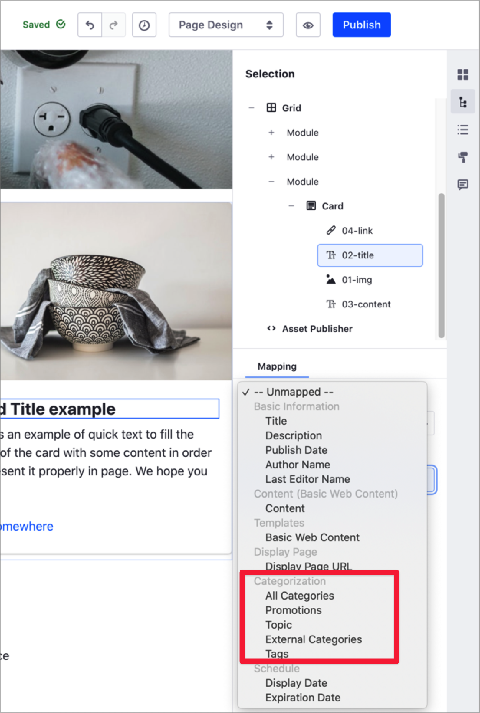

# Organizing Content with Categories and Tags

Tags and Categories are two important tools you can use to help organize and categorize your content in Liferay DXP. These tools help users to find the content in your site through search or navigation.

With Categories, you can group similar assets. For example, you can create the "Success Stories" Category and group all the customer success articles in your website under this Category. You can also create a hierarchy of Categories . For example, you can create the "Finance" and "Healthcare" categories under the "Success Stories" main category, to organize the customer success articles based on different customer segments. The Categories you define in Liferay DXP depend on your goal when organizing the site content. The Marketing department may want to use Categories for their content based on different customer segments, while the Human Resources department may want to use Categories for their content based on the internal company organization. To start using Categories in Liferay DXP, see [Defining Categories and Vocabularies for Content](./defining-categories-and-vocabularies-for-content.md).

Tags are keywords you can use to organize your assets and describe specific information about its content. Tags tell users or visitors of your website what is the content about, and help them to find relevant information through search or navigation. For example, in an online Kitchenware Store, you may find different tags describing the store items, like "glass", "clay", or "dishwasher-safe". Using these Tags, visitors interested in "clay" kitchenware only can find relevant articles faster. Tags are not hierarchical, so you cannot group tags inside other tags. To start using Tags, see [Tagging Content](./tagging-content.md).

The following table summarizes the main differences between Tags and Categories:

| Categories | Tags |
| --- | --- |
| Managed by administrators | Managed by administrators and non-administrators |
| Predefined | Predefined and 
| Grouped in vocabularies | Cannot be grouped |
| Hierarchical categorization | Non-hierarchical categorization |

In Liferay DXP, you can find Categories and Tags under the Categorization panel in the Site Navigation menu. From here, you can create new Categories and Tags or customize the existing ones. You define Tags and Categories at the site level.

```note::
   Categories in the Global site are available in other sites. Tags are particular to each site.
```


You can tag or categorize an asset at creation time or when editing an existing asset using the Categorization section.


## Vocabulary Visibility

> Available: Liferay 7.3+.

When you create a new Vocabulary, you define its Visibility. Categories can be *Public* or *Internal*, depending of the Category Visibility. Content creators can assign categories from Public or Internal vocabularies, but only categories from Public vocabularies are available for website visitors in Pages, Widgets, Fragments, and Searches.

This Visibility option can be useful when you need to separate internal and external categorization. For example, your Marketing department may want to create Internal categories for describing and organizing web content according to a specific audience, without exposing these categories to consumers. At the same time, you may want to use Public categories to provide users more relevant search results on your website.

```tip::
    Internal Vocabularies show a *Hidden* icon [Hidden](../../../images/icon-hidden.png) next to their name.
```

Before configuring your vocabulary's visibility, consider the following information:

- Existing Vocabularies from previous Liferay versions are configured with Public visibility.
- Administrators in Liferay DXP can search assets using Categories in an Internal Vocabulary, but search widgets in Content Pages will not consider or expose Internal Vocabulary.

    

- Custom portlets or applications using a Category selector only show Public Categories by default.
- When you edit a Content Page using a search-based Fragment, 
- When you map an existing content using Fragments, only Internal Vocabularies are available.

    

- If you select All Categories when mapping existing content, only Public Categories are displayed.

Consider the following example. In an online Kitchenware Store, certain items have a higher than average profit margin. You create the "High-Margin" Category in a Vocabulary with Internal Visibility, want to internally identify these items, so you can search them and market them accordingly. However, you do not want you store visitors to discover this category through search.

## Default Vocabularies

> Available: Liferay 7.3+.

In addition to the *Topic* vocabulary in previous Liferay versions, you can find two new vocabularies by default: Audience and Stage. These two vocabularies are industry standards that Content Authors, Content Strategist, and Marketers can use along with the Content Dashboard []() to review their content strategy, and audit the content.

```note::
   You can only use Audience and Stage vocabularies with Web Content Articles.
```

These new vocabularies, along with the new (((Content Dashboard))) [link?] provide answers to the most common questions:

- Determine content areas with enough content as well as content gaps.
- Audit content.
- Insights to create or adapt the content strategy.

```note::
   In previous Liferay versions, the *Topic* vocabulary was created for each site. The *Topic* vocabulary is now created at the Global Site.
```

## Related Information

- [Defining Categories and Vocabularies for Content](./defininig-categories-and-vocabularies-for-content.md)
- [Tagging Content](./tagging-content.md)
- [Targeted Vocabularies](./targeted-vocabularies.md)