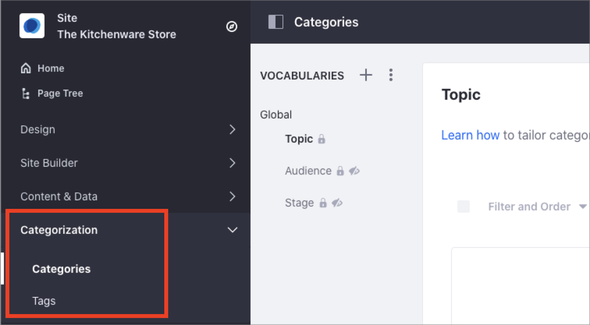

# Organizing Content with Tags and Categories

Tags and Categories are two important tools you can use to help organize and categorize your content in Liferay DXP. These tools help users to find the content in your site through search or navigation.

With Categories, you can group similar assets. For example, you can create the "Success Stories" Category and group all the customer success articles in your website under this Category. You can also create a hierarchy of Categories. For example, you can create the "Finance" and "Healthcare" categories under the "Success Stories" main category, to organize the customer success articles based on different customer segments. The Categories you define in Liferay DXP depend on your goal when organizing the site content. The Marketing department may want to use Categories for their content based on different customer segments, while the Human Resources department may want to use Categories for their content based on the internal company organization. To start using Categories in Liferay DXP, see [Defining Categories and Vocabularies for Content](./defining-categories-and-vocabularies-for-content.md).

With Tags, you can organize your assets and describe specific information about its content. Tags tell users or visitors of your website what is the content about, and help them to find relevant information. For example, in an online kitchenware store, you may find different tags describing the store items, like "glass", "clay", or "dishwasher-safe". Using these Tags, visitors interested in "clay" kitchenware only can find relevant articles faster. Tags are not hierarchical, so you cannot group tags inside other tags. To start using Tags, see [Tagging Content](./tagging-content.md).

In Liferay DXP, you can find Categories and Tags under the Categorization panel in the Site Navigation menu. From here, you can create new Categories and Tags or customize the existing ones. You define Tags and Categories at the site level.

```note::
   Categories in the Global site are available in other sites. Tags are particular to each site.
```



You can tag or categorize an asset at creation time or when editing an existing asset using the Categorization section.


## Related Information

- [Defining Categories and Vocabularies for Content](./defininig-categories-and-vocabularies-for-content.md)
- [Tagging Content](./tagging-content.md)
- [Targeted Vocabularies](./targeted-vocabularies.md)