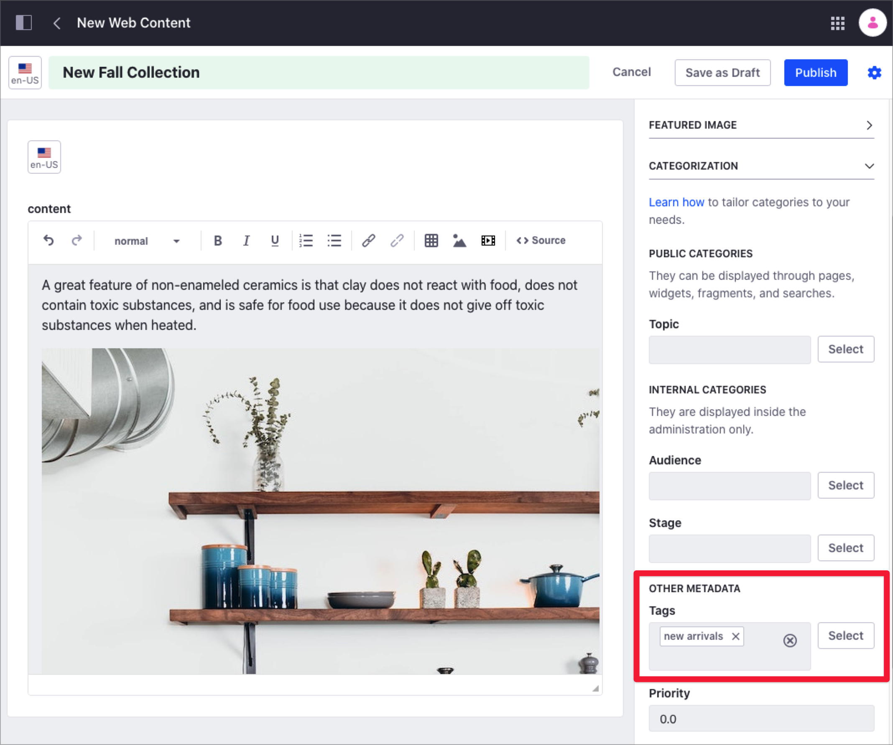

# Tagging Content

Tags are keywords that you can assign to content, to help you organizing your information and users to find relevant information. Tags are all-lowercase words or sentences that the content creator can attach to any content. The content creator chooses tags personally, with no predefined categorization or hierarchy.

```tip::
   If you need to categorize the content in a more hierarchical way, you can use [Categories and Vocabularies](./defining-categories-and-vocabularies-for-content.md)
```

After tagging content, you can search for this content using tags. Using tags makes your search results more accurate and enables you to use tools like the Asset Publisher to display content in an organized fashion on a web page.

You manage tags using the Tag Administrator, and you tag content when you edit or create the content, using the *Categorization* section in the sidebar panel.

## Managing Tags Using the Tag Administrator

Using the Tag Administrator, you can create new tags and edit existing ones.

```note::
   Only site administrators can acces the Tag Administrator
```

1. Open the Product Menu and, under the Site Menu, go to *Categorization* &rarr; *Tags* to open the Tag Administrator.
1. To create a new tag, click the *Add Tag* [Add Tag]() button.
1. Type the *Name* or your new tag and click *Save*.
1. To edit an existing tag, click the Actions Menu []() next to the tag's name and select *Edit*.
1. If you want to merge one or more tags, check the box next to the tags you want to merge and click the *Merge* button [Merge](icon-merge.png)

    


## Tagging Content

Use the *Categorization* section in the sidebar panel to tag content as it is being created.

1. Create or edit the content you want to tag (for example, a New Web Content.)
1. In the sidebar panel, under the *Categorization* section and *Other Metadata* subsection, click *Select* next to *Tags*.

    

1. Select the tags you want to use from the list of existing tags and click *Done*.
1. If you want to create new tags for the content, write the name of the new tag in the *Tags* field and press Enter.

## Related Information

- [Defining Categories and Vocabularies for Content](./defininig-categories-and-vocabularies-for-content.md)
- [Targeted Vocabularies](./targeted-vocabularies.md)