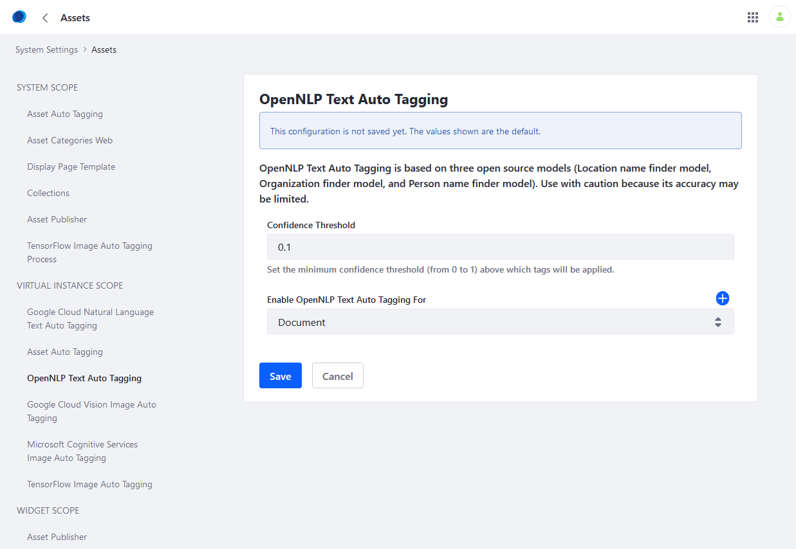

# Auto Tagging Assets

You can manually tag most assets, such as Message Boards, Blogs, Documents, Images, and Web Content Articles. You can tag certain assets, however, automatically when they are created. Tags applied automatically are in only English.

Auto tagging is only available for text-based documents, text-based web content, and blog entries, as well as [images](./auto-tagging-images.md).

Text Auto Tagging is disabled by default. You must [enable Auto Tagging](./configuring-asset-auto-tagging.md) in DXP and then enable a text auto tagging provider. Finally, you must choose the asset to auto-tag. There are two text auto-tagging providers available for DXP:

* **Google Cloud Natural Language Text Auto Tagging**: Uses the [Google Cloud Natural Language API](https://cloud.google.com/natural-language/) to analyze and automatically tag content.

* **OpenNLP Text Auto Tagging**: Uses the open source [Apache OpenNLP](https://opennlp.apache.org/) library to analyze and automatically tag portal content. Three models are used: location name finder, organization finder, and person name finder.

```tip::
   Use this provider with caution because its accuracy may be limited.
```

## Configuring Google Cloud Natural Language Text Auto Tagging

1. Click the _Global Menu_ &rarr; _Control Panel_
1. Click _System Settings_.

   

1. Click _Assets_ under _Content and Data_.

   

1. Under _VIRTUAL INSTANCE SCOPE_, click _Google Cloud Natural Language Text Auto Tagging_.
1. Fill out the form.
1. Click _Save_ when finished.

The form asks for this information:

 **API Key:** The API key to use for the Google Cloud Natural Language API. For more information, see [Google's documentation on API keys](https://cloud.google.com/docs/authentication/api-keys).

**Classification Endpoint Enabled:** Whether to enable auto tagging of text using the Google Cloud Natural Language API Classification endpoint.

**Confidence:** Set the classifier's confidence of the category. This number represents how certain the classifier is that this category represents the given text.

**Entity Endpoint Enabled:** Whether to enable auto tagging of text using the Google Cloud Natural Language API Entity endpoint.

**Salience:** The salience score for an entity provides information about the importance or centrality of that entity to the entire text.

**Enable Google Cloud Natural Language Text Auto Tagging For:** Choose the asset types to be auto-tagged. Select _Document_, _Blogs Entry_, or _Web Content Article_. To add multiple asset types, click the _Add_ icon () and select the asset type from the menu. You can delete any additional asset types by clicking the Trash icon ().


The Google Cloud Natural Language provider has been configured.

If there are multiple virtual instances on the server, you can override these settings for each instance from _Control Panel_ &rarr; _Instance Settings_ &rarr; _Assets_.

## Configuring OpenNLP Text Auto Tagging

1. Click the _Global Menu_ &rarr; _Control Panel_
1. Click _System Settings_.
1. Click _Assets_ under _Content and Data_.
1. Under _VIRTUAL INSTANCE SCOPE_, click _OpenNLP Text Auto Tagging_.
1. Fill out the form.
1. Click _Save_ when finished.

The form asks for this information:

**Confidence Threshold:** Set the minimum confidence threshold (from 0 to 1, where 1 is the highest confidence). Higher values yield fewer tags because the provider needs more confidence before it applies a tag. Lower values yield more tags.

**Enable OpenNLP Text Auto Tagging For:** Choose the asset types to be auto-tagged. Use the menu to select _Document_, _Blogs Entry_, or _Web Content Article_. To add multiple asset types, click the _Add_ icon () and select the asset type from the menu. You can delete any additional asset types by clicking the Trash icon ().



The OpenNLP provider has been configured.

If there are multiple virtual instances on the server, you can override these settings for each instance from _Control Panel_ &rarr; _Instance Settings_ &rarr; _Assets_.

## Additional Information

* [Auto Tagging Images](./auto-tagging-images.md)
