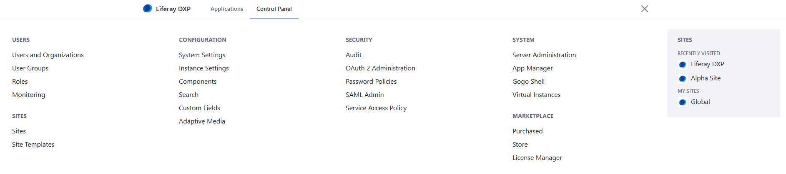
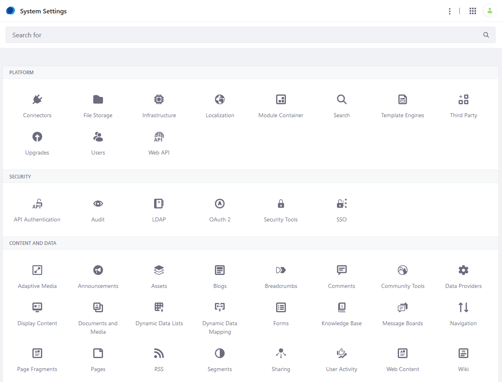
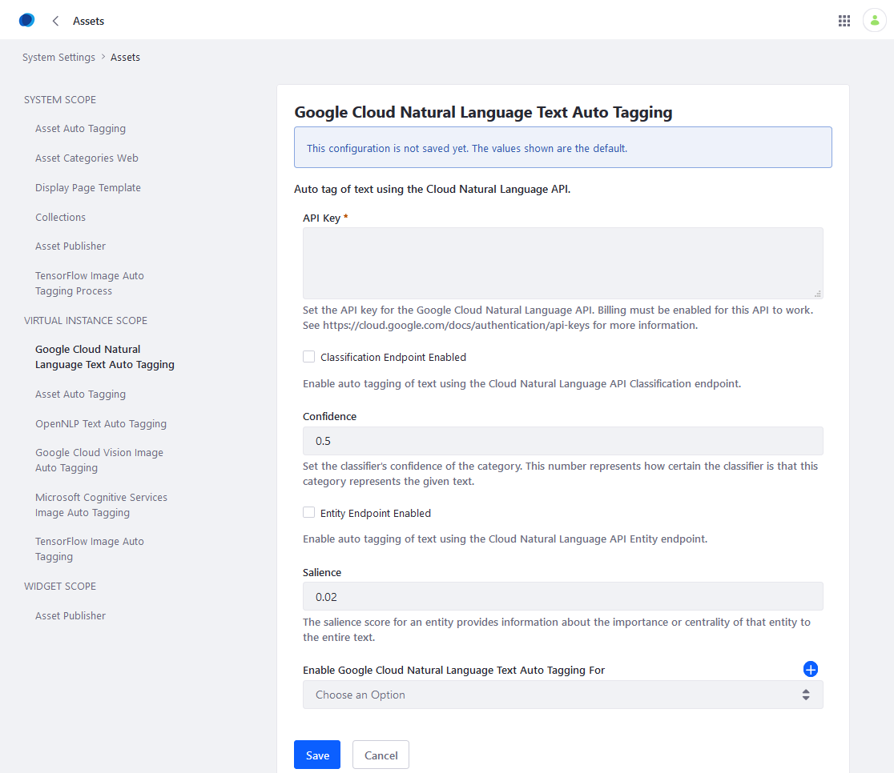

# Auto Tagging Text

Once [asset auto tagging has been enabled](./configuring-asset-auto-tagging.md), users can also configure text auto tagging. Text auto tagging automatically [tags](../tagging-content.md) text-based assets. Thus tags are applied automatically.

```tip::
   Currently, text auto tagging is only available for text-based documents, text-based web content, and blog entries. Tags applied automatically are English only.
```

Text auto tagging is disabled by default. To enable Text Auto Tagging:

* Ensure that [asset auto tagging](./configuring-asset-auto-tagging.md) is enabled. Although it's enabled by default, administrators can disable it.

* Ensure that a text auto tagging provider is configured and enabled for the asset types you want to auto tag.

There are two text auto-tagging providers in the portal:

* **Google Cloud Natural Language Text Auto Tagging**: Uses the [Google Cloud Natural Language API](https://cloud.google.com/natural-language/) to analyze and automatically tag portal content.

* **OpenNLP Text Auto Tagging**: Uses the open source [Apache OpenNLP](https://opennlp.apache.org/) library to analyze and automatically tag portal content. Three models are used: location name finder, organization finder, and person name finder.

```tip::
   Use this provider with caution because its accuracy may be limited.
```

## Configuring Google Cloud Natural Language Text Auto Tagging

Follow these steps:

1. Click the _Global Menu_ &rarr; _Control Panel_
1. Click _System Settings_.

    

1. Click _Assets_ under _Content and Data_.

    

1. Under _VIRTUAL INSTANCE SCOPE_, click _Google Cloud Natural Language Text Auto Tagging_.
1. Enter the following information:

    * **API Key:** The API key to use for the Google Cloud Natural Language API. For more information, see [Google's documentation on API keys](https://cloud.google.com/docs/authentication/api-keys).

    * **Classification Endpoint Enabled:** Whether to enable auto tagging of text using the Google Cloud Natural Language API Classification endpoint.

    * **Confidence:** Set the classifier's confidence of the category. This number represents how certain the classifier is that this category represents the given text.

    * **Entity Endpoint Enabled:** Whether to enable auto tagging of text using the Google Cloud Natural Language API Entity endpoint.

    * **Salience:** The salience score for an entity provides information about the importance or centrality of that entity to the entire text.

    * **Enable Google Cloud Natural Language Text Auto Tagging For:** The asset types to enable text auto tagging for. Select _Document_, _Blogs Entry_, or _Web Content Article_. To add multiple asset types, click the _Add_ icon () and select the asset type from the menu. You can delete any additional asset types by clicking the Trash icon ().

    

1. Click _Save_ when finished.

The Google Cloud Natural Language provider has been configured.

If there are multiple virtual instances on the server, users can override these settings for each instance from _Control Panel_ &rarr; _Instance Settings_ &rarr; _Assets_.

## Configuring OpenNLP Text Auto Tagging

Follow these steps to use OpenNLP:

1. Click the _Global Menu_ &rarr; _Control Panel_
1. Click _System Settings_.
1. Click _Assets_ under _Content and Data_.
1. Under *VIRTUAL INSTANCE SCOPE*, click *OpenNLP Text Auto Tagging*.
1. Enter the following values:

    * **Confidence Threshold:** Set the minimum confidence threshold (from 0 to 1, where 1 is the highest confidence) above which tags will be applied. Higher values yield fewer tags because the provider needs more confidence before it applies a tag. Likewise, lower values yield more tags.

    * **Enable OpenNLP Text Auto Tagging For:** The asset types to enable text auto tagging for. Use the menu to select _Document_, _Blogs Entry_, or _Web Content Article_. To add multiple asset types, click the _Add_ icon () and select the asset type from the menu. You can delete any additional asset types by clicking the Trash icon ().

    

1. Click _Save_ when finished.

The OpenNLP provider has been configured.

If there are multiple virtual instances on the server, users can override these settings for each instance from _Control Panel_ &rarr; _Instance Settings_ &rarr; _Assets_.

## Additional Information

* [Auto Tagging Documents](./auto-tagging-documents.md)
* [Auto Tagging Images](./auto-tagging-images.md)
* [Auto Tagging Web Content](./auto-tagging-web-content.md)
