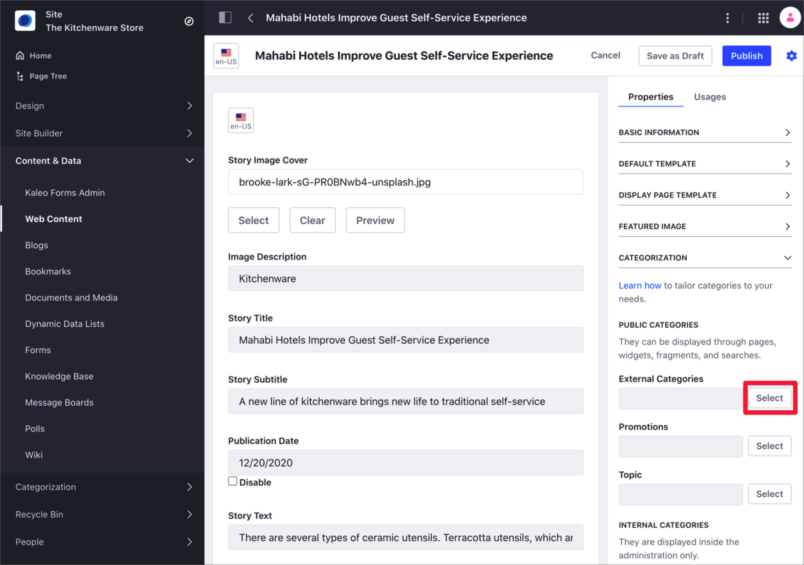
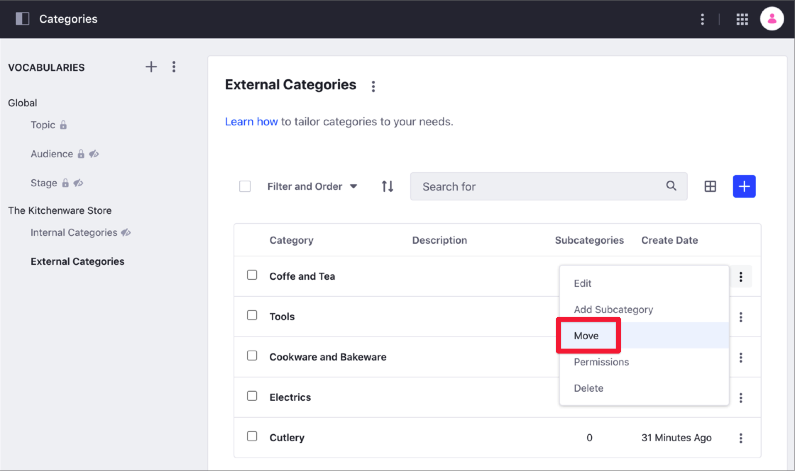

# Defining Categories and Vocabularies for Content

Using Categories, you can group similar assets and organize your site content. Along with [Tags](./tagging-content-and-managing-tags.md), Categories help you and your users find relevant information through search or navigation. For more information about Categories in Liferay DXP and the different usage scenarios, see [Organizing Content with Categories and Tags](organizing-content-with-categories-and-tags.md).

You group Categories using [Vocabularies](#defining-vocabularies), and you create a hierarchy of Categories using [Subcategories](#creating-subcategories).

```note::
   Only site administrators can manage Categories and Vocabularies in the Categories panel.
```

## Defining Vocabularies

1. Open the Product Menu and, under the Site Menu, go to *Categorization* &rarr; *Categories*.
1. Click *New Vocabulary* ().
1. Enter a *Name* for the Vocabulary and, optionally, a *Description*.
1. Complete the rest of the Category options:

    - *Allow Multiple Categories*: When this option is enabled, you can use more than one Category from the Vocabulary to the asset. When this option is disabled, you can use only one Category from the Vocabulary.
    - *Visibility*: See [Vocabularies Visibility](./organizing-content-with-categories-and-tags.md#vocabularies-visibility) for more information.

        ```important::
           You cannot change the Visibility after saving the Vocabulary.
        ```

    - *Associated Asset Type*: Select the type of assets where you can apply a Category from this Vocabulary. Set *Required* to *Yes* if you want this type of asset always to have a Category.

        ```tip::
           Click the *Add* () button under the *Associated Asset Type* section to include more than one asset type.
        ```

        

1. Click *Save*.
1. To edit an existing Vocabulary, click the *Actions* () menu next to the Vocabulary name and select *Edit*.

    

## Defining Categories

You create and manage Categories in the open the Site Menu &rarr; *Categorization* &rarr; *Categories* panel. You can also create new Categories from the Categorization section in the Content Editor, using the Select button for each Vocabulary.



### Creating Categories

1. Open the Product Menu and, under the Site Menu, go to *Categorization* &rarr; *Categories*.
1. Under the *Vocabularies* list, click the Vocabulary to add the new Category.
1. Click *Add Category* ().
1. Enter a *Name* for the Category and, optionally, a *Description*.
1. Click *Save* or *Save and Add a New One* to add more Categories.
1. To edit an existing Category, click the *Actions* () menu next to the Category's name.

### Creating Subcategories

You can create a nested hierarchy of Categories and Subcategories:

1. Open the Product Menu and, under the Site Menu, go to *Categorization* &rarr; *Categories*.
1. Under the *Vocabularies* list, click the Vocabulary you want to modify.
1. Click the Category name where you want to create the new Subcategory.
1. In the *Add New Subcategory* screen, enter the Subcategory's *Name* and, optionally, a *Description*.
1. Click *Save* or *Save and Add a New One* to add more Subcategories.

### Moving Categories

You can move a Category to a different Vocabulary, or as a Subcategory in the same Vocabulary.

1. Open the Product Menu and, under the Site Menu, go to *Categorization* &rarr; *Categories*.
1. Click the *Actions* () menu next to the Category you want to move and select *Move*.

    

1. Select the *Vocabulary* and *Category* where you want to move the Category.

    ```note::
       You can only move a Category into a Vocabulary of the same [Visibility type](./organizing-content-with-categories-and-tags.md#vocabulary-visibility).
    ```

### Editing Additional Category Properties

After creating a Category, you can define these additional options:

- Details (Name and Description)
- Images
- Friendly URL
- Properties (Key and Value pairs)

To access these options, click the *Actions* () menu next to the Category you want to modify and select *Edit*.


## Related Information

- [Organizing Content with Categories and Tags](./organizing-content-with-categories-and-tags.md)
- [Defining Categories and Vocabularies for Content](./defining-categories-and-vocabularies-for-content.md)
- [Tagging Content and Managing Tags](./tagging-content-and-managing-tags.md)
- [Targeted Vocabularies](./targeted-vocabularies.md)
