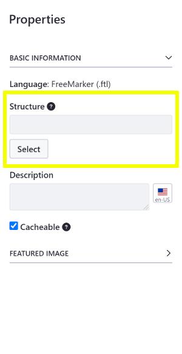
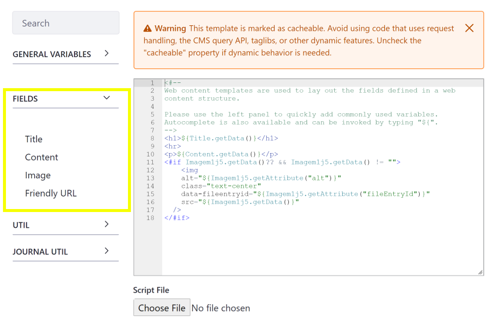

# Creating Web Content Templates

Structures define available fields for creating Web Content, while Web Content Templates define how a [Structure's](../web-content-structures/creating-structures.md) content is presented on a page. A Web Content Template can be associated with a Structure or even [embedded in another Web Content Template](./embedding-widgets-in-templates.md#embedding-other-templates). Changes in the Structure may require changes in the associated Web Content Template, if a Structure field name referenced in the Template is renamed or removed.

```note::
   Web Content Templates are written in the FreeMarker Template Language (FTL). If desired, template creation can be disabled for a DXP installation. To do this, open the *Control Panel* tab in the Global Menu, and go to *Configuration* → *System Settings* → *Dynamic Data Mapping* → *Dynamic Data Mapping Web*. Then, uncheck *Enable Template Creation*, and click *Save*.
   
   Once disabled, Users can no longer access creation options for Web Content Templates. However, this does not affect existing templates.
```

Download the [Newspaper Article Structure](./creating-web-content-templates/resources/newspaper-article-structure.xml) and [Template](./creating-web-content-templates/resources/newspaper-article-template.ftl) to follow along with the example. Unzip it to a convenient location on your system.

1. Open the Product Menu and go to the Site Menu &rarr; *Content & Data* &rarr; *Web Content*.
1. Select the *Templates* tab.
1. Click the *Add button* () to create a new Web Content Template.
1. Enter the title of your new Web Content Template and add your code to the script window. You can add the code from the example *Newspaper Article* Template by clicking the *Choose File* button below the Script window and importing the `newspaper-article-template.ftl` file. If you're creating a Web Content Template to [embed in another Template](./embedding-widgets-in-templates.md#embedding-other-templates), you can skip to step eight.

   

1. Optionally link a Structure to the Template by clicking *Select* under the *Structure* field in the *Properties* panel on the right and clicking the name of the Structure in the dialog that appears. See [Creating Structures](../web-content-structures/creating-structures.md) for more information on creating Structures.

   To follow along with the example, [Create a new Structure](../web-content-structures/creating-structures.md) called *Newspaper Article Structure* and replace the contents of the *Source* tab with the `newspaper-article-structure.xml` file.

   

   The fields configured in the Structure appear in the *Fields* panel on the left side of the script window.

   

1. Place your cursor in the script editor where you want to add the field to the Template and click the field in the *Fields* panel to add it:

    ```markup
    ${Title.getData()}
    ${Content.getData()}
    <#if Imagem1j5.getData()?? && Imagem1j5.getData() != "">
      
    </#if>
    ```

1. Add any additional HTML or FreeMarker that your require for the Template. The example below wraps the fields with some basic HTML elements to provide formatting:

    ```markup
    <h1>${Title.getData()}</h1>
    <hr>
    <p>${Content.getData()}</p>
    <#if Imagem1j5.getData()?? && Imagem1j5.getData() != "">
      
    </#if>
    ```

1. Click *Save*.

Once you've created the Web Content Template, you can [create a Web Content Article](../web-content-articles/adding-a-basic-web-content-article.md) to use it.

## Related Information

* [Creating Structures](../web-content-structures/creating-structures.md)
* [Adding a Basic Web Content Article](../web-content-articles/adding-a-basic-web-content-article.md)
