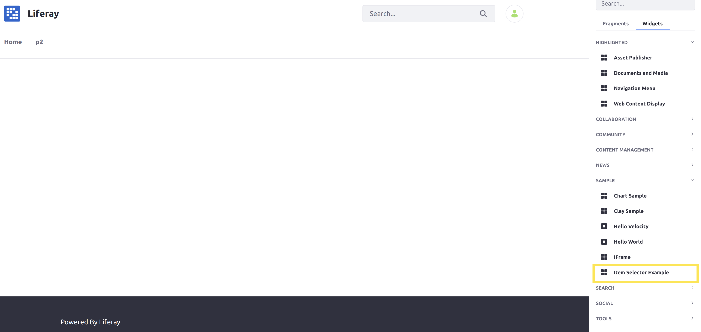

# Implementing an Item Selector

Item selectors are pop-up dialogs that allow users to select from the chosen criteria. They can be configured to select from a wide variety of entities, such as documents, videos, Users, Roles, and Sites.

By configuring the item selector's criteria and defining its usage, you have full flexibility in how to use the item selector dialog for your own application.

In this tutorial, you'll see an example item selector, and then walk through the steps of creating one yourself.

**Contents:**
1. [See an Example Item Selector](#see-an-example-item-selector)
1. [Start with a Sample Module](#start-with-a-sample-module)
1. [Create an Item Selector URL](#create-an-item-selector-url)
1. [Use the Item Selector in Your View](#use-the-item-selector-in-your-view)


## See an Example Item Selector

To see how item selectors work in Liferay DXP, begin by deploying an example module with a basic item selector implementation.

### Deploy the Example

1. Download and unzip the [example module](./liferay-f5d5.zip):

    ```bash
    curl https://learn.liferay.com/dxp/7.x/en/developing-applications/data-frameworks/liferay-f5d5.zip -O
    ```

    ```bash
    unzip liferay-f5d5.zip.zip
    ```

1. Start a Liferay DXP Docker container with the following command:

    ```bash
    docker run -it -p 8080:8080 --name lrdev liferay/portal:7.3.2-ga3
    ```

1. Run the following commands from the root of the module to build and deploy to your Docker container:

    ```bash
    ./gradlew deploy -Ddeploy.docker.container.id=$(docker ps -lq)
    ```

    ```tip::
       This command is the same as copying the deployed jars to ``/opt/liferay/osgi/modules`` on the Docker container.
    ```

1. Confirm the deployment in the Liferay Docker container console.

    ```bash
    STARTED com.acme.f5d5.web_1.0.0 [1017]
    ```

The example module is now deployed to your Docker image. Now you can see the item selector in action in Liferay DXP. 

### Use the Deployed Sample Widget

The example module adds a new widget ("Item Selector Example") to 

1. Open your browser to `https://localhost:8080`.

1. Edit any page by clicking the Edit icon () at the top-right corner of the screen.

1. Open the _Fragments and Widgets_ menu by clicking the Table icon () on the right edge of the screen.

1. Click the _Widgets_ tab, and then expand the _Sample_ section to locate _Item Selector Sample_.



1. Drag the _Item Selector Sample_ widget anywhere on the page.

1. Click the _Publish_ button on the top-right corner of the screen.

1. Click the "Select" button that now appears on the page to open the new _Select Role_ item selector.


Now you can see what an item selector looks like in Liferay DXP. In this example, the item selector allows User Roles to be selected.

## Start with a Sample Module

Item selectors are useful in a variety of applications to allow users to select data for your purposes. Thus, to implement an item selector, you need to embed it in an application, such as a module for a widget.

In this tutorial, a sample JSP portlet application from the Liferay Blade Samples is used as a convenient starting point. To begin from a similar starting point, clone the [`liferay-blade-samples` repository](https://github.com/liferay/liferay-blade-samples) and copy the module inside of the `liferay-workspace/apps/jsp-portlet` folder.

Once you have the example module, you are ready to begin adding an item selector to it. Implementing the item selector requires changes to both the Java code (in the example module, [JSPPortlet.java](https://github.com/liferay/liferay-blade-samples/blob/7.1/liferay-workspace/apps/jsp-portlet/src/main/java/com/liferay/blade/samples/portlet/jsp/JSPPortlet.java)) and either a `.js` or `.jsp` file to add it to the front-end of your application (in the example module, [view.jsp](https://github.com/liferay/liferay-blade-samples/blob/7.1/liferay-workspace/apps/jsp-portlet/src/main/resources/META-INF/resources/view.jsp)).

## Create an Item Selector URL

To create and use an item selector, you must define the necessary criteria that will determine how the selector works, and then you must create a URL for that criteria.

### Define the Item Criteria

The item criteria for an item selector determine the kind of data that it will handle, including what kind of entities to select from.

Since the Java class defining the portlet render logic for the sample JSP portlet is in `JSPPortlet.java`, begin by overriding the `render` method of the [`MVCPortlet` class](https://github.com/liferay/liferay-portal/blob/7.3.1-ga2/portal-kernel/src/com/liferay/portal/kernel/portlet/bridges/mvc/MVCPortlet.java) to add your Java code needed for creating an item selector. References to the two following types of classes are needed together to specify the item criteria for your selector:

1. A criterion class to represent the desired entities that the item selector will choose from. Criteron classes must implement the [`ItemSelectorCriterion` interface](https://github.com/liferay/liferay-portal/blob/7.3.1-ga2/modules/apps/item-selector/item-selector-api/src/main/java/com/liferay/item/selector/ItemSelectorCriterion.java).

    This example uses a reference to [`RoleItemSelectorCriterion`](https://github.com/liferay/liferay-portal/blob/7.3.1-ga2/modules/apps/roles/roles-item-selector-api/src/main/java/com/liferay/roles/item/selector/RoleItemSelectorCriterion.java) so that User Roles are shown in the selector. Define the criterion by creating a new instance of the class:

    ```java
    RoleItemSelectorCriterion itemSelectorCriterion =
        new RoleItemSelectorCriterion();
    ```

    ```tip
    If no criterion exists for the type of entity that you need, then you can define your own `ItemSelectorCriterion` by extending [`BaseItemSelectorCriterion`](https://github.com/liferay/liferay-portal/blob/7.3.1-ga2/modules/apps/item-selector/item-selector-api/src/main/java/com/liferay/item/selector/BaseItemSelectorCriterion.java).
    ```

1. A return type class to represent the information the entities provide when Users select them. Return type classes must implement the [`ItemSelectorReturnType` interface](https://github.com/liferay/liferay-portal/blob/7.3.1-ga2/modules/apps/item-selector/item-selector-api/src/main/java/com/liferay/item/selector/ItemSelectorReturnType.java). For example, a return type class may be used to return the entity's URL, UUID, or primary key.

    The return type class is added to the criterion class created previously. Every criterion used **must** have at least one return type associated with it.

    This example uses a reference to [`UUIDItemSelectorReturnType`](https://github.com/liferay/liferay-portal/blob/7.3.1-ga2/modules/apps/item-selector/item-selector-criteria-api/src/main/java/com/liferay/item/selector/criteria/UUIDItemSelectorReturnType.java) to define the selected Roles' `UUID` value as the crucial data to return. If multiple Roles are selected, they are returned as a comma-delimited list.

    Define the return type by adding an instance of the class to a list, and then registering it with the item criterion:

    ```java
    ItemSelectorReturnType[] returnTypeArray =
        new ItemSelectorReturnType[1];

    returnTypeArray[0] = new UUIDItemSelectorReturnType();

    List<ItemSelectorReturnType> itemSelectorReturnTypes =
        ListUtil.fromArray(returnTypeArray);

    itemSelectorCriterion.setDesiredItemSelectorReturnTypes(
        itemSelectorReturnTypes);
    ```

    ```tip
    If no return type exists for the type of information that you need, then you can define your own ```ItemSelectorReturnType`` <https://github.com/liferay/liferay-portal/blob/7.3.1-ga2/modules/apps/item-selector/item-selector-api/src/main/java/com/liferay/item/selector/ItemSelectorReturnType.java)>`__ implementation.
    ```

Your item selector uses these two classes to decide what selection views of items (presented as tabs) to show, and how to identify each item.

### Get an Item Selector for the Chosen Criteria

(explain the OSGi reference bit, and calling the factory to actually get it)

### Pass the Item Selector URL to Your View

In this example, the `view.jsp` file is where the front-end code is defined. The `renderRequest` object in your Java class's `render` method is passed to the JSP file later on.

Add the item selector URL to the `renderRequest` so that it will be available in the JSP code:

```java
renderRequest.setAttribute("itemSelectorURL", itemSelectorURL);
```

Finally, call `MVCPortlet`'s `render` method to continue the rendering process once your code is executed:

```java
super.render(renderRequest, renderResponse);
```

You have now finished adding the necessary Java code to create the item selector; see [`JSPPortlet.java`](./implementing-an-item-selector/liferay-f5d5.zip/f5d5-web/src/main/java/com/acme/f5d5/web/internal/portlet/bridges/mvc/JSPPortlet.java) in the provided example module to see the complete implementation. Now you only need to retrieve and use the item selector in your front-end code.

## Use the Item Selector in Your View

You must retrieve the item selector and define a way to use it in your front-end code (`view.jsp` in this example). Begin by retrieving the item selector URL from the request you stored it in previously:

```jsp
<%
String itemSelectorURL = String.valueOf(request.getAttribute("itemSelectorURL"));
%>
```

Now that you have the URL, you must provide a way to open the item selector, and then define how to use the result.

### Provide a Way to Open the Item Selector

In this example, a simple button is used to create the item selector dialog. You can use the `aui:button` tag from the [AUI library](http://alloyui.com/api/) to quickly create a button:

```jsp
<aui:button name="selectRole" value="Select" />
```

The `aui:button` tag creates a button (with the name "selectRole" and the label "Select" displayed on the screen) that will appear in your widget. This button can be identified by the String `<portlet:namespace />selectRole`.

The easiest way to utilize an item selector is by defining it in JavaScript, so use the `aui:script` tag to embed JavaScript in your JSP file. Use the item selector definition (`frontend-js-web/liferay/ItemSelectorDialog.es`) as a requirement for your script:

```jsp
<aui:script require="frontend-js-web/liferay/ItemSelectorDialog.es as ItemSelectorDialog">
    var selectRoleButton = document.getElementById('<portlet:namespace />selectRole');

    selectRoleButton.addEventListener(
        'click',
        function(event) {
            // Create and use the item selector dialog.
        }
    );
</aui:script>
```

This snippet of JavaScript first retrieves the "Select Role" button through its identifier (`portlet:namespace />selectRole`). Then, it adds an event listener to create the item selector dialog when clicked.

### Define and Use the Item Selector Dialog

Define the item selector dialog and its behavior inside the the select button's on-click function. Use the `ItemSelectorDialog.default` constructor to create the dialog:

```js
var itemSelectorDialog = new ItemSelectorDialog.default(
    {
        eventName: 'selectItem',
        title: '<liferay-ui:message key="select-role" />',
        url: '<%= itemSelectorURL %>'
    }
);
```

The value for the `eventName` field **must** match the  You must also use the URL that you retrieved from the `request` object for the `url` field when defining the item selector dialog.

```note::
The ``title`` field in this example uses a `language key <https://help.liferay.com/hc/en-us/articles/360018168251-Localizing-Your-Application>`__ to define the dialog title. Add any language keys you are using to a ```Language.properties`` <./implementing-an-item-selector/liferay-f5d5.zip/f5d5-web/src/main/resources/content/Language.properties>`__ file within your module.
```

```tip::
If you only want to support selecting one item, then you can restrict the dialog to a single selection by adding this field to the ``ItemSelectorDialog``: ``singleSelect: true``.
```

Then, define the dialog's behavior when the user makes a selection:

```js
itemSelectorDialog.on(
    'selectedItemChange',
    function(event) {
        var selectedItem = event.selectedItem;
    
        if (selectedItem) {
            // Use the selected item value(s) here.
        }
    }
);
```

Finally, now that the item selector is defined, the last step is to open the dialog:

```js
itemSelectorDialog.open();
```

## Use the Item Selector Result

Use the item selection, stored previously as `selectedItem`. The data type and information contained in the result `selectedItem` depends on what return type class you used in the Java code. Since this example uses `UUIDItemSelectorReturnType`, the data is a String value with the UUIDs of one or more selected items.

Implement your usage of the resulting value within the selection function:

```js
if (selectedItem) {
    // Use the selected item value(s) here.
}
```

Once you have finished adding your implementation logic, the implementation of the item selector is complete. To see all of the example JSP code in its full context, see the example module's [`view.jsp` file](./implementing-an-item-selector/liferay-f5d5.zip/f5d5-web/src/main/resources/META-INF/resources/view.jsp).

## Conclusion

Congratulations! You now know the basics for implementing an item selector, and have added a new item selector to Liferay DXP.