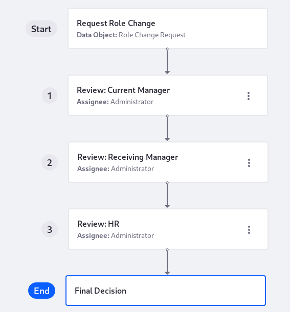

# Creating a Workflow Powered Application

> **Subscribers**

Workflow Powered Applications require data from multiple stakeholders. These process-driven applications can go through multiple stages before the object's data is fully fleshed out. These apps can even send the processing back to previous stages/stakeholders.

To create an example application, read

* [Creating the Role Change Request Object](./creating-the-role-change-request-object.md)
* [Creating the Role Change Request App](./creating-the-role-change-request-app.md)

Workflow Powered Apps are designed by thinking about the steps the object's forms must pass through before being considered complete.

Each step has configuration options depending on its stage in the workflow:

| Step | Configuration Options | Description |
| ---- | ------ | ----------- |
| Start (Initial Step) | Step Name   Main Data Object   Form View   Table View   Action | At a minimum, choose an object, form view, and table view so that the data object can begin getting filled out. There's no assignee, because anyone who can add a record begins the processing. The action can be renamed but always proceeds to the next step. |
| 1 (Step 1) | Step Name   Assignee   Form View   Action | Name the step and assign it to a [Role](../../users-and-permissions/roles-and-permissions/understanding-roles-and-permissions.md). Then choose or create a form view (set it to read only or editable) and name the action that transitions to the next step. |
| Additional Numbered Steps (e.g., Step 2, 3, 4, etc.) | Same as for step 1, plus the _Add New Action_ option | Additional steps can do everything that Step 1 can do, plus create a new action that transitions back to the previous workflow step, if necessary. |
| End (Final Step) | Step Name | Name the last step in the workflow process |

## App Versions

Workflow Powered Apps are versioned, because [workflow processes are versioned](../../process-automation/workflow/designing-and-managing-workflows/managing-workflows.md#viewing-and-restoring-workflow-revisions). A new version of the app is created when you

- Add, edit, or remove steps or transitions in the workflow process (actions that generate a new version of the workflow process).
- Add, update, or remove a form view in one of the workflow steps.
- Add, update, or remove the assignees of a workflow step.

A new version of the Workflow Powered App only applies to new submissions. The app's manager can check the version for each submission from its details view---view the record's details by clicking on it in a table view.

## Related Information

* [App Builder Overview](./app-builder-overview.md)
* [Creating a Standard Application](./creating-a-standard-application.md)
* [Workflow](../../process-automation/workflow/introduction-to-workflow.md)
* [Roles and Permissions](../../users-and-permissions/roles-and-permissions/understanding-roles-and-permissions.md)
