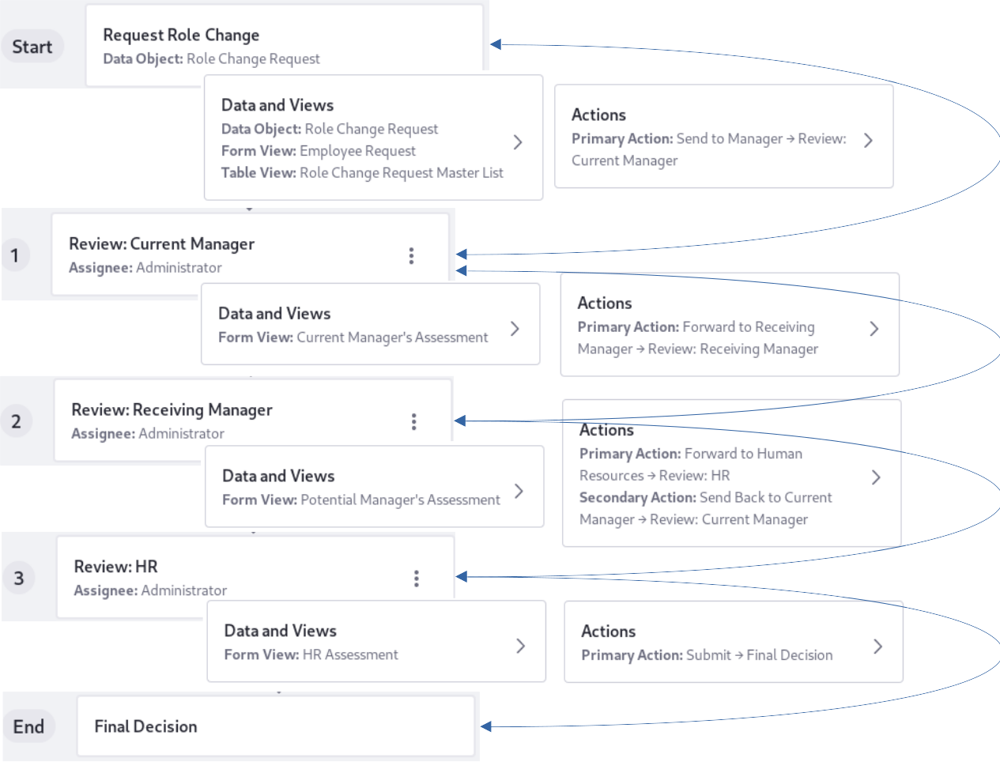

# Creating a Workflow Powered Application

> **Subscribers**

Workflow Powered Applications require data input from multiple stakeholders. These process-driven applications can go through multiple stages before the object's data model is fully fleshed out. They can even be sent back to previous stages/stakeholders in more complex cases.

The application is designed by thinking about the steps the object's forms must pass through before being considered complete.

   

Each step has configuration options depending on its stage in the workflow:

| Step | Configuration Options | Description |
| ---- | ------ | ----------- |
| Start (Initial Step) | Step Name   Main Data Object   Form View   Table View   Action | At a minimum, choose an object, form view, and table view so that the data object can begin getting filled out. There's no assignee, because anyone who can add a record begins the processing. The action can be renamed but always proceeds to the next step. |
| 1 (Step 1) | Step Name   Assignee   Form View   Action | Name the step and assign it to a Role. Then choose a form view (set it to read only or editable) or create a new one, and name the action that transitions to the next step. |
| Additional Numbered Steps (e.g., Step 2, 3, 4, etc.) | Same as for step 1, plus the _Add New Action_ option | Additional steps can do everything that Step 1 can do, plus choose to create a new action that transitions back to the previous workflow step, if necessary. |
| End (Final Step) | Step Name | Name the last step in the workflow process |

## App Version

Workflow Powered Apps are versioned, because [workflow processes are versioned](../process-automation/workflow/user-guide/managing-workflows.html#viewing-and-restoring-workflow-revisions). A new version of the app is created when you

- Add, edit, or remove steps or transitions in the workflow process (actions that generate a new version of the workflow process).
- Add, update, or remove a form view in one of the workflow steps.
- Add, update, or remove the assignees of a workflow step.

A new version of the Workflow Powered App will only apply to new submissions. The app's manager can check the version for each submission from its details view--view the record's details by clicking on it in a table view.

## Creating an Example Workflow Powered App

Consider a Human Resources application that allows employees to request changing Roles within the software engineering department: the Role Change Request App. This app starts with the employee submitting a request form, which proceeds to the Current Manager, then to the Receiving Manager, and finally to Human Resources. Each step along the way is responsible for collecting more fields of the data object, until, by the end of the process, the whole data object is complete.

<!-- Not Final -->

First create the backing object, form views, and table views, then create the Workflow Powered App itself.

### Creating the Role Change Request Object

For detailed instructions on creating App Builder objects, form views, and table views, see [Creating a Standard Application](./creating-a-standard-application.md). The same object can back a Standard App or a Workflow Powered App. The difference is all in how you create the app from the basic elements of the App Builder framework. These instructions are for creating the Object, Form Views, and Table Views needed in the Role Change Request App. You can accomplish this from the Objects entry in the Applications Menu's () Applications &rarr; App Builder section.

#### **Object:** Create the object named _Role Change Request_.

#### **Form:** Create the _Employee Request_ form.

   | Field Type | Field Label | Options | Required | Other Properties |
   | ---------- | ----------- | ------- | -------- | ---------------- |
   | Text | Name | Not applicable (NA) |  &#10004; | NA |
   | Text | Current Manager's Name | NA |  &#10004; | NA |
   | Text | Current Role | NA |  &#10004; | NA |
   | Select from List | Requested Role | Support Engineer   Backend Developer   Frontend Developer   Technical Writer   IT Engineer |  &#10004; | NA |

#### **Form:** Create the _Current Manager's Assessment_ form.

   | Field Type | Field Label | Options | Required | Other Properties |
   | ---------- | ----------- | ------- | -------- | ---------------- |
   | Single Selection | Current Manager: Is the Transfer Approved? | Yes   No |  &#10004; | NA |
   | Single Selection | Does the employee exhibit skills and experiences requisite with the requested role? | Yes   No |  &#10004; | NA |
   | Text | Detail the employee's skills and characteristics that will make the transfer successful | NA |  &#10008; | Multiple Lines |
   | Text | Detail the employee's skills and characteristics that might inhibit a successful transfer | NA |  &#10008; | Multiple Lines |
   | Date | When can the transfer occur? | NA | &#10008; | NA |

#### **Form:** Create the _Potential Manager's Assessment_ form.

   | Field Type | Field Label | Options | Required | Other Properties |
   | ---------- | ----------- | ------- | -------- | ---------------- |
   | Single Selection | Receiving Manager: Is the Transfer Approved? | Yes   No |  &#10004; | NA |
   | Single Selection | Is there an available role for the employee? | Yes   No |  &#10004; | NA |
   | Single Selection | Do you have concerns about the suitability of the employee? | Yes   No |  &#10008; | NA |
   | Single Selection | Are training resources available? | Yes   Unnecessary: The employee is already proficient in the subject matter. |  &#10008; | NA |
   | Text | Comments | NA |  &#10008; | Multiple Lines | NA |

#### **Form:** Create the _HR Assessment_ form.

   | Field Type | Field Label | Options | Required | Other Properties |
   | ---------- | ----------- | ------- | -------- | ---------------- |
   | Single Selection | HR Representative: Is the Transfer Approved? | Yes   No |  &#10004; | NA |
   | Single Selection | Does the transfer require a reassessment of the employee's benefits? | Yes   No |  &#10004; | NA |

#### **Table:** Create the _Role Change Request Master List_ table.

   | Column 1 | Column 2 | Column 3 | Column 4 | Column 5 | Column 6 |
   | ---------- | ----------- | ------- | -------- | ---------------- | ---- |
   | Name | Requested Role | Current Manager: Is the Transfer Approved? | Receiving Manager: Is the Transfer Approved? | HR Representative: Is the Transfer Approved? | When can the transfer occur? |
   

### Creating the Role Change Request App

A Standard app can be created from within the Object Control Panel entry, but not a Workflow Powered app. Instead use the _Apps_ Control Panel Entry:

1. Open the Applications Menu () and navigate to Control Panel &rarr; App Builder &rarr; Apps.

1. Click the _Workflow Powered_ tab. Any existing Workflow Powered apps are displayed. 

1. Click the Add button () to open the New Workflow Powered App canvas.

   

1. The first step of the workflow is in place--rename it to _Request Role Change_. The first step represents the submission of the first form that kicks off the application's process. After renaming the step, configure the Data and Views:

   - Main Data Object: Select the _Role Change Request_ object.
   - Form View: Select the _Employee Request_ form.
   - Table View: Select the _Role Change Request Master List_ (this table view won't be used for this step). <!-- Find out how this is supposed to work. Can we leave it blank? -->

   Configure the Actions:

   - Rename the current action to _Send to Manager_.

   Save the application.

1. Re-open the app, then add a step to the workflow by clicking the plus icon.

   Name it _Review: Current Manager_ and assign it to the _Administrator_ Role. Each step you add for the Role Change Request App corresponds to a different form. Together, all the steps/forms will fill out all the fields of the backing object.

   Now configure the Data and Views:

   - Form View: _Current Manager's Assessment_. Make it editable.

   Go back to the Step Configuration screen and configure the Actions:

   - Rename the action to _Forward to Receiving Manager_.

   Save the app. If you see a warning message about applying the updates to existing app data, click _Save_ in the dialog box. This is a new app that doesn't currently have any data records, and the warning is informational.

1. Re-open the app, click on the last step added, then add a new step by clicking the plus icon.

   Name it  _Review: Receiving Manager_ and assign it to the _Administrator_ Role.

   Now configure the Data and Views:

   - Form View: _Potential Manager's Assessment_. Make it editable.

   Go back to the Step Configuration screen and configure the Actions:

   - Rename the existing action to _Forward to Human Resources_. It transitions to the next step in the workflow.

   - Add a secondary action, named _Send Back to Current Manager_. It transitions back to the previous workflow step, enabling the two managers to collaborate on the details until it's ready for HR review.

1. Re-open the app, click on the last step added, then add a new step by clicking the plus icon.

   Name it  _Review: HR_ and assign it to the _Administrator_ Role.

   Now configure the Data and Views:

   - Form View: _HR Assessment_. Make it editable.

   Go back to the Step Configuration screen and configure the Actions:

   - Leave the action named _Submit_.

### Deploying and Using the App

<!-- do we also need a standard app for admins to just view the records in the master list?

## Related Information

* [App Builder Overview](./app-builder-overview.md)
* [Creating a Standard Application](./creating-a-standard-application.md)
* [Workflow](../../process-automation/workflow/user-guide/introduction-to-workflow.md)
* [Roles and Permissions](../../users-and-permissions/roles-and-permissions/understanding-roles-and-permissions.md)
