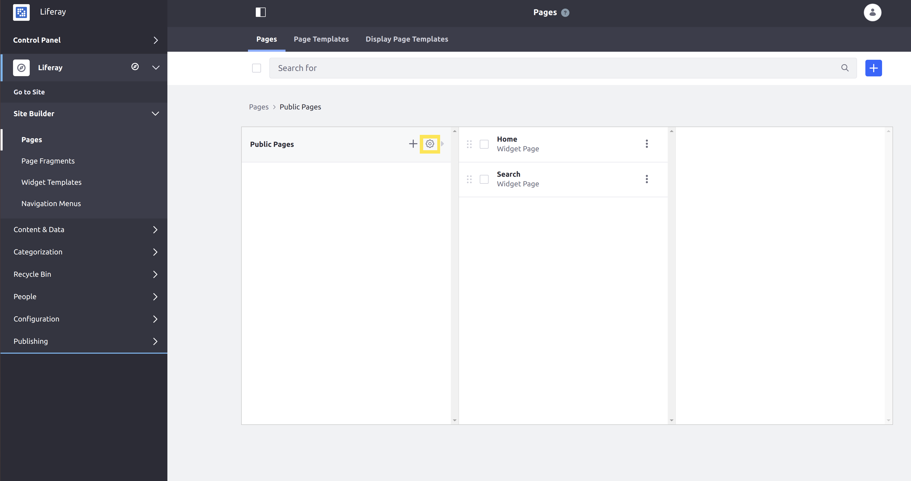
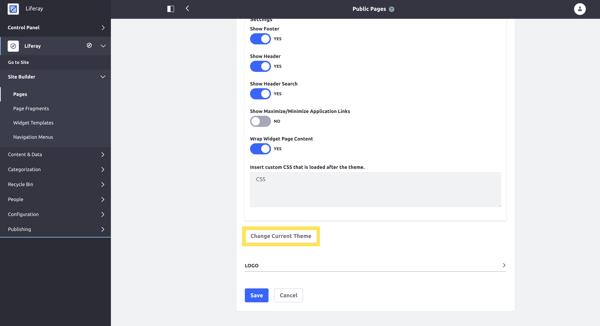

# Changing Your Theme

Themes in Liferay DXP set the overall look and feel for your Site. A Site's Public or Private Pages can be configured to use any theme that has been deployed to your DXP instance.

The DXP Docker image has the _Classic_ theme available by default. For this walkthrough, you will configure your Site to use a sample theme.

1. Start up the Liferay DXP Docker image:

	```bash
	docker run -it -p 8080:8080 liferay/dxp:7.2.10.1-sp1
	```

1. Download the WAR containing the sample theme:

	```bash
	curl https://learn.liferay.com/dxp/7.x/en/getting-started/changing-your-theme/liferay-5b2v.war -0
	```

1. Copy the WAR containing the theme into your DXP instance's deploy folder using `docker cp`:

	```bash
	docker cp liferay-5b2v.war docker-container:path-to-deploy-folder
	```

This will load the sample theme into your DXP instance. You can check your console for the following message to confirm that the theme successfully deployed:

```
020-01-23 00:04:32.824 INFO  [fileinstall-/home/liferay/deploy/7.2-test/osgi/war][BundleStartStopLogger:39] STARTED liferay-5b2v_1.0.0 [934]
```

Next, configure the Public Pages for your Site to use the deployed theme:

1. Open your browser to `https://localhost:8080` and login as an administrator.

1. Navigate to the product menu → _Site Administration_ → _Site Builder_ → _Pages_.

1. Click the gear icon  next to _Public Pages_ to configure them:

	

1. Scroll down and click the _Change Current Theme_ button:

	

1. Select the deployed sample theme, _Classic with Blue Background._

1. Navigate back to the home page for your Site to confirm that the theme has changed. The background for the page should now be solid blue.

Congratulations! You have changed your Site's theme!