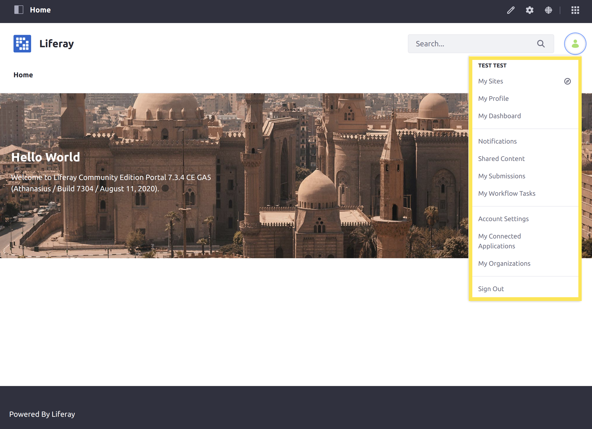
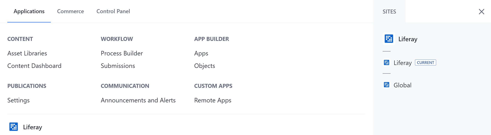
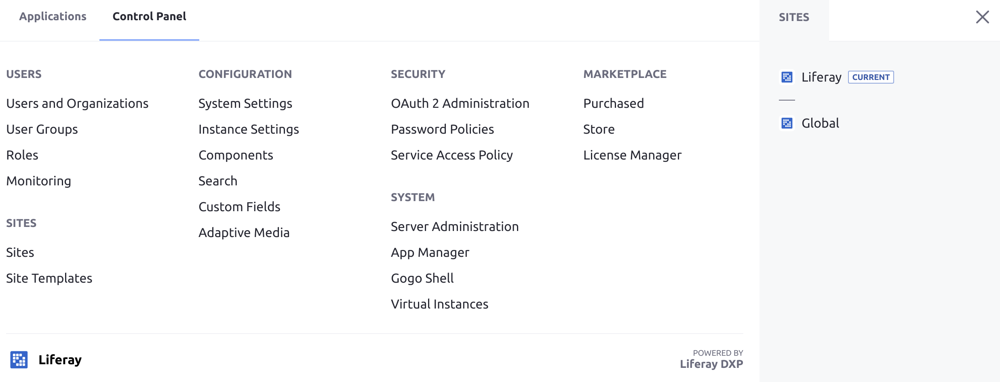
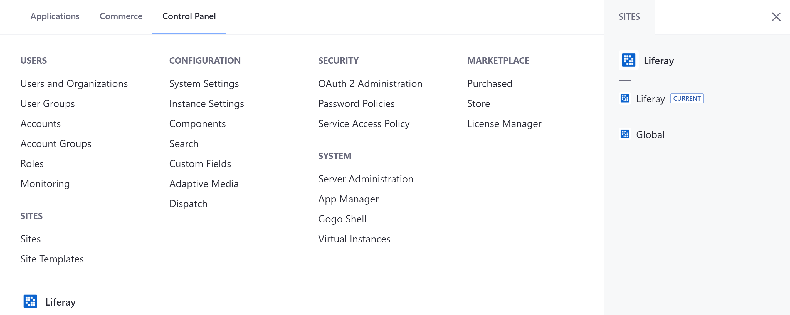
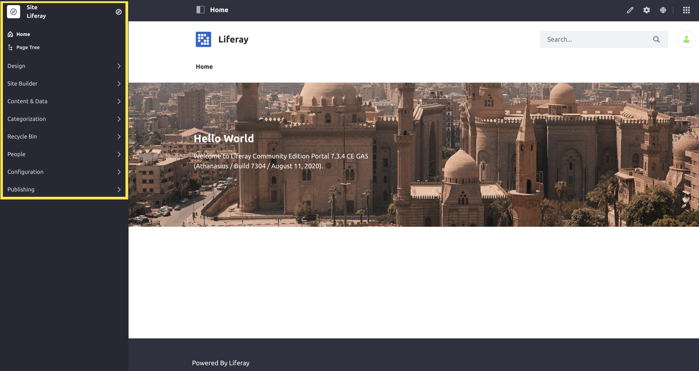

# Navigating DXP

Liferay DXP's out-of-the-box navigation is organized into two major areas: the _Personal Menu_ and the Global Menu_.

## Personal Menu

The Personal Menu is the hub for information and activities for a User that is logged in.



Users can use the personal menu to:

* [Change account information](./introduction-to-the-admin-account.md#changing-account-information) (Name, Password, etc.)
* [See what sites they are members of](../site-building/building-sites/adding-members-to-sites.md)
* [Review site notifications](../collaboration-and-social/notifications-and-requests/user-guide/managing-notifications-and-requests.md)
* [Sign out](./introduction-to-the-admin-account.md#signing-out)
* And more...

## Global

The DXP Global Menu_ contains the _Applications Menu_ and the _Control Panel_. Click the _Applications Menu_ icon () at the top of the screen to access it.

```note::
   By default, Users with the *Guest* or *User* roles are not able to access the Global Menu.
```

You can also navigate to other Sites available to you from either the _Applications_ or _Control Panel_ tabs in the Global Menu_, on the right side.

### Applications Menu

The _Applications Menu_ contains a variety of links to manage many different applications within your Liferay DXP server.



The following sections can be managed from the _Applications Menu_:

* Asset Libraries and the Content Dashboard
* [User Accounts](../users-and-permissions/accounts/introduction-to-accounts.md)
* [Workflow](../process-automation/workflow/user-guide/introduction-to-workflow.md)
* [Alerts and Announcements](../collaboration-and-social/alerts-and-announcements.md)
* [App Builder](../developing-applications/developing-low-code-applications/app-builder-overview.md)

### Control Panel

The _Control Panel_ contains general administrative actions and configurations that apply _globally_ to the Liferay DXP installation.



The following common administrative activities can be done in the Control Panel:

* [Manage Users, Permissions, and Roles](../users-and-permissions/users/adding-and-managing-users.md)
* [Change how users login](../installation-and-upgrades/securing-liferay/authentication-basics.md)
* [Create new Sites](../site-building/building-sites/adding-a-site.md)
* Add new Custom Fields to applications on the site
* And more...

## Site Menu

The DXP _Site Menu_ on the left side of the screen contains actions, content, and configurations that are scoped to the specific site that is being currently viewed. The Site Menu may be hidden until you expand it by clicking the icon (  ) at the upper-left corner of the screen.



```note::
   The *Site Menu* indicates which site you are working with when using the Site Menu. In this example the Site is `Liferay DXP`. You may change what site you are working with by clicking the Compass Icon in the Site Menu.
```

The following common site building and management activities can be done in the _Site Menu_:

* [Adding Pages](../site-building/creating-pages/adding-pages/adding-a-page-to-a-site.md)
* [Creating Content](../content-authoring-and-management/README.md)
* [Managing Site Memberships](../site-building/building-sites/adding-members-to-sites.md)
* [Configuring and Optimizing Site Behavior and Functionality](../site-building/optimizing-sites/README.md)
* And more...

## DXP 7.1 and 7.2

In Liferay DXP versions prior to 7.3, all of the contents of the Global Menu are instead contained within the Control Panel. The Control Panel itself is located above the Site Menu on the left side of the screen in these versions.



## What's Next

Continue our Getting Started walkthrough and learn about [Creating Your First Site](./creating-your-first-site.md).
