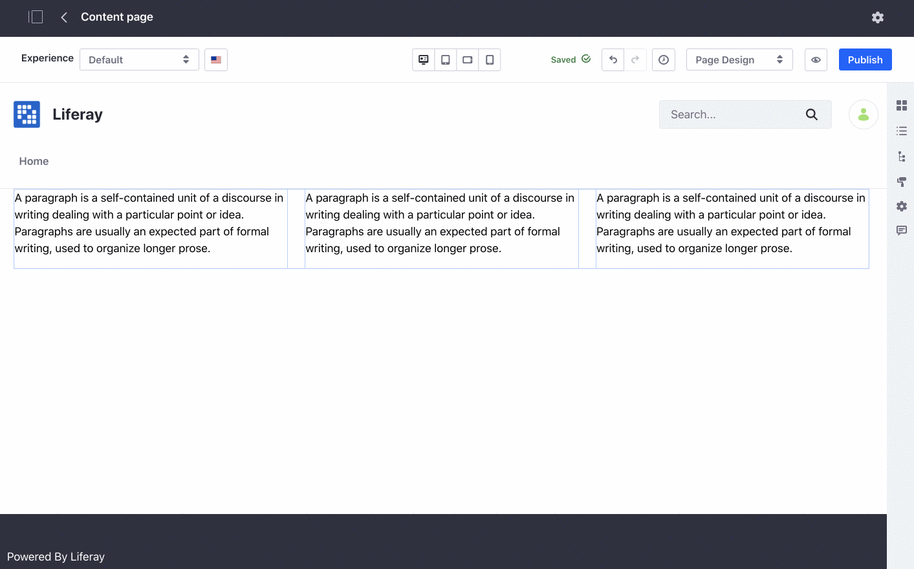
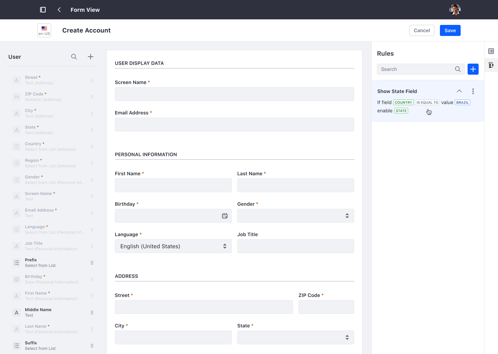
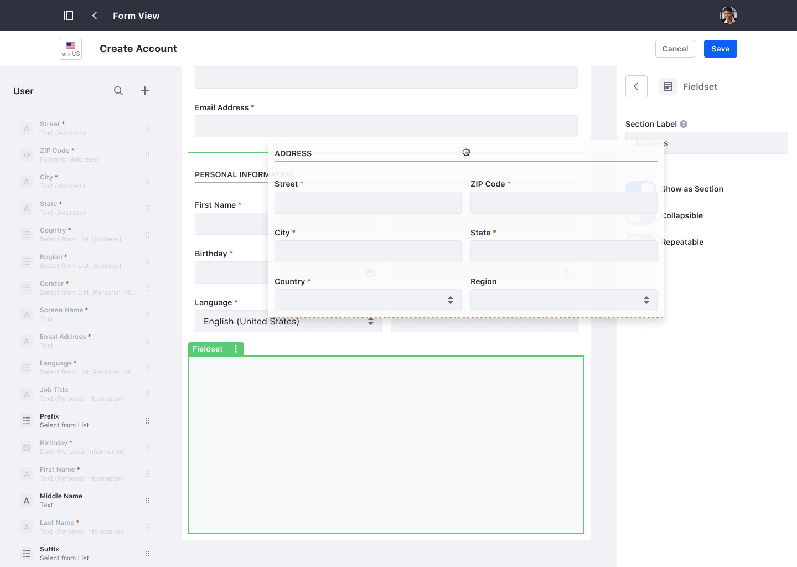
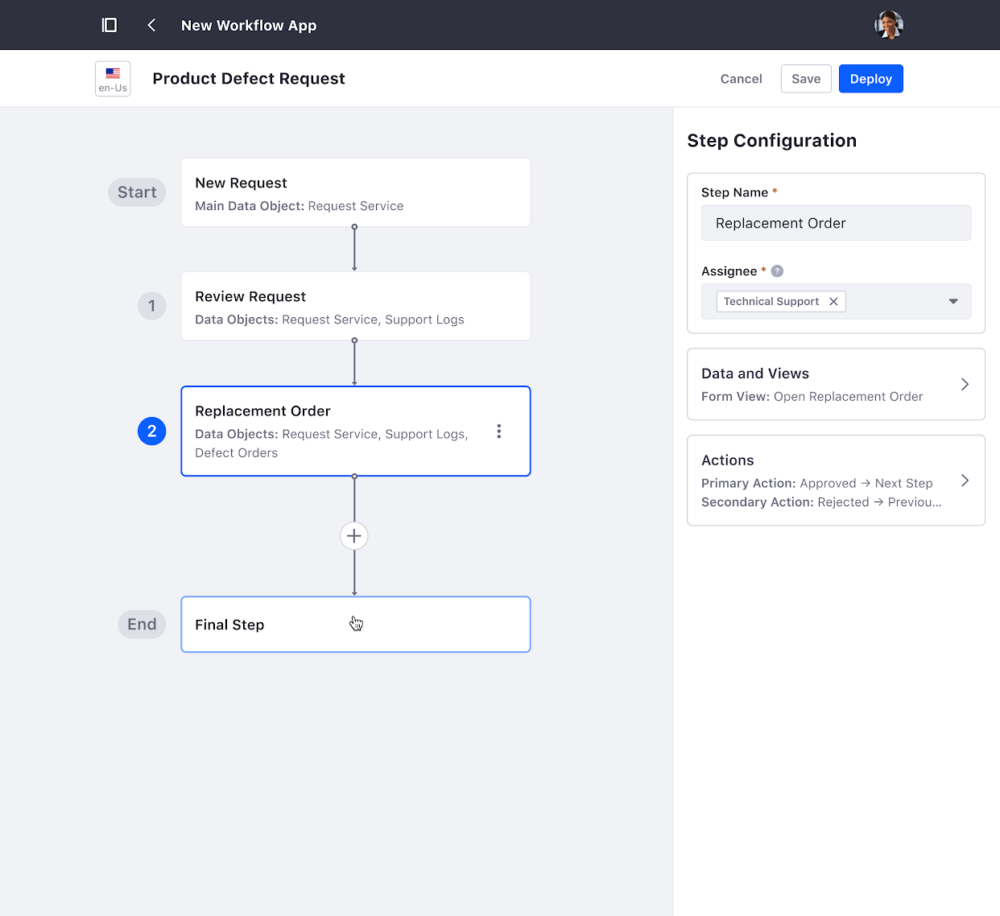
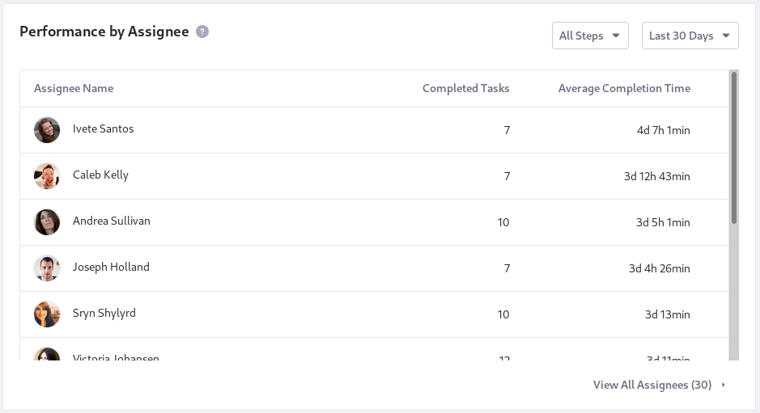
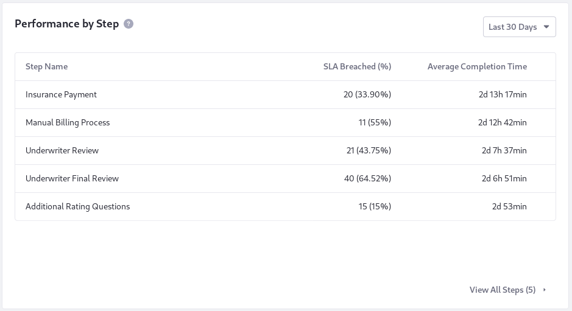
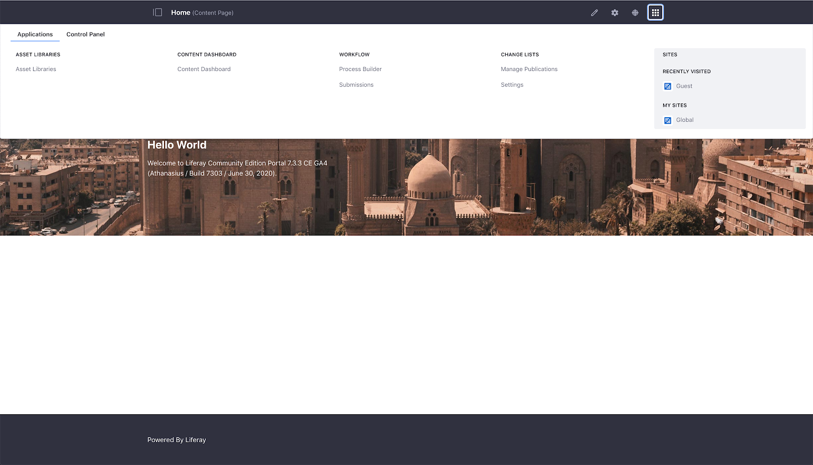
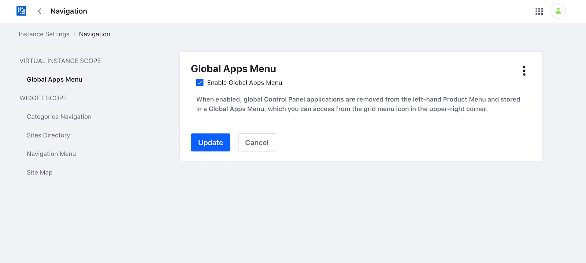
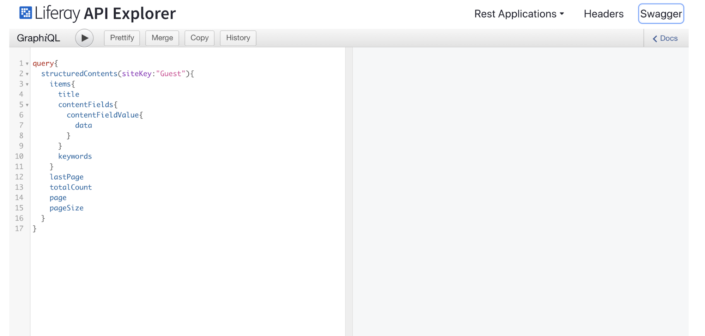

# What's New in Liferay DXP 7.3

Liferay DXP 7.3 aims to refine Experience Management and Digital Operations to be better leveraged by non-technical practitioners. Improvements to site building, design, and personalization give users a new level of control and maintainability to the platform without having to know templating languages or relying on developers, built in content analytics empowers authors to be data driven, and app builder opens the door for business analysts to digitize operations without developers.

For a full feature list, please read the Liferay DXP 7.3 Features Overview or contact 

## Page Building

### Master Pages

Master Pages define page areas that are consistent across several or even all pages across Sites. Most commonly, they're used to define headers, footers, and side bars. Prior to this feature, common page areas could only be defined within a theme. Now non-technical users can create their own master pages, use them across the site and change them at any time (having the changes automatically applied to all pages). This is actually part of a larger ongoing effort to support customizing Liferay's look and feel and branding for the most common cases without the need for development. Master pages are created using the page editor, allowing the use of any fragment or widget in the common page areas. A cool feature is the ability to configure which fragments are allowed for a given master page, giving administrators the possibility to provide useful guide rails per use case. Master Pages are a type of Page Template and can be created and managed from the "Page Templates" application within Design .

### Undo and Redo

New buttons are added to the toolbar that make it possible to undo/redo the actions. Keyboard shortcuts are also available: CMD + z / CMD + shift + z (MacOS) Ctrl + z / Ctrl + shift + z (Windows, Linux)

In addition to this feature, we have added a panel that lists all the actions performed by the user in the editing session, allowing also to move rapidly to a concrete state of the page.

### At-Mention Users in Page Comments

Page Commenting was introduced in DXP 7.2 SP1 to make it easier for users to collaborate and review. In DXP 7.3, this will be improved with the ability to @mention users in the comments. Mentioned users will receive a notification they can click on to view the comment. Users must have permission to edit the page to be @mentioned.

Known limitation is that page comments do not work with workflow comments, which can be rather unintuitive for customers. This will be fixed for the next version.

### Collection Display

A new fragment has been added that takes advantage of the collection functionality ("content sets" in 7.2) to easily display sets of assets. We are introducing this as an alternative and, eventually, a replacement to Asset Publisher.

The limitations of Asset Publisher was that it required a developer to alter the presentation. The new Collection Display fragment allows for the drag and drop editing.

When the fragment is added to the page, it must first be configured by linking it to a collection. After this,  the fragment is divided into different spaces, each one corresponding to an asset in the collection. From there, any adjustment made to each of the spaces will be replicated in the rest. Editable fields can be mapped to the common fields in the collection. For example, if a Heading fragment is added, it can be mapped to the title field of a web content structure and this mapping will propagate to each item.

In addition to this, we can also make some adjustments to the presentation format, changing the layout or the maximum number of items to be displayed.

### Visual Responsive Layout Editor

Responsive design is a must have because there is a wide and increasing variety of device screen sizes accessing the same source of information. The responsive editor makes it possible to adapt the page content in the most suitable way for each device where it is visualized.

Although the layouts provided out of the box with Liferay for fragment-based pages are configured to be responsive depending on the size of the browser window, in some cases, it's desirable to finetune the out of the box responsive behavior. The new tool allows the page author to customize the fluid page behavior of each of the layouts.

The new tool to customize the responsive behavior is located in the page editor toolbar, providing 4 buttons. Each button represents a viewport: desktop, tablet, landscape mobile and portrait mobile. If the user selects either of them, the page is resized to the corresponding width simulating the size of each device. Moreover, the user can resize the page to an intermediate size within the limits of the viewport.

Styles are maintained per viewport and are inherited by viewports smaller than it. There is an initial configuration and this configuration is inherited by the rest of viewports (from desktop to mobile). If the style of some of the viewports changes for the first time, the rest of viewports inherit this style in descending order. That is to say, if the tablet viewport is modified, the style of the smaller size devices (mobile) will also change, inheriting its style [and breaking the desktop viewport inheritance. Consequently, when the desktop viewport is modified again only that viewport is modified.

### General Performance Improvements

The page editor was completely overhauled to utilize React in Liferay DXP 7.3. This has substantially increased the performance when utilizing the editor, especially when working with larger pages. A number of bugs have also been fixed during the process.

### Visual Fragment Composition

As page authors invest time in creating fragments for their pages, a clear need is to be able to reuse the compositions of fragments created in some pages in other pages. To solve this need it should be possible for a page author to take a composition defined within one section or row of columns and save them with a name. When the composition is saved as a fragment, the following information should be saved with it (or at least offered as an option for the user to save). 

All the fragments inside the section or rows of columns.

Configuration of the section, row of columns and all of its fragments.

Inline content (the author should be allowed to leave this out)

Mapping to existing content (the author should be allowed to leave this out)

When saving the composition the user should be able to specify a name and description. Also, the user must select a collection among those specific to the site. If no site-specific collection exists one will be created automatically with the name \"Saved Fragments\".
 
With the new capability introduced with fragments of fragments we gave the possibility to assemble fragments from fragments with endless combinations. With container fragment we wanted to provide this capability to non-technical users that will be able to do that visually using the new container fragment located in the page editor.

## Design and Theme Editor

### Stylebooks

The need for a Stylebook goes hand in hand with the need to have "design systems" where solutions can be scaled with efficiency, while design and experiences remain consistent. A Stylebook is a group of Styles (CSS rules) that can be created and modified using the Style editor UI. A Theme creator can create multiple Stylebooks[ for the same site and a Page Creator can pick the Stylebook for a particular page. The Stylebooks aim at bringing order by reducing inconsistencies, and disconnected experiences that site users may have when multiple content authors and web designers work in parallel to create new experiences.

Stylebooks will hence allow UX Designers to create consistent user experiences across pages leveraging re-usable and shareable Styles and Style rules for all contents within the same site and reinforce the company brand while reducing implementation time.

## Content Authoring and Management

### Asset Libraries

Create dedicated libraries to organize better the content  and have better-isolated control on them. Asset libraries make it easier to reuse resources across different sites, connecting them only to the sites where you need to provide access to.

Asset Libraries support the storage of documents and web content allowing, for example, a marketing team to organize collateral used in a campaign in an asset library and connect it to the sites where the campaign will be run.  While creating a page, or writing a blog post, content authors can access the connected asset libraries and use images, documents or content stored in them. 

### Instance-level Content Application

The average content typically requires 3 weeks to produce yet most companies have databases full of content that goes unused. A large reason is the difficulty of auditing content across different solutions and sites. We offer a centralized Content Dashboard that can sort and group content and their performance by topics and audiences so performing content can be repurposed and campaigns can be optimized to make use of existing collateral.

The new Content Dashboard aims to be a one-stop-place where content authors will be able to access all the contents generated by them, not only for a given site, but for all the sites and asset libraries in a Liferay instance. [As this all-content-view can be overwhelming, a comprehensive set of filters provides filter and ordering capabilities that will apply to both list of content and audit graph, to help users to easily find and audit the contents they need. 

You can access this content dashboard through Global Menu &gt; Applications tab.

### Content Audit Tool

Content Marketing teams usually have in mind that conducting a content audit periodically is a good practice - although a time and resources consuming activity too. The new Content Dashboard includes a tool that makes it easier to audit a company\'s content. Simply by selecting the vocabularies whose contents need to be audited, the Content Audit graph will automatically calculate the number of existing assets for each category of the featured vocabularies. Filters available in the content's list (categories, tags, authors, asset subtype, site...) can be used also to adjust the volume of assets represented in the graph.

This way the content marketing teams can streamline the content audit process and minimize the effort of finding gaps in their content strategy execution.

### Extended categorization capabilities

Content categorization can be carried out in many ways and for many different purposes. For example, content that is created for marketing purposes have specific requirements in terms of metadata, so it can be tracked, searched and reused whether by content teams or other areas of the organization. In these cases, having vocabularies that are only visible from the administration side can facilitate sorting, findability and reuse of contents. In 7.3 we've added a new configuration to vocabularies in order to set visibility as internal or public. New Out-of-the-box Audience, Stage and Topic Global Vocabularies provide a more systematic categorization throughout sites.

## Publication Management

Your sites are constantly evolving and updated. Changes are made on a regular basis and must be staged and reviewed before they go live.  Publications is a new feature in Liferay DXP that allows content creators to prepare their own set of changes and publish them on their own schedule. Publications allow teams to collaborate on site changes. For instance, a customer portal team may need to roll out a special, seasonal promotion that involves updating images, copy, and adding new pages to the site. They can create a Publication and invite the necessary users to make their changes before publishing them. Because multiple Publications can be worked on at a time, this is very useful for customer portals that involve regular campaign roll outs, program offers, or seasonal changes.

### Dedicated translation experience for web contents

Now Liferay allows the possibility to define roles for translators where they will be able to translate web content articles to the languages they are allowed to. Translators will perform the job from a new side by side UI that optimizes the translation process. Additionally, this translation process is integrated with our workflow capabilities, allowing teams to review in parallel the different translations, approve the ones that are ready and wait for the needed ones to be ready before publishing the final article.

### Import/Export of web content for translations

For content-heavy sites and presence in multiple markets, translations are done with the help of external agencies or freelancers that use dedicated software to provide the translations.

Now Liferay allows the possibility to select the content to be translated and export the needed languages in the standard format for translations (XLIFF, either in 1.2 or 2.0 versions), then these files can be sent to the translation agency. After the translations are ready, the files with the translations can be imported in Liferay to include the translations with the original content.

## SEO Configuration

### Open Graph

Open graph support for pages allows non-technical users to improve how the links to their pages will be shown when they are shared in applications supporting this protocol, such as Facebook, Twitter or Linkedin. They will have the tools to customize and tailor the message they will use in social media, which in some cases might be the same they want to use for search engines, but in some others, those messages can slightly differ. Additionally, they can now get a real time preview of how their pages will appear both in search engines and social networks.

### Redirection Management

New application allows site admins to create redirections from URLs of the site to any valid URL. It will enable quicker changes to site URLs without causing visitors or search engines to 404.

The new application supports temporary and permanent redirections, as well as setting an expiration date for the redirections.

### 404 URLs list

Complementing the redirection application, we are including a list of URLs that the users tried to access the site and end up in a 404 error. Site admins will be able to create redirections from them, streamlining the process and in the end, helping users to find the content they are looking for.

### Friendly URL history 

URL design is important for SEO and other reasons, and we have continued developing and improving the tools provided by Liferay Portal so that administrators can manage URLs easier and better.

As part of that process, now users can easily check the friendly URLs previously used in any page for each language and manage them visually, either forgetting URLs to be reused in other pages or restoring old friendly URLs in case of a mistake or after finding that the new one is not performing as well as expected.

## Segmentation and Personalization

### Create new segments combining existing segments

Since Liferay 7.2, Personalization Capabilities allow users to define Segments that match the different types of audiences and deliver personalized experiences for them. These Segments can be created combining User, Organization and Session criteria. Now in Liferay CE/DXP 7.3, it is possible to reuse existing segments and combine them with complex rules to create new audiences. In DXP, this allows marketers to mix DXP and Analytics Cloud segments to create new and more powerful criteria.

## Content Performance

[DXP-only feature]

A key part of any content strategy is ensuring the content has the right visibility and generates targeted audience's engagement. So authors need to care for SEO and ensure the topic is something people frequently search for. Then there are multiple ways to measure engagement, but existing analytics solutions usually don't focus on what content authors care the most: whether a visitor actually took the time to read through an article.

Liferay DXP provides authors with a simple way to understand how many visitors actually read the content completely, besides comparing reads and views and giving insights on SEO performance. Content performance analytics are presented in context with the page and content it relates to, including total views vs. reads metrics, search engines' incoming traffic volume and keyword reports by region, to help content authors and marketers to build and assess a successful content strategy. 

## User Collaboration

### Questions app

Users are used to visiting your site to look for answers to the problems they are facing. These answers can come from information provided by the company directly, or from other users. To help users find issues similar to theirs and the answers they are looking for, we've developed a new application focused on questions and answers that take full advantage of the GraphQL APIs and the message boards infrastructure.

With this application, users will be able to group the questions on different topics, ask any question they have, vote the answers, mark the most valuable answer so others can check it easily, etc.

## Digital Operations

### App Builder

Liferay DXP 7.2 introduced Data Engine, a new approach to defining and consuming data models dynamically, 7.3 GA1 includes App Builder, a new low-code application development solution for Liferay DXP backed by the Data Engine. To try this out go to Global Menu &gt; Applications &gt; App Builder &gt; Custom Objects.

As its name implies, this application empowers business users with an intuitive GUI to define forms and table views and leverage workflows to build applications with the goal of digitizing and automating business processes. Applications can be deployed in standalone fashion or added to pages as a widget or through the product menu.

With App Builder, it's possible to:

1.  Create Custom Objects to represent and store business specifics data in Liferay. This is somewhat similar to how developers can define entity models using Service Builder or similar tools, but all done through the interface and using a Low-Code UX.
2.  Define one or more Form Views for each custom object in order to collect data from the target users of the application.
3.  Define one or more Table Views to display and manage captured data.
4.  Define a linear workflow process to orchestrate the data, tasks and assignees managed by the application.
5.  Create an App to tie all of these together and build a full application that can be deployed as a Widget, Standalone or added to the Product Menu.

### Form View Rules

Just like Forms portlet, App Builder also provides a Rule Builder to allow users to define dynamical behaviors for fields of each Form View of the application, like set visibility of a field or using a predefined condition to enable or disable a field. To start defining rules in a Form Views, click in the Rules option present in the right menu bar of the Form View builder.

### Field Sets

App Builder also provides a fieldset capability, which allows users to create, update and reuse frequently used groups of fields in different objects and forms views. This way, users don't have to recreate one same group of fields (e.g. address) over and over for each application. To start creating and using fieldsets, access the Fieldset tab on the right sidebar of the Form View Builder.

### Process Driven Apps (DXP-only)

One of the main values offered by App Builder is the automation of business processes through Workflow Powered Apps. For this use case, we offer a separate and special-made experience that allows users to define the stages of the process and specify which information of the Custom Object should be requested and/or displayed in each step of the application. Users can also make use of [Workflow Metrics](#workflow-metrics-improvements) to understand the performance and health of the App's processes. To create Process Driven Apps, access Global Menu &gt; Applications &gt; App Builder &gt; Apps &gt; Workflow Powered.

### Localized Applications

Users can also internationalize the applications created through App Builder by translating and making Apps available in several different languages. To create localized applications, you just need to select and translate the fields to the languages you want in the Form View Builder of the application.

## Forms

Because web forms are among the most common interfaces for collecting user-provided data, there needs to be a GUI and development tools to design forms that comply with GDPR requirements. Doing so means implementing 2 Data Protection Features within Forms.

### Data Erasure (AKA GDPR Right to be Forgotten)

The right to be forgotten (technically known as the "right to erasure") requires organizations to delete an individual's personal data upon his or her request. Personal data is considered erased when the data can no longer be reasonably linked to an identifiable individual. Like in other applications in Liferay DXP, administrators can review Form\'s entries that potentially contains personal information and edit, anonymize or delete as needed through a simple interface.

### Data Export (AKA GDPR Right to Data Portability)

The right to data portability requires organizations to provide a machine-readable export of a user's personal data upon request. This right intends to prevent vendor lock-in by requiring organizations to export a user\'s personal data in a machine-readable format upon request. Like in other applications in Liferay DXP, administrators can export a user's personal data submitted through Forms before going through the erasure process.

### Forms Reports

Liferay Forms counts now with a built-in summary report of the answers received, allowing users to not only see the data collected, but also have an overall analysis of answers of each field according to the field type.

### Page Reorder

The UI/UX of Forms page management was enhanced to not only make it easier to create and manage multi-page Forms, but also to allow reordering pages of a Form. A feature that was highly requested by customers and community and is now available in DXP 7.3 GA1.

### Workflow Metrics Improvements

### Workload by Assignee

The Workflow Metrics Reports was enhanced with a card to show a breakdown of the workload of the process's assignees. This new chart offers a valuable glimpse to identify overloaded assignees and better drive decisions like re-assigning tasks to remove bottlenecks.

### Performance by Assignee

To help operations managers understand who are the process assignees that are performing under or above the expected, Workflow Metrics now offers a new card under the Performance tab with metrics regarding each assignee's average completion time and total completed tasks.

### Performance by Step

Identify where the bottlenecks of the process are by seeing how many SLA breaches occurred at each step and the step\'s average completion time. This new card is available under the Performance tab of the Workflow Metrics Reports.

### Bulk Actions

Now it is also possible to execute actionability options like bulk transitioning and/or reassigning  instances while analyzing the process health and performance in the Workflow Metrics Reports. To access these new options, access the table view of items by clicking on one of the metrics from either the Dashboard or the Performance cards.

### Data Engine Improvements

Aside from the UI provided by App Builder, Data Engine also had a few improvements on its APIs and architecture to augment the developer experience when using Data Engine to build applications, including:

-   Ability to create and reuse fieldsets.
-   Search Data Record Collections.
-   Render a layout by its Data Definition Key.
-   Create Version Attributes for Data Definitions and Layouts.
-   Search Data Layouts by name.
-   Scope Data Definitions by using ClassNameId.
-   Save a data definition using the builder taglib.
-   Make Data Records localizable.
-   Ability to nest fields.
-   New Field Types and visual elements:
-   Separators
-   Rich Text Fields
-   Image Fields
-   Geolocation Fields
-   Color Fields

# Platform Improvements

## Navigation

### Global Menu

New menu to separate cross-site applications and system settings.

As we grow Liferay DXP, we see more and more customers leveraging multiple sites and needing ways to easily manage content, documents, and data across the entire system in a centralized manner while still retaining site-level scoping for distributed administration.

Liferay DXP has always relied on a combination of site hierarchy and the global site to empower centralized administration. Although this gets the job done, over the years, we have seen several drawbacks of this approach; properly setting up site hierarchies requires foresight, is difficult to adapt to evolving use cases, and the relationships become difficult to maintain and track as the system expands.

To alleviate these shortcomings, we have started introducing applications that work across sites, such as workflow, forms, and the commerce applications. However, we didn't have a great place to house these applications. Because of how Liferay DXP has evolved, we have had a site level application menu and control panel to configure system level settings (cross-site). For the last few versions, we have been using control panel to house these new cross-site applications and it has become a challenge for permissioning and access control. 
For this reason, we have created a new application drawer that houses cross-site applications. What we are releasing in this version is an initial iteration and we hope to evolve it in coming releases. The old product menu behavior can be reverted within system configuration. We hope to evolve more applications to work across sites to better support central management of content, digital assets, and experiences.

We can enable or disable the Global Apps Menu from Instance Settings &gt; Navigation

## Application security

### Multi-factor authentication (DXP only)

With multi-factor authentication additional checks can be made to verify the user's identity beyond the login name/password during sign in process.

Activating multi-factor authentication means activating the mandatory email one-time password authentication factor at the same time. Additional authentication factors appear in the multi-factor authentication configuration list. Further built-in authentication factors are the IP based and the time-based one-time password (TOTP), that the administrator can set up also.

Some of the authentication factors may need user configuration also before they can fully participate in the sign in process.

Developers can create custom multi-factor authentication factors utilizing the provided API. After deploying such custom authentication factors they appear in the multi-factor authentication configuration list and administrators can configure them also.

### SAML configuration on instance level

This change allows to configure SAML settings on instance level, with handling the certificates on instance level also.

Beside that, we made SAML SSO honor the already existing *Allow strangers to create account* setting in the portal on a per IdP basis to not have a feature regression. We did so because SAML is a standards based protocol and a very large number of products & services can act as SAML IdPs. As such, controls over which users should be automatically provisioned on the SP when they do not already exist need to be on a per SAML IdP connection basis.

Here, a new SAML property is introduced, the *Unknown users are strangers*. This property determines the behavior of SAML IdP connection when an End User is a stranger. With this property, it is possible to prevent having that mixed database described above.

The property defines if users that do not exist already in the portal database should be classified as "strangers". Once classified, the portal instance's existing stranger handling policy determines if the user will be automatically provisioned or not using information available from the IdP's SAML assertion.

### OAuth 2 configuration on instance level

For instance level administrators, the OAuth 2 application scopes screen has been simplified. There is no longer any indication of which API application a scope relates to. This means the portal level administrators have more control over the presentation of scopes to the instance level administrators and also end users when they are presented with application authorization requests. For example, two scopes relating to two separate API applications can be presented on UI as if they are one.

Another enhancement connects to the expiration period. Authorizations for OAuth2 applications have an expiration period. An authorization is considered to be expired when the refresh token expiration date is prior to the process execution date, if the authorization does not have this refresh date, the access token expiration date will be checked.

After expiry, authorizations data is still kept in the database even though this can no longer be used.

Now an expired authorizations afterlife duration can be configured. After the expired authorizations afterlife duration the authorization data is automatically removed by a scheduled process running in the background.

### OpenId Connect configuration on instance level

From now on, it is allowed to configure connections to different OpenId Connect providers for each instance.

The option to configure an OpenId Connect Provider on system level is still available. When one is configured on system level, that is visible to all instances, acting like a default OpenId Connect Provider. And when one is configured on instance level, that is only visible to that same instance.

### CORS configuration on instance level

This change allows to configure CORS settings on instance level. The way to configure on instance level remains the same as at system level.

The new CORS infrastructure will try to match url patterns that are configured at instance level first, then try to match url patterns that are configured at system level, meaning if there are the same url patterns, those configured at instance level will take precedence.
## Search

There are several improvements and changes to Liferay DXP 7.3's search engine connector to Elasticsearch.

### Elasticsearch 7 Support

Liferay DXP's default search engine has been upgraded to Elasticsearch 7, providing improved performance, scalability, and resilience over previous Elasticsearch releases.

### Multiple Connections

Liferay DXP supports connecting to multiple Elasticsearch clusters. App developers are no longer limited to reading and writing from the same Elasticsearch cluster containing Liferay DXP's system indices. This feature can be used in conjunction with the Low Level Search Options and Search Results widgets to show results from third-party systems using Elasticsearch clusters.

### REST Client

Liferay DXP now communicates with Elasticsearch using the REST Client instead of the Transport Client. This provides greater deployment flexibility and future-proofing as Elastic has deprecated their Transport Client.

### Widget Template Support

The Search widgets now support Widget Templates. This allows customizing search widgets' visual look and feel using Freemarker or Velocity templates. For example, the Search Results widget can be configured to display a card layout, and an asset's properties like author or modified date can be shown or hidden.

## Developer Experience

### API explorer

The API explorer is a new web application that allows developers to check the available APIs, their documentation and also perform queries to test their apps during development. It allows to explore all the REST applications and its endpoints. 

To access, log in the portal and then go to {myportalURL}/o/api.

It includes a GraphQL client as well, so a developer will be able to define and test their query before including it in the application, accelerating the development.

### OpenAPI validator

For the developers that need or want to extend the APIs with OpenAPI, and in order to improve the developer experience when working with the REST builder to implement your custom REST and/or GraphQL APIs, we've added an OpenAPI validator that will inform users in case there's any format error with the input file, as well as informing of any feature in the standard that we are not supporting yet.

### Batch Operations

Support for batch operations in the headless APIs, so now the headless APIs support batch operations allowing to perform requests over multiple elements in a single request asynchronously. 

### Manage all translations of localized content in a single request

All translations can now be retrieved, added or updated in the headless APIs using the new set of properties added to localized elements. Every localized property, for example "title", has an equivalent property that supports multiple values for the translations, "title\_i18n". Use the new custom header "X-Accept-All-Languages" (set to true) to retrieve all translations. For scenarios where it is important to maximize the performance, being able to create a content with all the translations in the same request can drastically reduce the number of requests needed.

### Expose actions in Headless APIs

Now you can retrieve in your queries which are the operations the user can execute, taking into account permissions as well as OAuth2 scopes. [With this feature, frontend developers will be able to create apps with dynamic action menus, showing the user only what they can perform, instead of waiting for the server to return permissions errors.

### Exposing Metadata in Documents & Media APIs

Now the APIs do not only expose the basic fields of documents, but the whole set of metadata included in document types. Those fields are exposed when retrieving document information, but also, while uploading or updating a new document, it is possible to choose which document type to use and fill the metadata information.

### Access to content templates to render web content articles with any of its templates externally

The content templates stored in a site are exposed through an API, so developers can retrieve them and render the content on their side when needed.

### Asset Libraries delivery APIs

Asset Libraries are meant to help you organize and reuse better the content. This becomes key with the growth of different channels that are available and also, there are situations where creating a whole site to feed content to a mobile or web application might be too much. Now Liferay provides access through the headless REST and GraphQL APIs to the content and documents stored in an Asset Library, allowing customers to created dedicated content repositories with the collateral needed for a new microsite the company is working on.

### Headless APIs extensibility

The headless APIs cover the most common use cases, but sometimes, the projects you'll be working on might need some modifications to fit 100% your needs. For that reason, we have implemented different extensibility mechanisms that will allow developers to perform changes such as: exposing new properties or new components in the OOTB applications, deactivating endpoints, add contributions in GraphQL, etc

### Return facets in collections

To create more dynamic applications making use of the headless APIs, now it is possible for developers to request the available facets when retrieving collections of elements (documents, structured contents, etc). This will allow developers to build dynamic filters to show to end-users where they can choose the information they are interested in.

### React.js Facilities 

Liferay has started to transition big portions of its internal UI to React as stated in The State of Frontend Infrastructure by David Truong. As a side effect of those changes, new utilities have been added that can make life easier for others following a similar path. In particular, we've added:

### ReactRenderer

A low level Java primitive that can be used to render React components simplifying the bootstrapping of a React component and generating the necessary JavaScript code for its initialization. At the time of this writing, this component does not render the component on the server side (does not generate HTML markup), which is something we'd like to consider in the future.

### React:component

 A high level JSP tag that can be combined with traditional MVCPortlet approaches to render and initialize complex React applications from traditional JSPs. This facilitates the progressive migration of complex JS applications and the adoption of more modern front-end workflows.

### Upgrade Improvements 

Many reliability improvements have been added to the upgrade process.  The upgrade process has been unified  between Core and Modules.  Auto upgrade behavior can be controlled by a new portal property: upgrade.database.auto.run.  More information can be found in the Breaking Changes document.

