# What's New in Liferay DXP 7.3

The latest release of Liferay DXP has been improved across the board. From page building to design, from content authoring and publication management to search engine optimization and content performance, from the new App Builder to the API Explorer, you'll find a wide range of improvements to help you build your site, analyze your traffic, manage documents, or create the applications you need to be successful. 

## Page Building

### Master Pages

[Master Pages](../site-building/creating-pages/defining-headers-and-footers/creating-a-master-page-template.md) define page areas that are consistent across several or even all pages across Sites. Most commonly, they're used to define headers, footers, and side bars. Prior to this feature, common page areas could only be defined within a theme. Now non-technical users can create their own master pages, use them across the Site, and change them at any time (having the changes automatically applied to all pages). 

### Undo and Redo

New buttons make it possible to undo/redo actions. Keyboard shortcuts are also available: `CMD + z` / `CMD + shift + z` (MacOS) `Ctrl + z` / `Ctrl + shift + z` (Windows, Linux)

There's also a panel listing all actions performed, for quick movement to any page state in the editing session.

### Collection Display

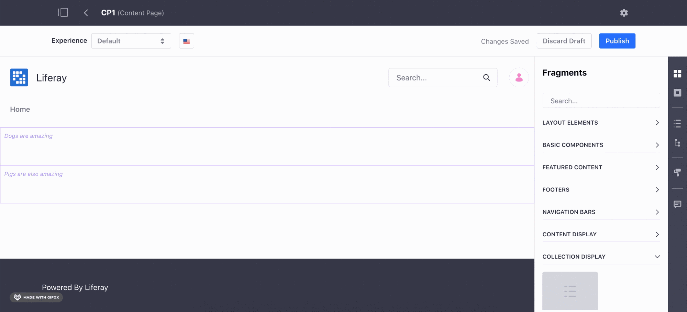

The [Collection Display](../content-authoring-and-management/collections-and-collection-pages/displaying-collections-and-collection-pages.md) fragment shows sets of assets, with drag and drop editing. When the fragment is added to the page, you link it to a collection. It then defines a space for each asset in the collection. Adjustments made to the spaces are replicated in the rest. Editable fields can be mapped to the common fields in the collection. For example, if a Heading fragment is added, it can be mapped to the title field of a web content structure and this mapping propagates to each item.

### Visual Responsive Layout Editor

The responsive editor helps you fine tune the out-of-box responsive behavior. You can adapt the page content in the most suitable way for each device where it is visualized.

### General Performance Improvements

The page editor was completely overhauled to utilize React in Liferay DXP 7.3. This has substantially increased the editor's performance, especially when working with larger pages. 

### Visual Fragment Composition

Page authors can now save their column compositions as reusable, sharable Fragments so they can be used on other pages. 

## Design and Theme Editor

We took Themes to the next level by providing Master Pages, Templates, Fragments and Style Books (see below) to override partially or completely the default theme look and feel. You can now use the classic Liferay theme as a base. 

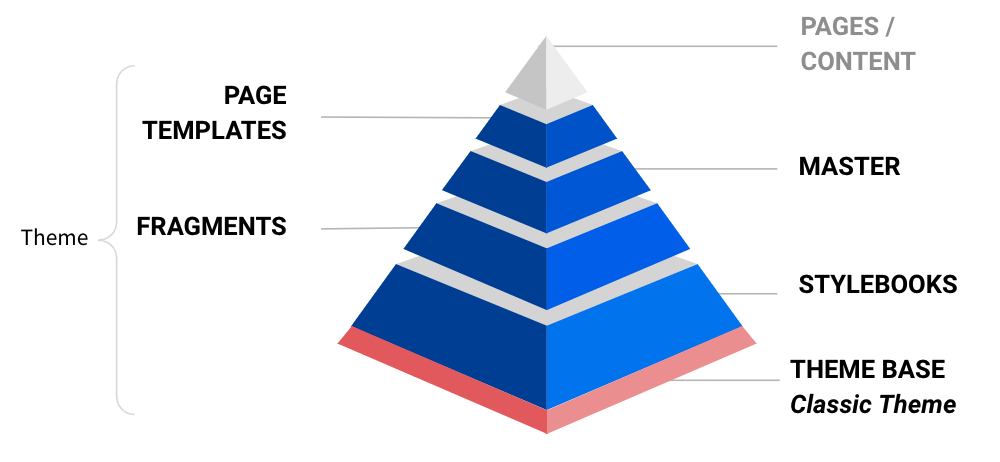

### Style Books

A [Style Book](../site-building/site-appearance/using-a-style-book-to-standardize-site-appearance.md) is a group of Styles (CSS rules) you can create using the Style editor UI. Style Books provide "design systems" for UX designers who want to create consistent user experiences across Pages, by leveraging re-usable and sharable styles and style rules. A Theme creator can create multiple Style Books for the same Site and a page creator can pick the Style Book for a particular page. Style Books help reduce inconsistency when multiple content authors and web designers work in parallel to create new experiences.

## Content Authoring and Management

### Asset Libraries

You can now create [dedicated libraries](../content-authoring-and-management/asset-libraries/asset-libraries-overview.md) to organize and reuse your content. Asset libraries make it easier to reuse resources across different Sites. 

Asset Libraries aren't limited to web content: you can share any asset type and connect them to the Sites where they're needed.While creating a page or writing a blog post, content authors can access the connected asset libraries and use images, documents or content stored in them. 

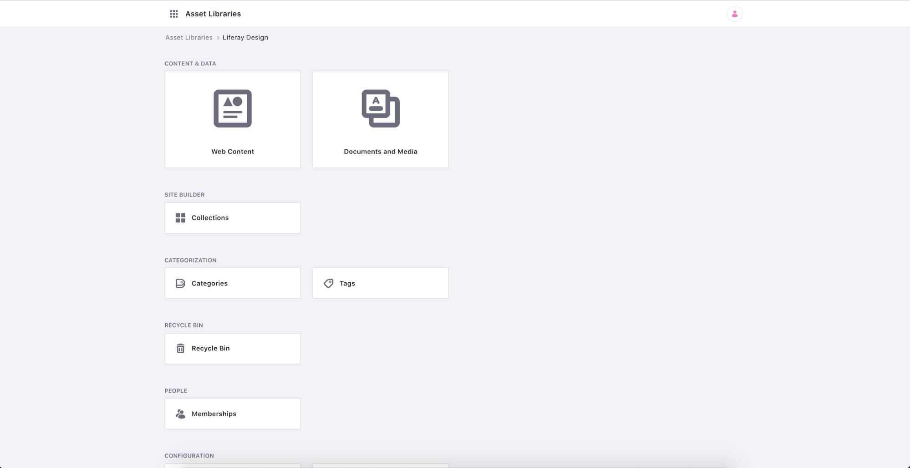

### Content Dashboard

For those with large databases full of content that may be going unused, Liferay has created the [Content Dashboard](../content-authoring-and-management/content-dashboard/about-the-content-dashboard.md). This is a one-stop-place where content authors can access all the content, not just for a given Site, but for all the Sites and asset libraries in a Liferay instance. To help you navigate such a large amount of content, a comprehensive set of filters provides filter and ordering capabilities for the list of content and an audit graph that helps you easily find and audit the content you need. 

You can access this content dashboard through Global Menu &rarr; Applications tab.

### Content Audit Tool

The new Content Dashboard includes a tool that makes it easier to [audit your content by type](../content-authoring-and-management/content-dashboard/content-dashboard-interface.md#content-audit-tool). Selecting vocabularies, and the Content Audit graph calculates the number of existing assets for each category in the vocabularies. You can filter by categories, tags, authors, asset subtype, Site (and more) to adjust the assets represented in the graph.

### Extended categorization capabilities

In 7.3 we've added a new configuration to vocabularies in order to [set visibility as internal or public](../content-authoring-and-management/tags-and-categories/organizing-content-with-categories-and-tags.md#vocabulary-visibility). New out-of-the-box Audience, Stage and Topic Global Vocabularies provide a more systematic categorization throughout Sites.

## Publication Management

[Publications](../site-building/publishing-tools/publications/publications-overview.md) is a new feature that enables content creators to prepare changes and publish them on a schedule. If you must roll out a special, seasonal promotion that involves updating images, copy, and adding new pages, you can create a Publication and invite the necessary users to make their changes before publishing them. Multiple Publications can be worked on at a time, giving you the freedom to create many updates at once and roll them out on your schedule.

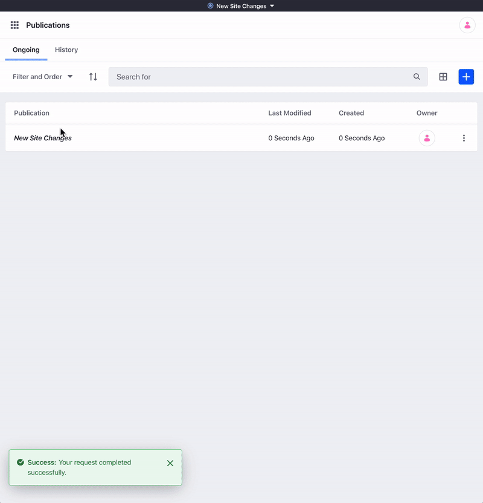

### Dedicated translation experience for web content

A [new translation UI](../content-authoring-and-management/web-content/translating-web-content/manually-translating-web-content.md) makes it easy to translate content in a side-by-side UI that optimizes the process. Translators can translate only into languages for which they have permission, and our workflow processes make reviewing those translations a snap. 

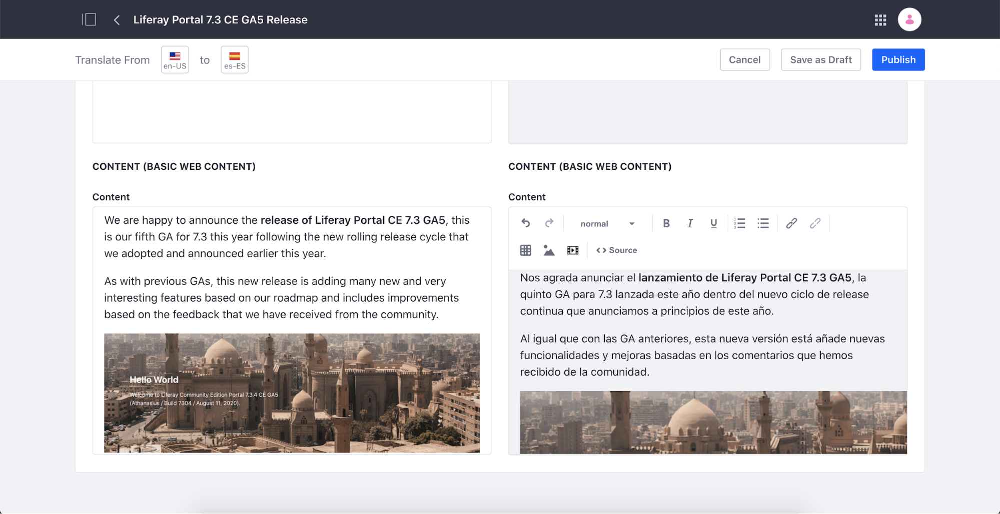

### Import/Export of web content for translations

If you use an external agency or freelancers for your translations, you can now select the content to be translated and [export the needed languages in the standard format for translations](../content-authoring-and-management/web-content/translating-web-content/exporting-and-importing-translations.md) (XLIFF, either in 1.2 or 2.0 versions) and send them to the translation agency. When the translations are finished, you can import the translations to have them with the original content.

## SEO Configuration

### Open Graph

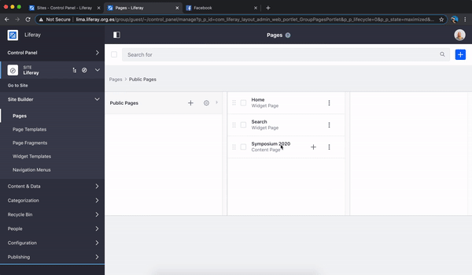

You can now configure your Pages' previews on social media with built-in [Open Graph](../site-building/site-settings/configuring-open-graph.md) support. You also get a real time preview of how your pages appear on search engines and social networks.

### Redirection Management

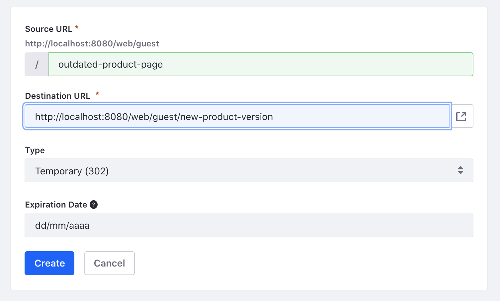

You can now [redirect](../site-building/site-settings/managing-site-urls/using-the-redirection-tool.md) your Site's URLs to any valid URL. Now you don't have to worry about old links directing to a 404 error. It supports temporary and permanent redirections, as well as setting an expiration date for the redirections.

For links that do break, Liferay now keeps track of all 404 errors. You can use this list to create new redirects to help users find what they wanted.

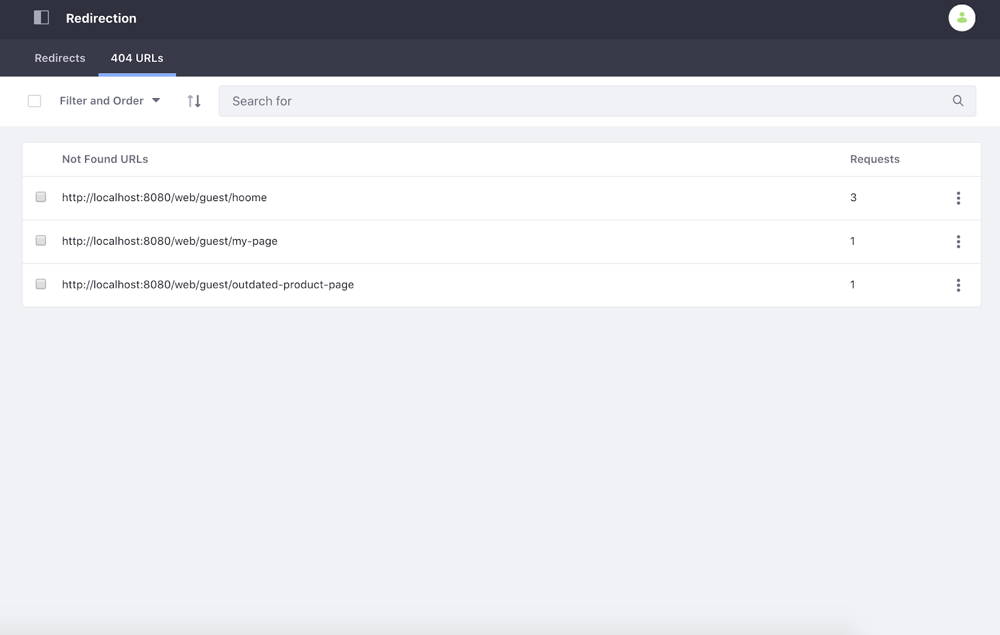

### Friendly URL history 

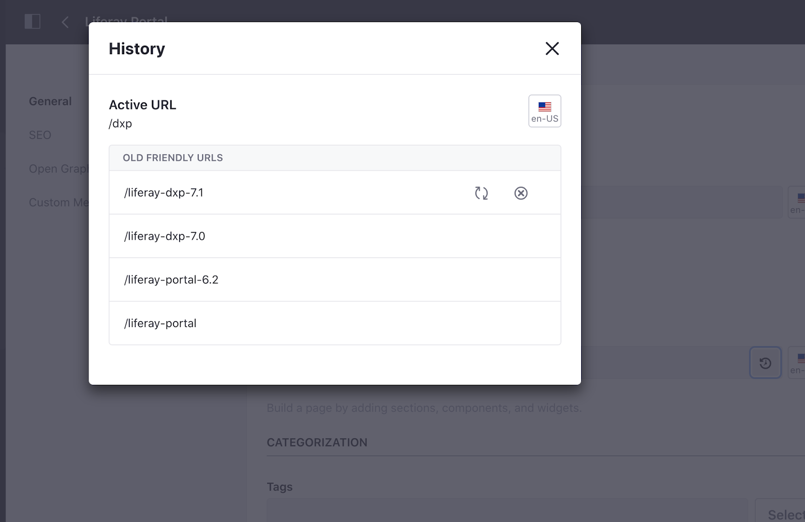

Now you can easily check all [friendly URLs used in any page](../site-building/creating-pages/page-settings/configuring-your-pages-friendly-url.md#managing-a-page-s-url-history) for each language and manage them visually. You can "forget" URLs to be reused in other pages or restore old friendly URLs. 

## Content Performance

> Subscription Required

Now you can tell how many visitors completely read your content. [Content performance analytics](../content-authoring-and-management/content-dashboard/content-dashboard-interface.md#content-performance-sidebar) appear in context with content it relates to, to help content authors and marketers to build and assess a successful content strategy. 

## Questions app

If you use your site to support products, the new [Questions app](../collaboration-and-social/using-the-questions-app.md) can help your users find answers to the questions they have about your products. Taking advantage of Liferay's GraphQL APIs and Message Boards infrastructure, the questions app gets users the best answers through voting and marking the most valuable information. 

## App Builder

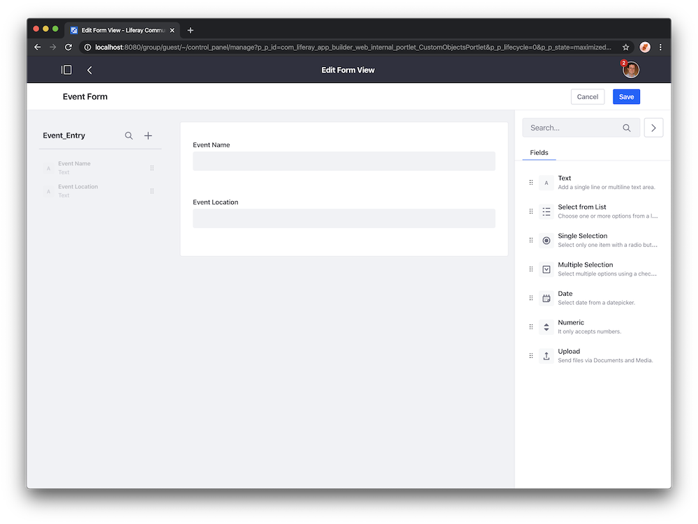

[App Builder](../developing-applications/developing-low-code-applications/app-builder-overview.md) is a new low-code application development solution for Liferay DXP backed by the Data Engine. It empowers business users with an intuitive GUI to define forms and table views and leverage workflows to build applications with the goal of digitizing and automating business processes. Applications can be deployed in standalone fashion or added to pages as a widget or through the product menu.

### Form View Rules and Field Sets

App Builder provides a Rule Builder for defining dynamic form behaviors, like setting visibility of a field or using a predefined condition to enable or disable a field. 

Fieldsets are fields grouped together, and App Builder's fieldsets make it easy to create, update and reuse them in different objects and forms views. This way, you don't have to recreate the same group of fields (e.g. address) over and over for each application. 

### Process Driven Apps

> Subscription Required

App Builder contains a [workflow process for approvals](../developing-applications/developing-low-code-applications/creating-a-workflow-powered-application.md). You can define the stages of the process and specify what information should be requested and/or displayed in each step of the application. You can also make use of [Workflow Metrics](#workflow-metrics-improvements) to understand the performance and health of the App's processes. 

### Localized Applications

App Builder applications can also be localized in several different languages. The Form View Builder provides an interface for selecting and translating fields to the languages you want. 

### Data Engine Improvements

Under App Builder's hood, Data Engine was improved to augment the developer experience when using Data Engine to build applications: 

-   Ability to create and reuse fieldsets.
-   Search Data Record Collections.
-   Render a layout by its Data Definition Key.
-   Create Version Attributes for Data Definitions and Layouts.
-   Search Data Layouts by name.
-   Scope Data Definitions by using `ClassNameId`.
-   Save a data definition using the builder tag library.
-   Make Data Records localizable.
-   Ability to nest fields.
-   New Field Types and visual elements:
-   Separators
-   Rich Text Fields
-   Image Fields
-   Geolocation Fields
-   Color Fields

## Forms

Since user-provided data is often collected using [web forms](../process-automation/forms/introduction-to-forms.md), Liferay has provided a GUI and development tools to design forms that comply with GDPR requirements. 

### Data Erasure (AKA GDPR Right to be Forgotten)

The right to be forgotten (technically known as the "right to erasure") requires organizations to delete an individual's personal data upon his or her request. Personal data is considered erased when the data can no longer be reasonably linked to an identifiable individual. You can now review form entries and edit, anonymize, or delete personal information as needed through a simple interface.

### Data Export (AKA GDPR Right to Data Portability)

The right to data portability requires organizations to provide a machine-readable export of a user's personal data upon request. You can now export a user's personal data submitted through Forms before going through the erasure process.

### Forms Reports

Liferay Forms now comes with a built-in summary report of the answers received, allowing you not only to see the data collected, but also an overall analysis of the answers. 

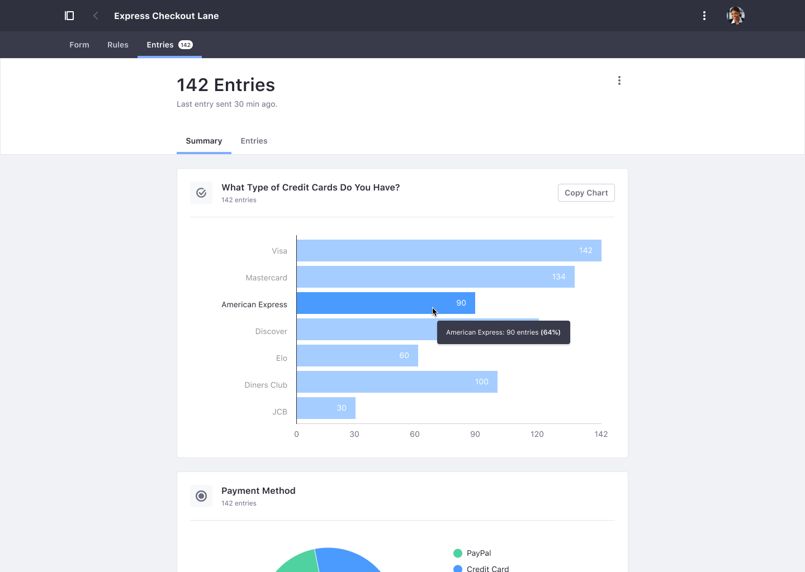

### Page Reorder

It's now not only easier to create and manage multi-page Forms, but also to reorder pages of a Form. 

### Workflow Metrics Improvements

### Workload by Assignee

In [Workflow Metrics](../process-automation/workflow/user-guide/using-workflow-metrics.md), there's now a card to show a breakdown of the workload of the process's assignees. This new chart offers a valuable glimpse to identify overloaded assignees and better drive decisions like re-assigning tasks to remove bottlenecks.

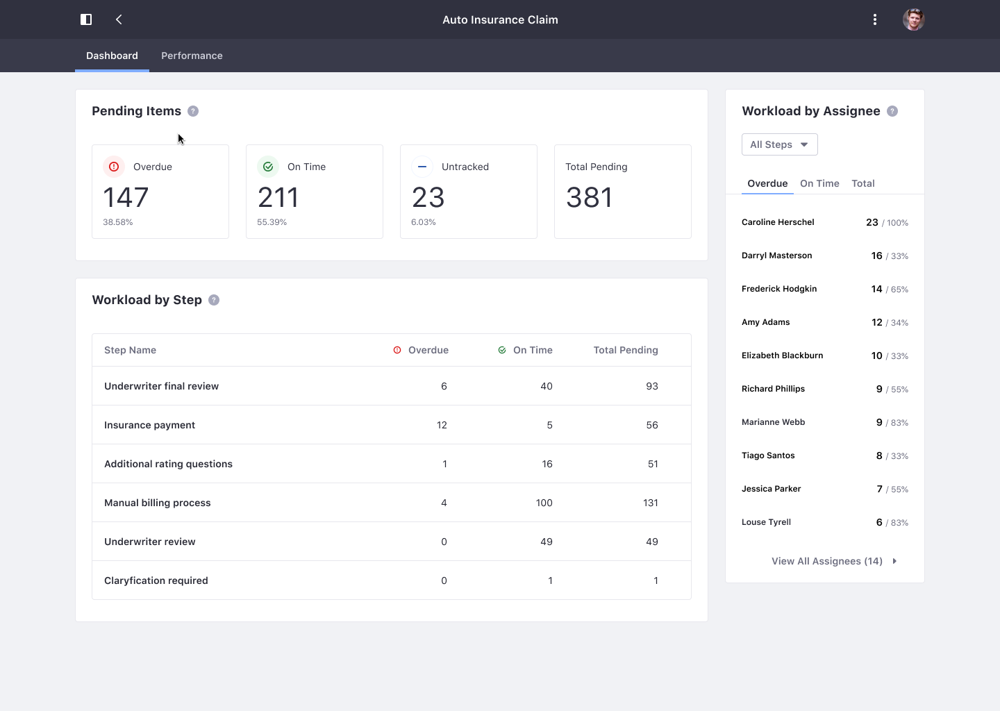

### Performance by Assignee

To help you understand who are the best performers, there's a new card under the Performance tab showing each assignee's average completion time and total completed tasks.

### Performance by Step

Identify where the bottlenecks of the process are by seeing how many SLA breaches occurred at each step and the step's average completion time. 

### Bulk Actions

You can now bulk-transition and/or reassign instances while analyzing the process health and performance in the Workflow Metrics Reports. 

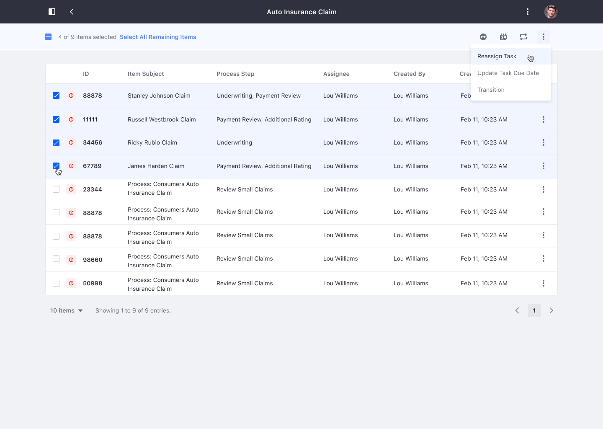

## Global Menu

A new application drawer houses cross-site applications, such as workflow, forms and [Commerce](https://learn.liferay.com/commerce/2.x/en/index.html). 

## Application security

### Multi-factor authentication

> Subscription Required

[Multi-Factor Authentication](../installation-and-upgrades/securing-liferay/multi-factor-authentication/using-multi-factor-authentication.md) (MFA) provides better security by requiring users to prove their identity in multiple ways, or _factors_. The basic user name/password combination is augmented with one or more further, configurable factors. These include the default One Time Password (OTP) and configurable IP address, time-based OTP, and because the system is extensible, any factor you wish to write. 

### SAML configuration on instance level

This change allows to configure [SAML](../installation-and-upgrades/securing-liferay/configuring-sso/authenticating-with-saml/single-sign-on-with-saml.md) settings on instance level, including handling the certificates. 

A new SAML property was introduced: *Unknown users are strangers*. This property determines the behavior of SAML IdP connection when an End User is a stranger. The property defines if users that do not exist already in the portal database should be classified as strangers. Once classified, the portal instance's existing stranger handling policy determines if the user should be automatically provisioned using information available from the IdP's SAML assertion.

### OAuth 2 configuration on instance level

The [OAuth 2](../installation-and-upgrades/securing-liferay/configuring-sso/using-oauth2/introduction-to-using-oauth2.md) application scopes screen has been simplified, so you have more control over the presentation of scopes during application authorization requests. For example, two scopes relating to two separate API applications can be presented as if they are one.

Expired authorizations can now be configured to be removed. After the expired authorizations afterlife duration, the authorization data is automatically removed by a scheduled process running in the background.

### OpenId Connect configuration on instance level

Each instance can now configure connections to different [OpenId Connect](../installation-and-upgrades/securing-liferay/configuring-sso/other-ssos/using-openid-connect.md) providers. 

A system-level OpenId Connect Provider is visible to all instances, acting like a default OpenId Connect Provider. 

### CORS configuration on instance level

[CORS](../installation-and-upgrades/securing-liferay/securing-web-services/setting-up-cors.md) settings can now be configured on the instance level. The way to configure on instance level remains the same as at system level.

Url patterns are now matched at the instance level first, and then at the system level. Patterns at the instance level take precedence.

## Search

There are several improvements and changes to [Liferay DXP 7.3's search engine connector to Elasticsearch](../using-search/installing-and-upgrading-a-search-engine/elasticsearch.md).

### Elasticsearch 7 Support

Liferay DXP's default search engine has been upgraded to Elasticsearch 7.

### Multiple Connections

You can now connect Liferay DXP to multiple Elasticsearch clusters. This feature can be used in conjunction with the Low Level Search Options and Search Results widgets to show results from third-party systems using Elasticsearch clusters.

### REST Client

Communication with Elasticsearch now uses the REST Client instead of the Transport Client.

### Widget Template Support

The Search widgets now support Widget Templates. 

## Developer Experience

### API explorer

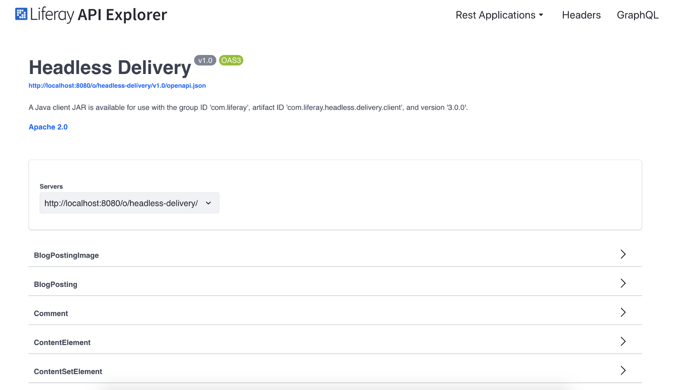

The [API explorer](../headless-delivery/consuming-apis/consuming-rest-services.md) provides an interface for browsing and querying Liferay DXP's available APIs. You can explore all the REST applications and their endpoints. 

The [GraphQL client](../headless-delivery/consuming-apis/consuming-graphql-apis.md) makes it easy to define and test queries.

### OpenAPI validator

The OpenAPI validator informs you if the configuration file has errors, lets you know if there's any feature in the standard Liferay doesn't yet support.

### Batch Operations

Headless APIs now support batch operations. 

### Manage all translations of localized content in a single request

You can add, update, or retrieve translations in the headless APIs simultaneously. 

### Expose actions in Headless APIs

Allowed user actions based on their permissions can now be retrieved in your queries. Now you can create apps with dynamic action menus, showing users only actions they can perform. 

### Exposing Metadata in Documents & Media APIs

Documents and Media APIs now expose the whole set of metadata included in document types. 

### Content Template API

You can grab content templates through an API and render the content outside of Liferay if needed. 

### Asset Libraries delivery APIs

You can access through the headless REST and GraphQL APIs the content and documents stored in an Asset Library, so you can use Liferay DXP as a content repository for other applications.

### Headless APIs extensibility

Headless APIs are extensible, making it easy to expose new properties or new components in the OOTB applications, deactivate endpoints, add contributions in GraphQL, and more. 

### Return facets in collections

When using the headless APIs, you can now request the search facets when retrieving collections of elements (documents, structured contents, etc.). You can use these to build dynamic filters to show end-users.

### React.js Facilities 

Liferay has begun transitioning big portions of its internal UI to React. As a side effect of those changes, new utilities have been added that can make life easier for others following a similar path: 

**ReactRenderer:** A low level Java primitive for rendering React components, simplifying the bootstrapping of a React component and generating the necessary JavaScript code for its initialization. 

**React:component:**  A high level JSP tag that can be combined with traditional `MVCPortlet` approaches to render and initialize complex React applications from traditional JSPs. This facilitates the progressive migration of complex JS applications and the adoption of more modern front-end workflows.

### Upgrade Improvements 

Many reliability improvements have been added to the [upgrade process](../installation-and-upgrades/upgrading-liferay/upgrade-basics/upgrade-overview.md). The upgrade process has been unified between Core and Modules. Auto upgrade behavior can be controlled by a new portal property: `upgrade.database.auto.run`. 
