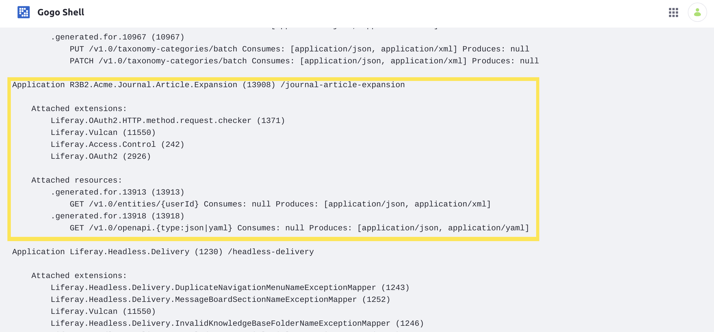

# Implementing a New API with REST Builder

REST Builder allows you to quickly implement new JAX-RS APIs for your DXP application. You can simply define the API you want to build, and REST Builder provides the framework and endpoints for you. <!-- Add link to the REST Builder overview article once available. -->

## Deploy an Example REST Builder API

First, see a sample REST Builder API in your own Liferay DXP instance. Follow these steps to add the API to your instance:

1. Start up the Liferay DXP Docker image:

    ```bash
    docker run -it -p 8080:8080 liferay/portal:7.3.1-ga2
    ```

1. Download and unzip the `.zip` archive containing the [Acme Journal Article API Expansion](./implementing-a-new-api-with-rest-builder/liferay-r3b2.zip):

    ```bash
    curl https://learn.liferay.com/dxp/7.x/en/headless-delivery/content-delivery-apis/rest-builder/implementing-a-new-api-with-rest-builder/liferay-r3b2.zip -O
    ```

    ```bash
    unzip liferay-r3b2.zip
    ```

1. Build and deploy the example:

    ```bash
    ./gradlew deploy -Ddeploy.docker.container.id=$(docker ps -lq)
    ```

    ```note::
       This command is the same as copying the deployed jars to /opt/liferay/osgi/modules on the Docker container.
    ```

1. Confirm the deployment in the Docker container console for both the `api` and `impl` bundles:

    ```
    STARTED com.acme.r3b2.api_1.0.0
    STARTED com.acme.r3b2.impl_1.0.0
    ```

1. Log into your DXP instance, and navigate to the Product Menu &rarr; _Control Panel_ &rarr; _Gogo Shell._

1. In the Gogo Shell prompt, type the following command:

    ```
    jaxrs:check
    ```

    The page lists all of the installed JAX-RS bundles, including the newly deployed API, "R3B2.Acme.Journal.Article.Expansion". The API is now deployed and ready for you to call.

    

1. Add a [basic content article](../../../content-authoring-and-management/web-content/user-guide/web-content-articles/adding-a-basic-web-content-article.md) to test the new API with.

1. Test the API by running the following command from your terminal:

    ```bash
    curl -u 'test@liferay.com:test' "localhost:8080/o/journal-article-expansion/v1.0/entities/{userId}"
    ```

    If you use the correct `userId` for the User you added the article with, then the query returns the content, ID, title, and User ID in a JSON object:

    ```json
    {
        "content" : "<?xml version=\"1.0\"?>\n\n<root available-locales=\"en_US\" default-locale=\"en_US\">\n\t<dynamic-element name=\"content\" type=\"text_area\" index-type=\"text\" instance-id=\"psqx\">\n\t\t<dynamic-content language-id=\"en_US\"><![CDATA[<p>test content</p>]]></dynamic-content>\n\t</dynamic-element>\n</root>",
        "id" : "36528",
        "title" : "Web Content A",
        "userId" : 20126
    }
    ```

    ```tip::
       You can query your database to find the ``userId`` that you added the article with. If you use the default Test User in a fresh 7.3 GA2 instance, then the default ``userId`` is ``20126``.
    ```

Congratulations, you've successfully deployed and used a new REST Builder API.

Now that you've seen a REST Builder behavior, walk through the steps to build one yourself.

## Initial Setup

Begin by setting up both an `impl` and `api` module in your Liferay workspace project. Your `impl` module's `build.gradle` file must install and apply REST Builder as a plugin:

```
buildscript {
    dependencies {
        classpath group: "com.liferay", name: "com.liferay.gradle.plugins.rest.builder", version: "1.0.125"
    }

    repositories {
        maven {
            url "https://repository-cdn.liferay.com/nexus/content/groups/public"
        }
    }
}

apply plugin: "com.liferay.portal.tools.rest.builder"
```

Your `build.gradle` files in both modules must also declare several dependencies on annotation packages, including the `jackson-annotations` and `swagger-annotations` packages, as well as Vulcan API. <!-- It doesn't seem to be ready yet, but insert a REST Builder to the complete compatibility matrix. --> See the example [`build.gradle` file](./implementing-a-new-api-with-rest-builder/liferay-r3b2.zip/r3b2-impl/build.gradle) for a reference of needed package imports for your module.

## YAML configuration

The first step of creating new API with REST Builder is in creating the REST Builder configuration files. Open the folder for your `impl` module, and then add two files into it: `rest-config.yaml` and `rest-openapi.yaml`. These files must contain all of the information necessary for REST Builder to generate the scaffolding code for your API.

### Add Basic REST Builder Configuration

The most basic configuration belongs in the `rest-config.yaml` file. Open this file and add the following fields to it:

* **apiDir**: the directory for your Java scaffolding code (in this case, your `api` directory source folder)

* **apiPackagePath**: the convention used to place all API packages across all modules

* **baseURI**: the base string to append to the URL for all of the configured APIs in this project

* **className**: the Java class name for the root resource class (used by JAX-RS)

* **name**: the JAX-RS name of the API

Define these fields using this structure:

```
apiDir: "../r3b2-api/src/main/java"
apiPackagePath: "com.acme.r3b2.journal.article.expansion"
application:
    baseURI: "/journal-article-expansion"
    className: "JournalArticleExpansionApplication"
    name: "R3B2.Acme.Journal.Article.Expansion"
author: "Liferay"
```

### Add an Information Block to the OpenAPI Configuration

Next, open the `rest-openapi.yaml` file to add configuration more specific to your APIs.

The first section to add into your OpenAPI configuration file is the information block. Add this block of fields into your `rest-openapi.yaml` file:

```
info:
  description: "Extra API for Liferay journal articles"
  license:
        name: "Apache 2.0"
        url: "http://www.apache.org/licenses/LICENSE-2.0.html"
  title: "Journal Article API Expansion"
  version: v1.0
openapi: 3.0.1
```

```important::
   The ``version`` field defined here affects part of the URL when your API paths are exposed within your Liferay instance.
```

### Define the Necessary Schemas

Next, define any schemas for entities that your API will use within the `components` block. Defining each schema in the `rest-openapi.yaml` file allows REST Builder to create the Java classes to use their corresponding Objects in Java code. <!-- Add reference to overview article elaborating a bit more on how REST Builder represents Java Objects with schemas. -->

Define a `schema` block for each schema your API will work with:

```
components:
  schemas:
    Article:
      description: A journal article's content
      properties:
        userId:
          description: The author's user ID
          type: integer
        id:
          description: The article's id
          type: string
        title:
          description: The article's title
          type: string
        content:
          description: The article content as XML
          type: string
      type: object
```

In this example, a schema called `Article` represents the important data for the use of this API. The `Article` entity contains an integer (`userId`) and three string values (`id`, `title`, and `content`) as its fields (or `properties`), which are the important pieces of data for this API to return.

### Define Your APIs

Finally, add the `paths` block, which must include all APIs that you plan to implement with REST Builder. Add each API to a path, with either `get` or `post` (for a GET or POST request):

```
paths:
  "/entities/{userId}":
    get:
      operationId: getFirstArticleByUser
      parameters:
        - in: path
          name: userId
          required: true
          schema:
            type: integer
```

The path (`entities/{userId}`) specifies that this API (`getFirstArticleByUser`) can be reached by appending the path string to the end of the URL (which also includes the `baseURI` and `version` values from your `rest-config.yaml` file). For instance, this example API is accessed via the full URL: `localhost:8080/o/journal-article-expansion/v1.0/entities/{userId}`.

The value you substitute in for `userId` is used as the parameter with the matching name.

Beneath the `parameters` block (and within the `get` block), add in a `responses` block to define at least the response for a successful call (indicated by a `200` response):

```
responses:
    200:
        content:
            application/json:
                schema:
                    $ref: "#/components/schemas/Article"
            application/xml:
                schema:
                    $ref: "#/components/schemas/Article"
        description: "Return the first article found by the User with the given User ID"
```

This `responses` block specifies that a successful call returns an `Article`. The string `#/components/schemas/Article` references the schema defined earlier in the same file, allowing REST Builder to use the `Article` schema as the return type for this API.

Lastly, add a `tags` definition for this path, beneath the `responses` block:

```
tags: ["Article"]
```

The tag specifies what to call the resource classes when REST Builder builds the scaffolding and templates for your code, in the "resources" files. In this example, because the tag is `Article`, the implementation logic belongs in the `ArticleResourceImpl` class.

See the [example `rest-openapi.yaml` file](./implementing-a-new-api-with-rest-builder/liferay-r3b2.zip/r3b2-impl/rest-openapi.yaml) for a complete reference.

## Run REST Builder

Now that you have added all of the configuration necessary for REST Builder to do most of the work, run the following command from within your `impl` module to run the `buildREST` Gradle task:

```bash
../gradlew buildREST
```

REST Builder uses your configuration and populates both your `api` and `impl` classes with scaffolding code, as well as the Java classes you can add your implementation logic into.

## Add Your Implementation Logic

The last step is to define the logic for each API you have defined. Within your `impl` module, find the Java resource class to add your implementation to, based on the tag name you defined in ``rest-openapi.yaml`` (in this example, ``ArticleResourceImpl.java``).

```tip::
   The location of the class for your implementation depends on the value you defined for ``apiPackagePath`` within your ``rest-config.yaml`` file. Follow that path, and that navigate into ``internal/resource/<version>/`` within it. If you used the same path as this example, then the file is located within ``src/java/com/acme/r3b2/journal/article/expansion/internal/resource/v1_0/``.
```

The implementation class (`[TAG]ResourceImpl`) is located beside the base class (`Base[TAG]ResourceImpl`). Open the implementation class and add the implementation of your API as an overridden method:

```java
@Override
    public Article getFirstArticleByUser(Integer userId) {

    return null;
}
```

```note::
   This method overrides the base method defined in the base class (``Base[TAG]ResourceImpl``), which is defined using special JAX-RS annotations. The base implementation of the method returns an empty ``Article`` object.
```

Finally, add the business logic to complete the request. REST Builder only creates a default constructor for the Object you defined in your schema, so you must create an empty Object, and then add your values to it (based on how you defined its `parameters` in `rest-openapi.yaml`):

```java
List<JournalArticle> journalArticles = JournalArticleLocalServiceUtil.getArticles();

for (JournalArticle journalArticle : journalArticles) {
    if (journalArticle.getUserId() == userId.longValue()) {
        Article article = new Article();

        article.setUserId((int)journalArticle.getUserId());
        article.setId(journalArticle.getArticleId());
        article.setTitle(journalArticle.getTitle());
        article.setContent(journalArticle.getContent());

        return article;
    }
}

return null;
```

This example uses [`JournalArticleLocalServiceUtil`](https://github.com/liferay/liferay-portal/blob/7.1.3-ga4/modules/apps/journal/journal-api/src/main/java/com/liferay/journal/service/JournalArticleLocalServiceUtil.java) to retrieve all articles, and then compares their authors with the `userId` from the request to return the first match.

## Conclusion

Congratulations! You now know the basics of implementing a new API with REST Builder and have added a new API to DXP.

<!-- Add links to the overview and other articles as additional information when available. -->